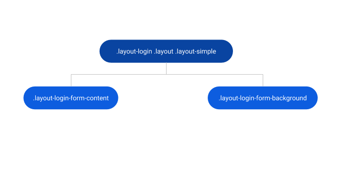
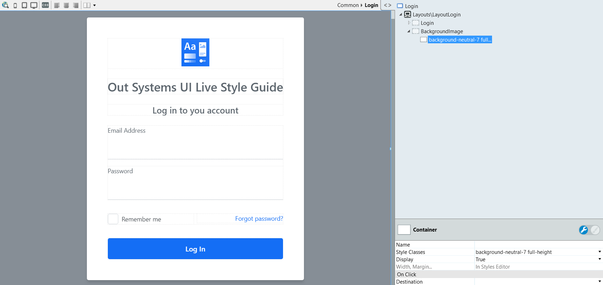

# Layout Login Reference

Applies only to Traditional Web Apps.

## Layout and classes

### Login

Drag login related content to this placeholder.

### Background image

Drag an image, GIF or video to this placeholder.

## Advanced use case

### Change background color

1. In the Interface tab, go to the Login screen.
1. Drag a container to the BackgroundImage placeholder.
1. Set the Style Classes of that container to `full-height background-your-color`.
1. Publish and test.

## Compatibility with other patterns

[Login Form](loginform.md)
