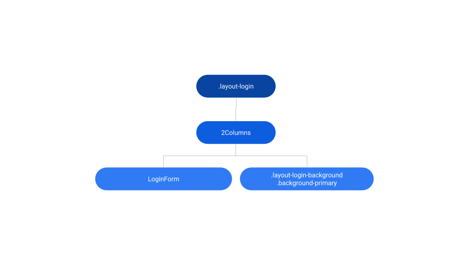
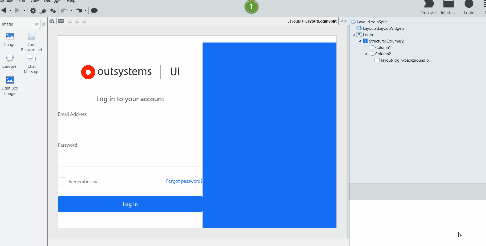
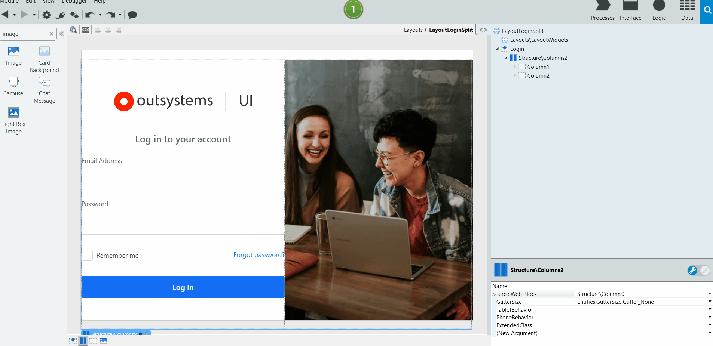

# Layout Login Split Reference

Applies only to Traditional Web Apps.

## Layout and classes

### Login

Drag login related content to this placeholder.

## Advanced use case

### Change background to image

1. In the Interface tab, go to the Login screen.
1. Remove the background container and drag an image.
1. Publish and test.

### Change layout structure

1. In the Interface tab, go to the Login screen.
1. Change the Column type by using the corresponding parameter (for instance, ColumnsMediumRight).
1. Publish and test.

## Compatibility with other patterns

[Login Form](loginform.md)
