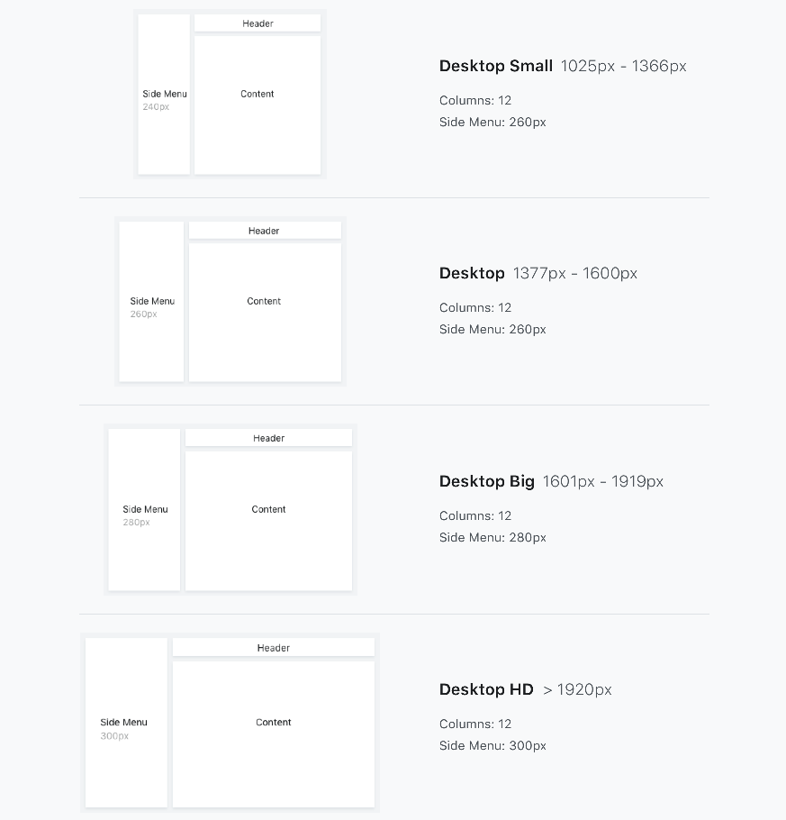

# Layout Side Menu Reference

<div class="info" markdown="1">

Applies only to Traditional Web Apps.

</div>

## Layout and classes


## Responsive behavior

This layout comes with a default responsive behavior. On tablets it remains the same as on desktop. But on phones it breaks the content vertically, making the placeholders Title and Actions full-width.




The menu also adapts to mobile, hiding the navigation sidebar, which can be toggled by a hamburger icon.

<iframe src="https://player.vimeo.com/video/1002680199" width="344" height="750" frameborder="0" allow="autoplay; fullscreen" allowfullscreen="">Video demonstrating the toggle of the navigation sidebar in the Layout Side Menu on a mobile device.</iframe>


## Advanced

Here are some more advanced use-cases of the widget.

### Customize your responsive breakpoints

1. Go to the Common Web Flow.
1. Double-click on your Layout to open the widget tree.
1. Go to the LayoutTopMenu parameters.
1. Toggle the DeviceConfiguration 'plus icon'.
1. Set your custom breakpoints (in pixels). On the example below the phone breaks is set to happen only when the Device with is at 200px.
1. Publish and test.


### Customize your content max-width

1. Go to Themes.
1. In the Grid section, set your custom width (default value is 1280px) in the Max. Width parameter.
1. Publish and test.


## Device compatibility

In Internet Explorer we made specific CSS that uses 'position: fixed' instead of 'position: sticky', as 'sticky' is not supported in Internet Explorer.

## Notes

In Internet Explorer 10 and 11, we added some specific behaviors to account for the flicker caused by the slow loading time of polyfill CSS Variables. If there are any JavaScript errors, this will cause the screen to appear white.

To override this behavior, add the following code snippet to your CSS theme:

```css
.ie10, .ie11 {
    display: block;
}
```
