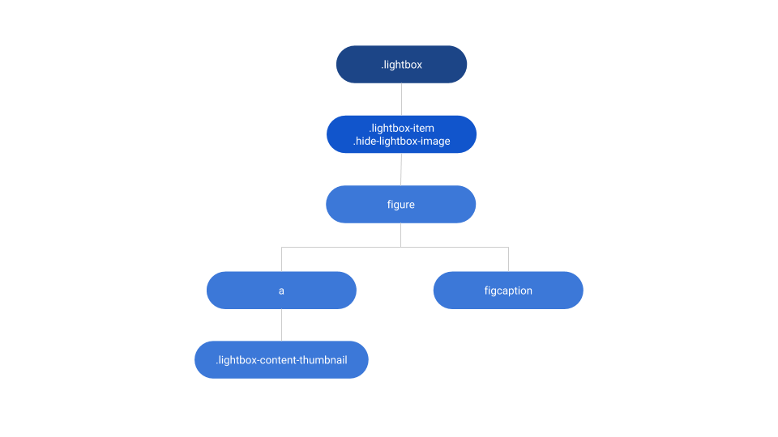
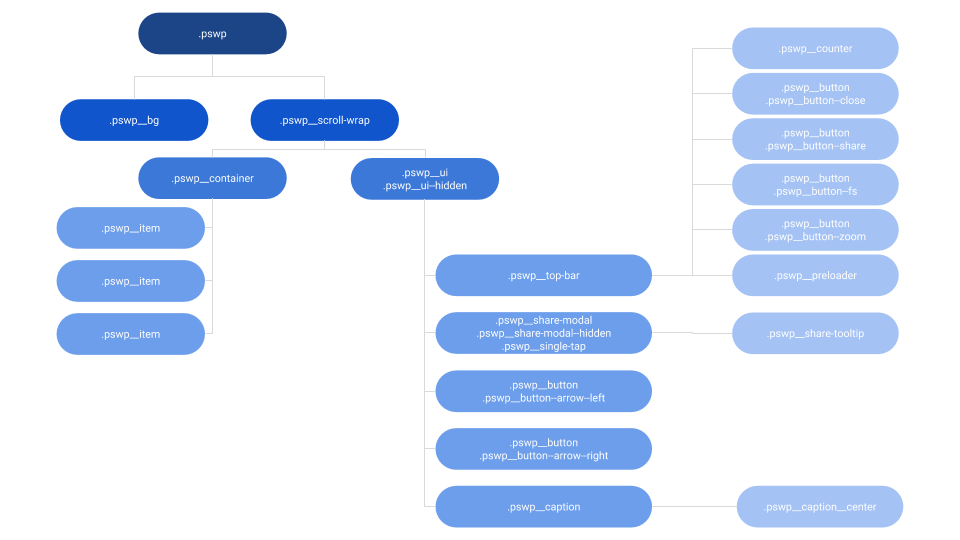
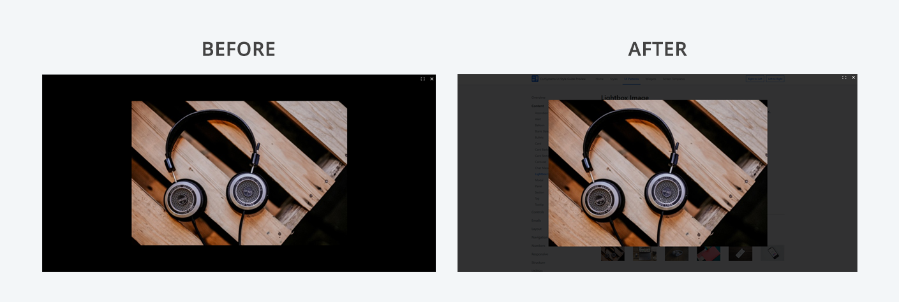
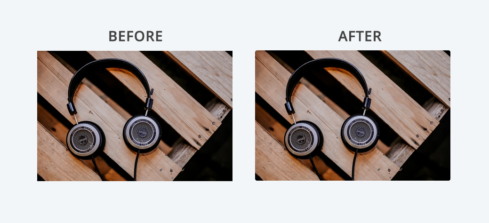

# Light Box Image Reference

<div class="info" markdown="1">

Applies only to Traditional Web Apps.

</div>

## Layout and classes

 



## Advanced use case

### Change the Light Box Image overlay

It is possible to change the opacity of Light Box Image overlay when it is open by adding custom CSS. To implement this in your application, copy the CSS code below and add it to the theme.

```css
.pswp__bg {
    background-color: rgba(0, 0, 0, 0.8);
}

.pswp__ui--fit .pswp__top-bar, .pswp__ui--fit .pswp__caption {
    background-color: rgba(0, 0, 0, 0);
}
```



### Add rounded corners to images inside Light Box Image Pattern

To add rounded corners to images inside Light Box Image, add the following custom css to the theme.

```css
.lightbox-content-thumbnail img,
.pswp__item img {
    border-radius: var(--border-radius-soft);
}
```


    