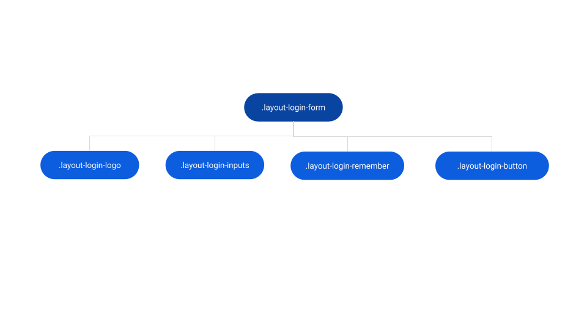
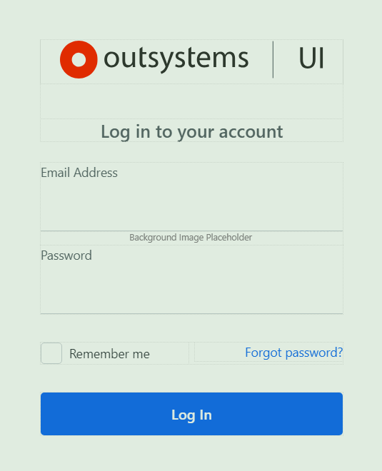
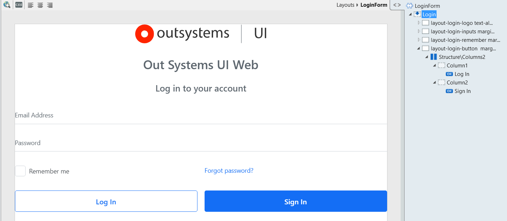

# Login Form Reference

Applies only to Traditional Web Apps.

## Layout and classes

### Login

Drag login related content to this placeholder.

## Advanced use case

### Add a Sign In button

1. In the Interface tab, go to the Login screen.

1. In the widgets tree, expand the Login placeholder.

1. Drag a Columns 2 structure to the "layout-login-button" container.

1. Drag the "Log In" button to the Column1 placeholder.

1. Drag a new button to the Column2 placeholder and set the value of the Label to "Sign In".

1. Publish and test.

    

## Compatibility with other patterns

[Layouts](../../../building-apps/ui/patterns/web/layout/layout-login.md)
