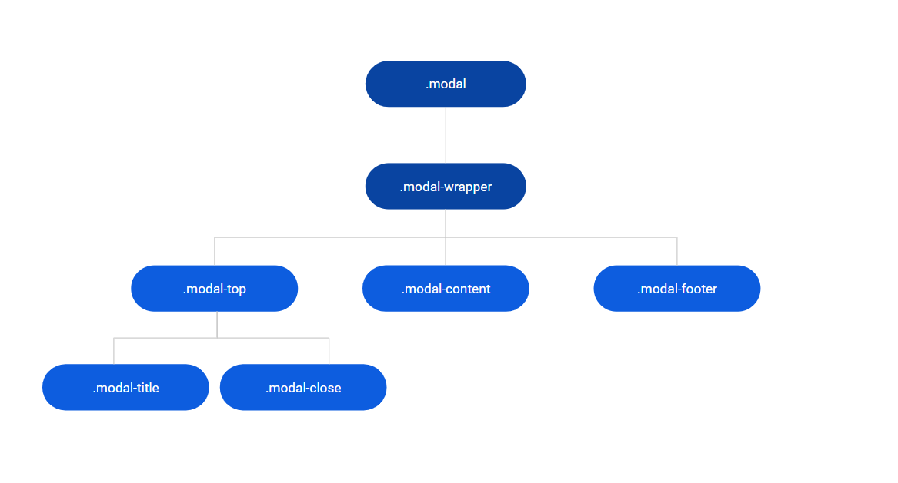

# Modal Reference

<div class="info" markdown="1">

Applies only to Traditional Web Apps.

</div>

## Layout and classes



## Advanced use case

### Change the animation speed

It is possible to change the animation speed of Modal by using custom CSS. To implement this in your application, copy the CSS to the theme.

```css
.modal .animate {
    -webkit-animation-duration: 500ms;
            animation-duration: 500ms;
}
```
