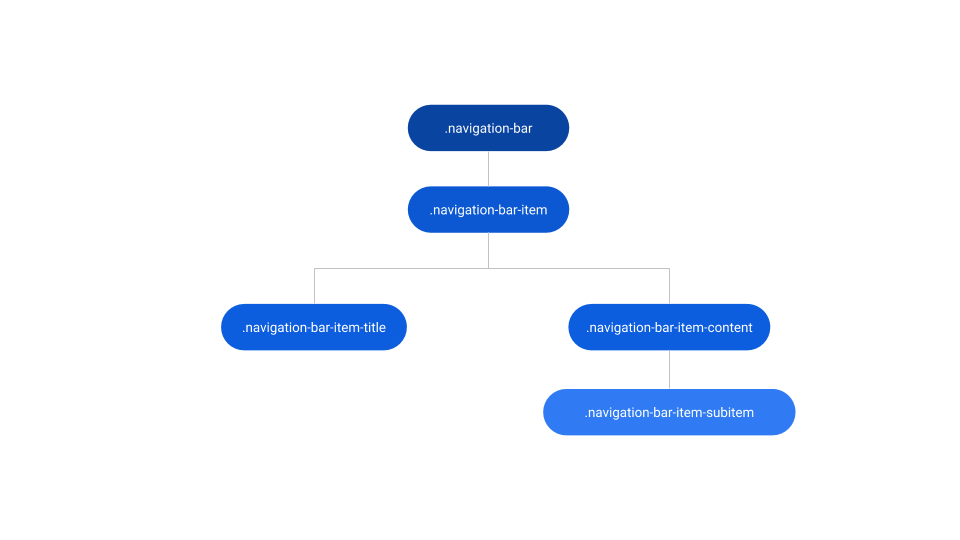
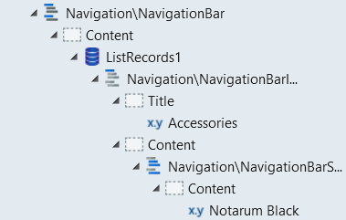

# Navigation Bar Reference

<div class="info" markdown="1">

Applies only to Traditional Web Apps.

</div>

## Layout and classes




## CSS selectors

| **Element** |  **CSS Class** |  **Description**  |
| ---|---|---  
| .navigation-bar |  .is--sticky|  Defines if the navigationBar position is fixed or not  |
| .navigation-bar-item | .is--active |  Defines if the current navigationBarItem is active  |
| .navigation-bar-item | .is--open |  Defines if the current navigationBarItem is open  |
| .navigation-bar-item | .is--closed |  Defines if the current navigationBarItem is closed  |
| .navigation-bar-item-content | .is--active |  Defines if the current navigationBarSubItem is active  |
| .navigation-bar-item-content | .is--open |  Defines if the current navigationBarSubItem is open  |
| .navigation-bar-item-content | .is--closed |  Defines if the current navigationBarSubItem is closed  |
| .navigation-bar-item-content | .is--expanded |  Defines if the current navigationBarSubItem is expanded  |
| .navigation-bar-item-content | .is--collapsed |  Defines if the current navigationBarSubItem is collapsed  |


## Advanced use case

### Use Navigation Bar with ListRecords

1. Drag the Navigation Bar into the preview.

1. In the Content placeholder, drag a ListRecords widget.

1. Set the Line Separator from ListRecords to None.

1. In the ListRecords widget, drag a NavigationBarItem.

1. In the NavigationBarItem, use expressions to display the required database content in the placeholders. Optionally, you can drag a NavigationBarSubItem to the Content Placeholder and set the expression there.

1. Publish and test.

    


### Change the active color on the NavigationBarItem

* Write the following CSS in the CSS editor and change the `yourcolor` and `yourelement`.

```css
.navigation-bar-item.is--active yourelement {
    color: yourcolor;
}
```

* Or use CSS variables: `var(--color-yourcolor)`.

```css
.navigation-bar-item.is--active yourelement {
    color: var(--color-yourcolor);
}
```

### Change the active color on the NavigationBarSubItem

* Write the following CSS in the CSS editor and change the `yourcolor` and `yourelement`.

```css
.navigation-bar-item-subitem.is--active yourelement {
    color: yourcolor;
}
```

* Or use CSS variables: `var(--color-yourcolor)`.

```css
.navigation-bar-item-subitem.is--active yourelement {
    color: var(--color-yourcolor);
}
```
