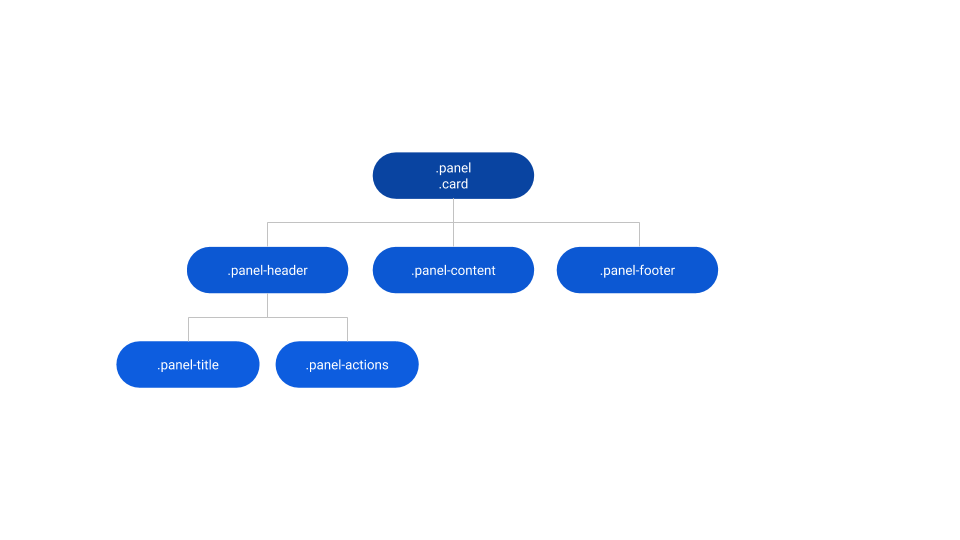
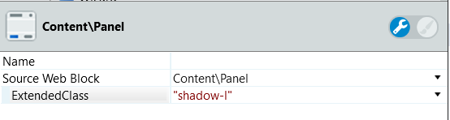
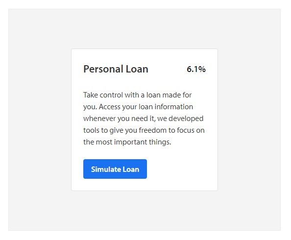
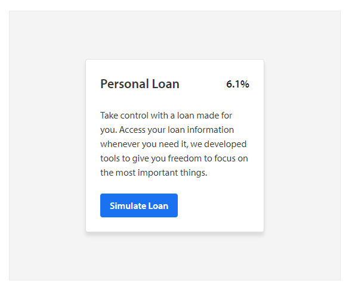

# Panel Reference

Applies only to Traditional Web Apps.

## Layout and classes

## Advanced use case

### Add box-shadow on Panel

1. Set the ExtendedClass parameter to `shadow-l`.

    

1. Publish and test.

**Before**

**After**

