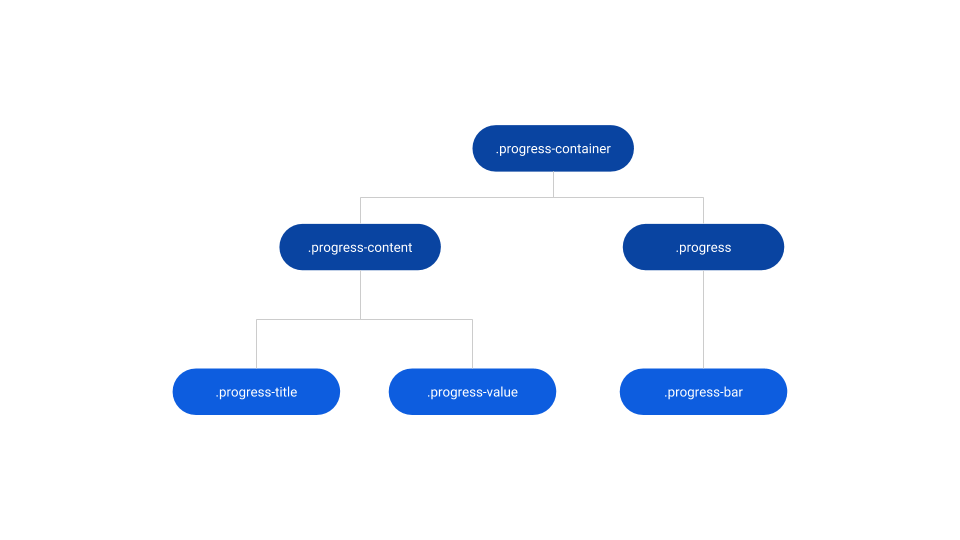
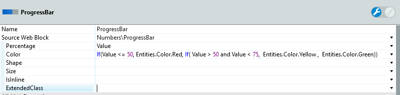
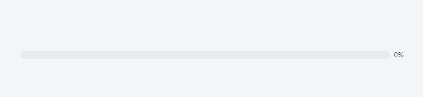
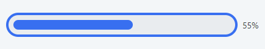
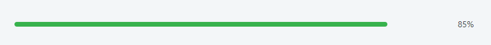

# Progress Bar Reference

<div class="info" markdown="1">

Applies only to Traditional Web Apps.

</div>

## Layout and classes



## CSS selectors

| **Element** |  **CSS Class** |  **Description**  |
| --- | --- | --- |
| .progress-container | .progress-container.flex-direction-column |  When IsInline parameter is False  |
| .progress-container | .progress-container.flex-direction-row |  When IsInline parameter is False  |

## Advanced use case

### Change color of Progress Bar based on value

1. Create a local Integer variable "Value".

1. Drag the Progress Bar pattern into the preview.

1. Set the Value of the Progress Bar's Percentage parameter.

1. To change the color of your ProgressBar based on values, create a condition and set limits to use color. In this example, 3 colors represent diferent states of progress. Set the Color parameter to `If(Value <= 50, Entities.Color.Red, If( Value > 50 and Value < 75,  Entities.Color.Yellow ,  Entities.Color.Green))`.

    

1. Publish and test.

    

### Change the style of Progress Bar

It is possible to change the style of Progress bar by using custom CSS. To implement this in your application, copy the CSS and add it to the theme.

```css
.progress {
    padding: var(--space-s);`
    border: var(--space-xs) solid var(--color-primary);`
}
```



### Remove background of Progress Bar

To remove the background, use this CSS snippet.

```css
.progress {
    background-color: transparent;
}
```


