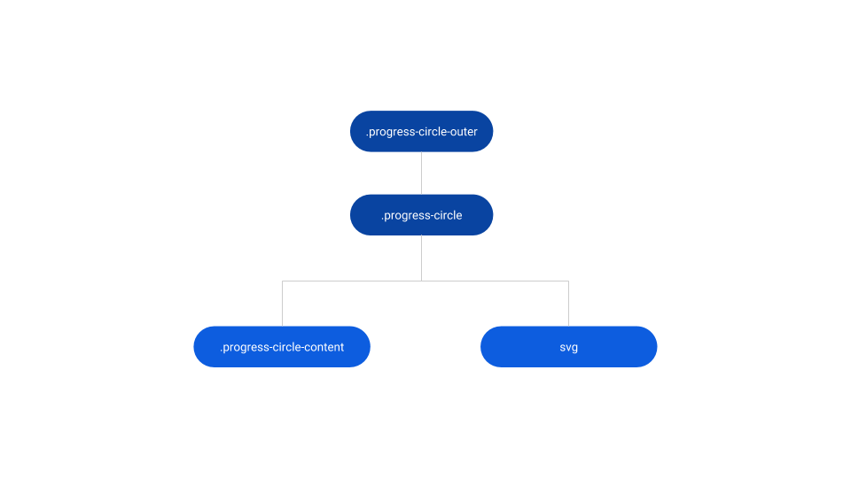
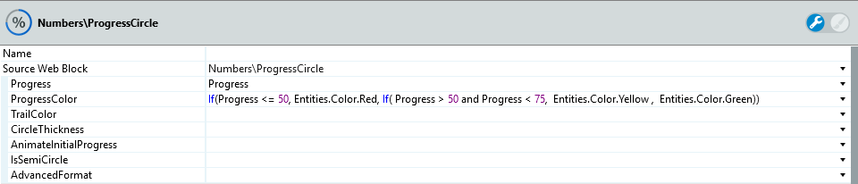
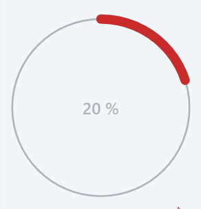
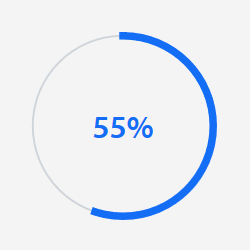
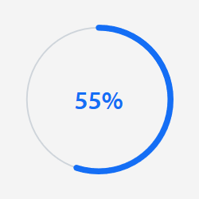

# Progress Circle Reference

<div class="info" markdown="1">

Applies only to Traditional Web Apps.

</div>

## Layout and classes



## CSS selectors

| **Element** |  **CSS Class** |  **Description**  |
| --- | --- | --- |
| .progress-circle | .progress-circle .progress-circle-content |  When IsSemiCircle parameter is False  |
| .progress-circle | .progress-circle .progress-semi-circle-content |  When IsSemiCircle parameter is True  |

## Advanced use case

### Change color of progress circle based on value

1. On your screen, create a local variable called Progress (Integer type).

1. Drag the Progress Circle pattern into the preview.

1. Set the Value of the Progress Circle's Progress parameter.

1. To change the color of the Progress Circle based on values, create a condition and set limits. 

    In this example, 3 colors represent different states of progress. Set the value of the ProgressColor parameter to `If(Progress <= 50, Entities.Color.Red, If( Progress > 50 and Progress < 75,  Entities.Color.Yellow ,  Entities.Color.Green))`.
    
    

1. Publish and test.

    

### Remove the round corners of the Progress Circle

To remove the round corners, use this CSS snippet.

```css
.progress-circle svg {
    stroke-linecap: square;
}
```



### Change the trail thickness of the Progress Circle

To change the trail thickness, set the AdvancedFormat property to `{trailWidth: 1}`.


