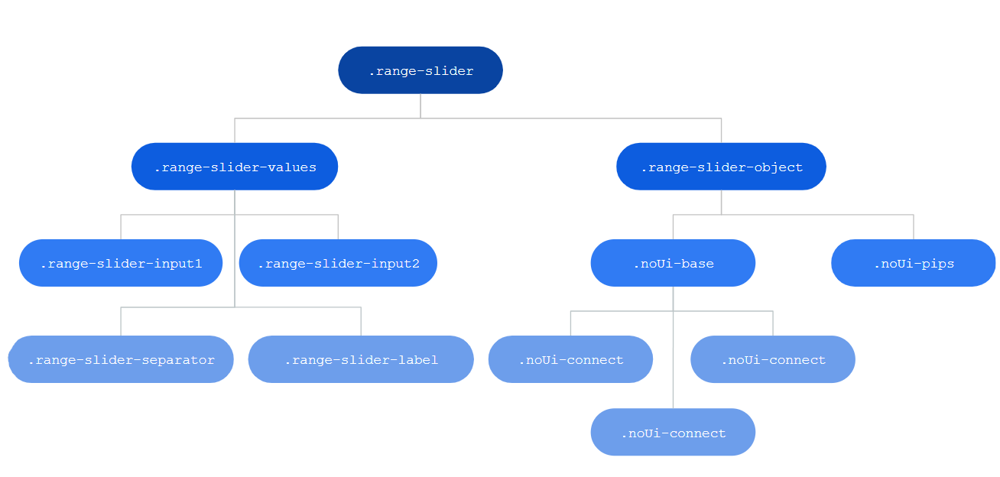
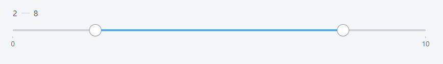

# Range Slider Interval Reference

## Events

| **Event Name** |  **Description** |  **Mandatory**  |
| ---|---|--- |  
| OnChange | Event triggered once a handler is dragged and the values change.  |  True  |

**Return values**

* SelectedMinValue: Integer
* SelectedMaxValue: Integer
  
## Layout and classes



## CSS selectors

| **Element** |  **CSS Class** |  **Description**  |
| ---|---|---  
| Lesser handle |  .noUi-handle-lower |  It's the lesser handle, used to customize (use also the :before and :after).  |
| Upper Handle  |  .noUi-handle-upper  |  It's the upper handle, used to customize (use also the :before and :after). |
| Interval  |  .noUi-connect  |  Used to change the color of the interval.  |
  
## Advanced use case

### Change the interval color

Write the following CSS in the CSS editor and change the `yourcolor` to your color:

```css
.range-slider .noUi-connect {
    background: yourcolor;
}
```

Or using the CSS variables: `var(--color-yourcolor)`  
Example:  

```css
.range-slider .noUi-connect {
    background: var(--color-red);
}
```

### Removing the || of the handlers

1. Create a class `.range-slider .noUi-handle:before, .range-slider .noUi-handle:after`.

1. Set the content to `height: 0px`.

1. Publish the application.


