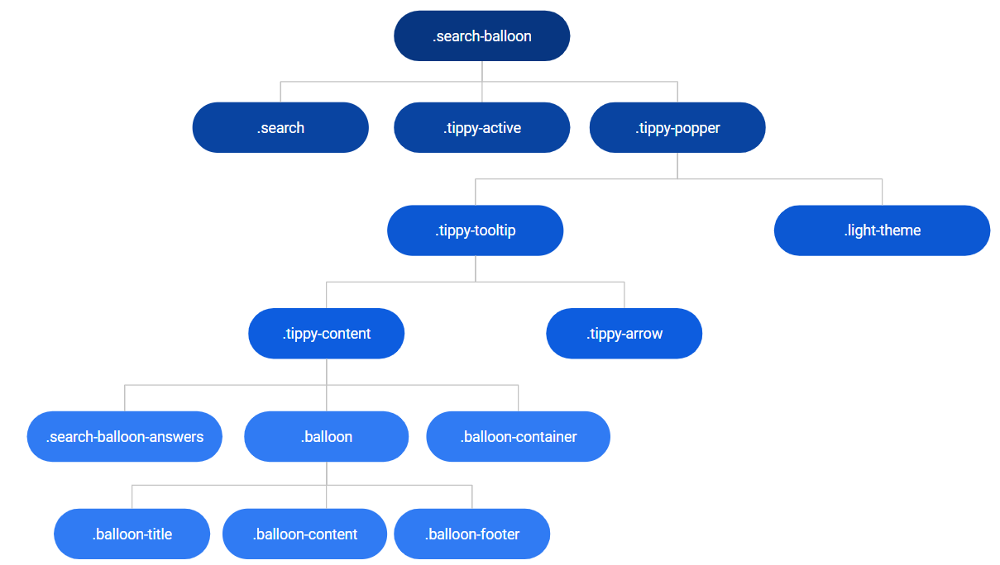
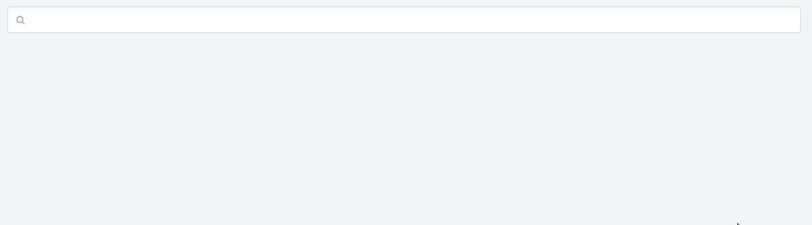

# Balloon Search Reference

Applies only to Traditional Web Apps.

## Layout and classes

## Events

| **Event Name** |  **Description** |  **Mandatory**  |
| ---|---|--- |  
| OnHide | Event triggered once the balloon is hidden.  |  False  |
| OnShow | Event triggered once the balloon is shown.  |  False  |

## Advanced

Here are some more advanced use-cases of the widget.

### Show results on init

1. Drag Search Balloon to the preview.
1. On the AdvancedFormat parameter add the following line:  
`{ showOnInit: true }`.

### Change animation of results

1. Drag Search Balloon to the preview.
1. On the AdvancedFormat parameter add the following line:  
`{ showOnInit: true }`.

