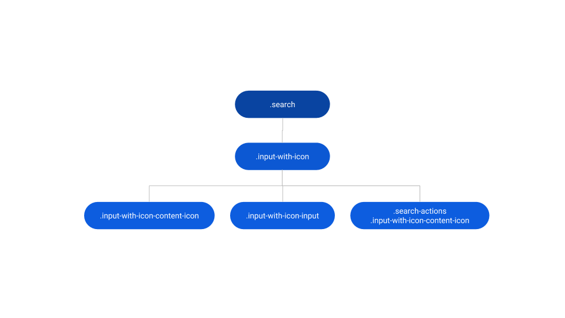
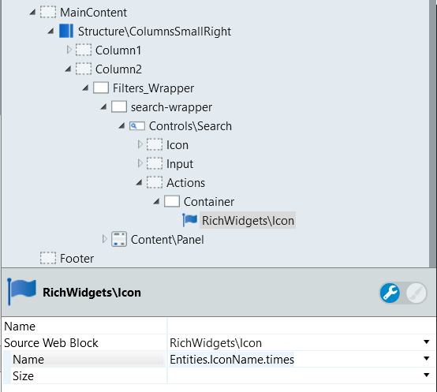
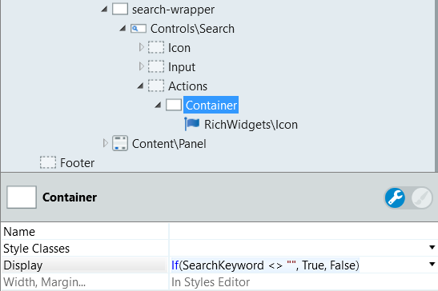
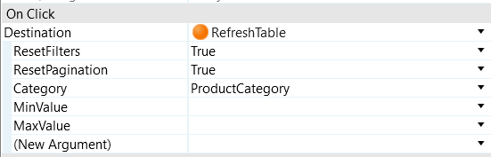

# Search Reference

Applies only to Traditional Web Apps.

## Layout and classes

## Advanced use case

### Make a reset search button

For this example, refer to the [FourColumns Screen Template](https://outsystemsui.outsystems.com/OutSystemsUILiveStyleGuide/FourColumnGallery.aspx).

1. Go to the Search Pattern presented in Column2 inside the Filters_Wrapper container.

1. Drag a container inside the Actions placeholder.

1. Drag a Icon Widget inside that container and choose `Entities.IconName.times` for the Name parameter. This is the X icon.

    

1. In the container, set the Display parameter to `If(SearchKeyword <> "", True, False)`. This uses the already existing SearchKeyword Local Variable and only displays the container if the search input has text.

    

1. Add an OnClick event and set the handler to the RefreshTable action.

1. Set the parameters ResetFilters and ResetPagination to True.

1. In the Category property, set the ProductCategory Local Variable. This way you reset the search input as well as the screen to the default state.

    

1. Publish and test.

    
