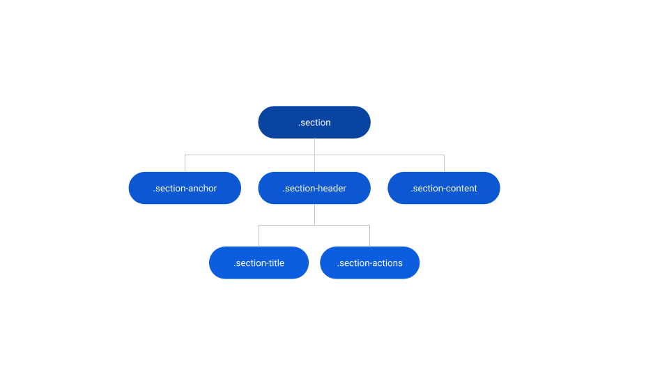
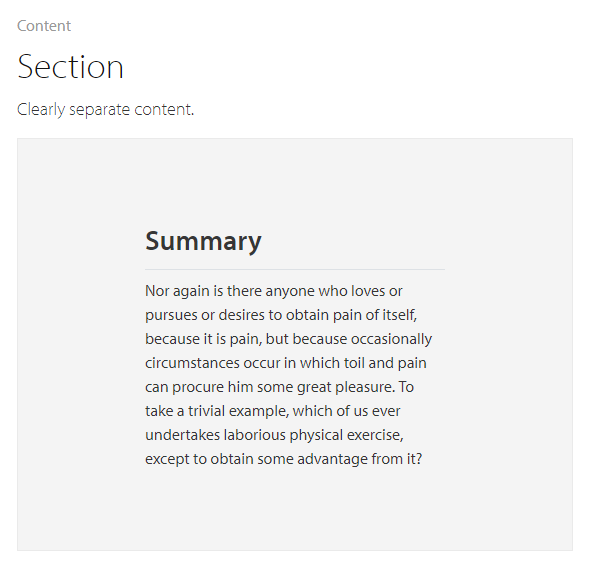
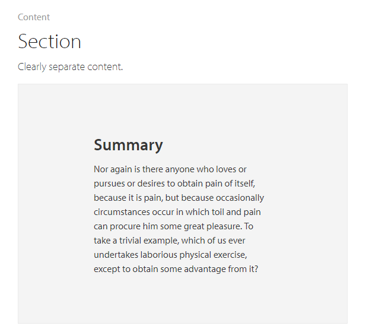

# Section Reference

<div class="info" markdown="1">

Applies only to Traditional Web Apps.

</div>

## Layout and classes



## Advanced use case

### Remove line below title

Write the following CSS in the CSS editor.

 ```css
.section-header {
    border-bottom: none;
    padding-bottom: var(--space-none);
}
```

**Before**



**After**



## Compatibility with other patterns

Works with Section-Index Pattern on the same screen to create navigable anchors.
