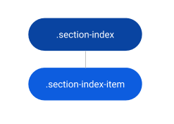

# Section Index Reference

Applies only to Traditional Web Apps.

## Layout and classes

## CSS selectors

| **Element** |  **CSS Class** |  **Description**  |
| ---|---|---  
| .section-index |  .section-index.is--sticky|  Defines if the SectionIndex position is fixed or not  |
| .section-index-item |  .section-index-item.is--active|  Defines the current active link  |

## Advanced use case

### Change active color

1. Write the following CSS in the CSS editor and change the `yourcolor`.

        a.section-index-item.is--active {
            border-left-color: yourcolor;
            color: yourcolor;
        }

1. Or using CSS variables: `var(--color-yourcolor)`.

        a.section-index-item.is--active {
            border-left-color: var(--color-yourcolor);
            color: var(--color-yourcolor);
        }

For RTL compatibility, make sure to also add the following code:

    .is-rtl a.section-index-item.is--active {
        border-right-color: yourcolor;
        color: yourcolor;
    }
