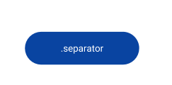
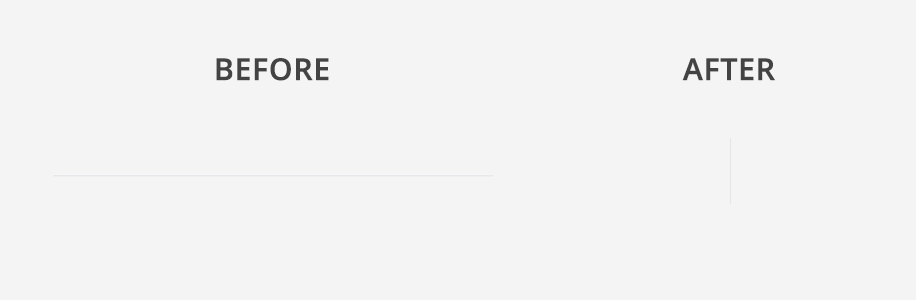

# Separator Reference

Applies only to Traditional Web Apps.

## Layout and classes

## CSS selectors

| **Element** |  **CSS Class** |  **Description**  |
| --- | --- | --- |
| .separator | .separator-horizontal |  When IsVertical parameter is False  |
| .separator | .separator-vertical |  When IsVertical parameter is True  |

## Advanced use case

### Use the vertical separator

1. Drag a container into the preview.

1. Create a class called "separator-height".

        .separator-height {
            height: 100px;
        }

1. Drag the Separator pattern into the container.

1. Set the IsVertical parameter to True.

1. Publish and test.

