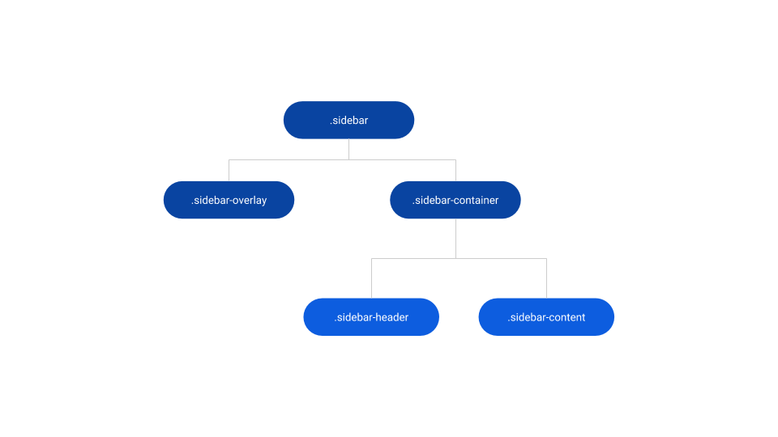

# Sidebar Reference

Applies only to Traditional Web Apps.

## Layout and classes

## CSS selectors

| **Element** |  **CSS Class** |  **Description**  |
| --- | --- | --- |
| .sidebar | .sidebar.is--hidden |  When Sidebar is closed  |
| .sidebar | .sidebar.is--visible |  When Sidebar is open  |
