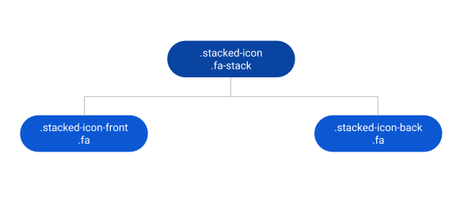
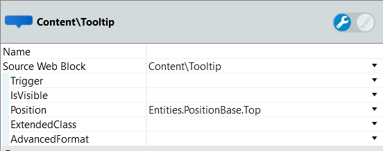
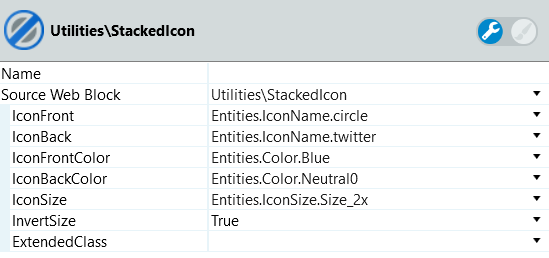
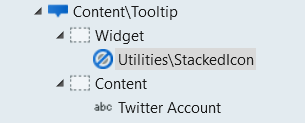

# Stacked Icon UI Pattern Reference

Applies only to Traditional Web Apps.

## Layout and classes

## CSS selectors

| **Element** |  **CSS Class** |  **Description**  |
| ---|---|---
| .stacked-icon  | .fa-2x |  Change the icon size, to 2em  |
| .stacked-icon  | .fa-3x |  Change the icon size, to 3em  |
| .stacked-icon  | .fa-4x |  Change the icon size, to 4em  |
| .stacked-icon  | .fa-5x |  Change the icon size, to 5em  |
| .stacked-icon  | .fa-lg |  Change the icon size, to 1.33333333em  |

## Advanced use case

### Use the Stacked Icon Pattern with a tooltip

1. Drag a Tooltip Pattern into the page.

1. Set the parameters for the Tooltip behavior.

    

1. In the Widget placeholder, drag a StackedIcon Pattern.

1. Set the parameters for the SatckedIcon Pattern.

    

1. In the Content placeholder, from the Tooltip Pattern, set the desired label for the icon.

    

1. Publish and test.

<iframe src="https://player.vimeo.com/video/998188456" width="750" height="417" frameborder="0" allow="autoplay; fullscreen" allowfullscreen="">Video demonstrating the interaction with the Stacked Icon UI Pattern.</iframe>

## Notes

The InvertSize parameter changes the sizes of the back and front icons with each other. This means toggling the `.fa-stack-1x` and `.fa-stack-2x` CSS classes.
