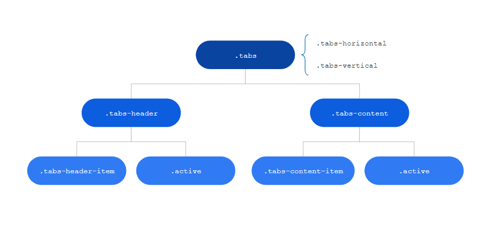
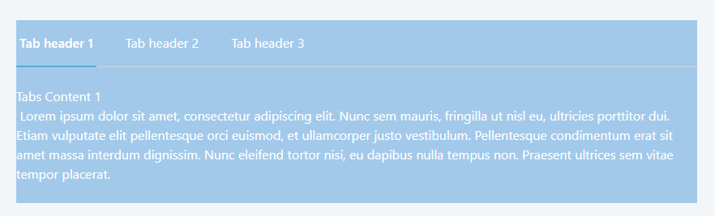

# Tabs Reference

<div class="info" markdown="1">

Applies only to Traditional Web Apps.

</div>

## Layout and classes



## CSS selectors

| **Element** |  **CSS Class** |  **Description**  |
| ---|---|---  
| Active Header |  .tabs-header-item.active |  It's active header (represented as the one with a colored underline)  |
| Active Tab  |  .tabs-content-item.active  |  It's active content  |
  
## Advanced

Here are some more advanced use-cases of the widget.

### Change the active header style

Write the following CSS in the CSS editor and change the `yourcolor` value:

```css
.tabs-header-item.active {
    border-bottom: var( --border-size-m) solid yourcolor;
}
```

Or using CSS variables: `var(--color-yourcolor)`

Example:

```css
.tabs-header-item.active {
    background: border-bottom: var( --border-size-m) solid var(--color-red)
}
```

### Add a background color to the tabs

1. Enclose the tabs with a container.
1. Add the classes `background-blue-lighter text-neutral-0`, this adds a light blue background and force the text to be white.
1. Publish the application.


