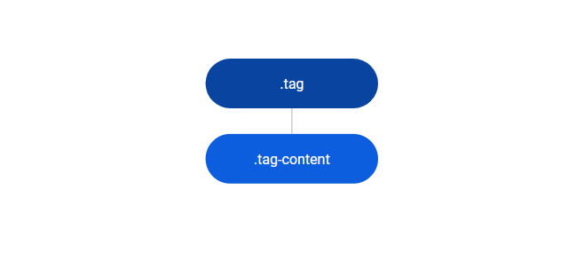
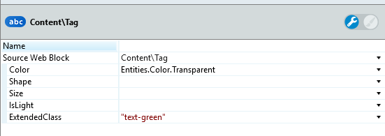
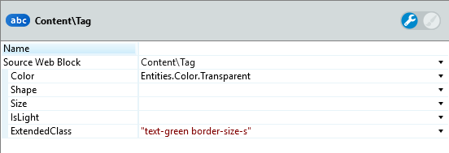
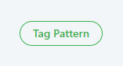

# Tag Reference

Applies only to Traditional Web Apps.

## Layout and Classes

## Advanced use case

### Use only border in Tag Pattern

1. Set the Color parameter to Transparent.

1. In the ExtendedClass property, set the text color.

    

1. Set the border size.

    

1. Publish and test.

    
