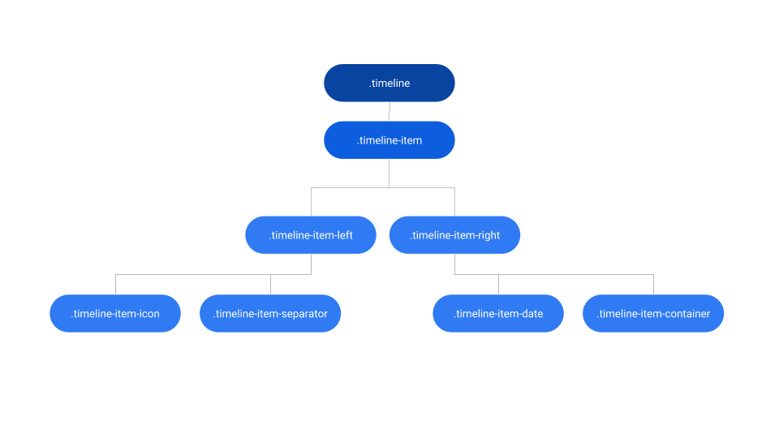
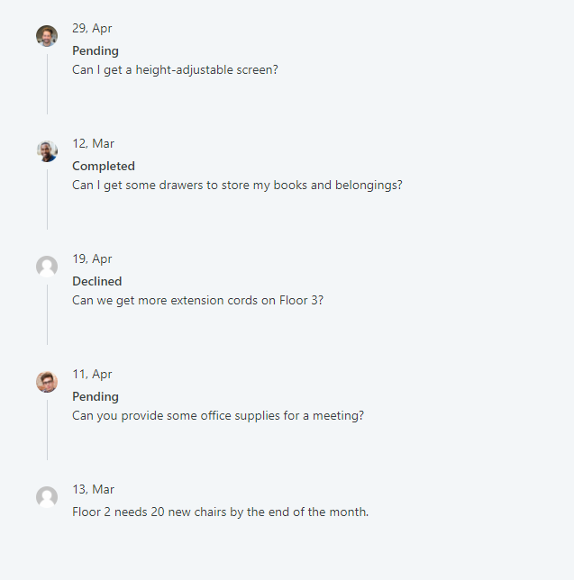

# Timeline Reference

Applies only to Traditional Web Apps.

## Layout and classes

## Advanced Use Case

### Use the Timeline Pattern with ListRecords

1. Drag the Timeline Pattern into the preview.
1. In the Content placeholder, drag a ListRecords widget.
1. In the ListRecords widget, drag a TimelineItem.
1. In the TimelineItem, use expressions to display the database content you need.
1. To disable the vertical line on the last TimelineItem, write the following CSS code in the application Theme:

        .ListRecords .timeline-item:last-of-type .timeline-item-separator {
            display: none; 
        }

1. In the ListRecords Widget, set Line Separator to None to avoid additional margin between elements.

1. Publish and test.

