# Time Picker Reference

Applies only to Traditional Web Apps.

## Layout and Classes

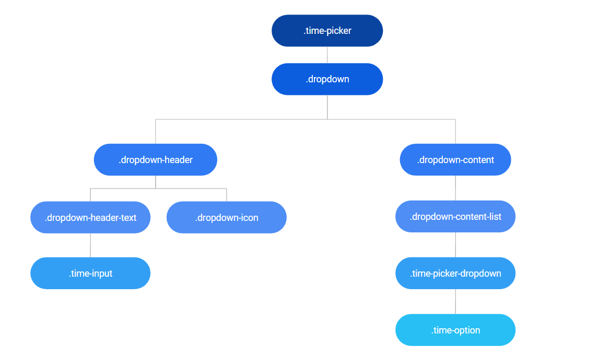

## Events

| **Event Name** |  **Description** |  **Mandatory**  |
| ---|---|--- |  
| OnSelect | Event will be triggered when a time is selected returning it.  |  False  |

## CSS Selectors

| **Element** |  **CSS Class** |  **Description**  |
| ---|---|---
| .time-option | .time-option-selected |  When the time option is selected  |
| .time-option | .time-picker .dropdown-content-list .time-option[disabled="disabled"] |  When the time option is disabled  |

## Advanced Use Case

### Use the OnSelect event

1. Drag the TimePicker pattern into the preview.

    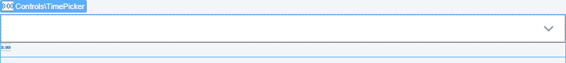

1. Set a variable of type Time to the input.

1. Set the StartTime Parameter to a variable Time.

    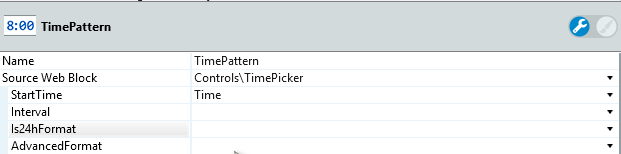

1. In the preparation, set the Time variable to the start time you want for the picker. 

    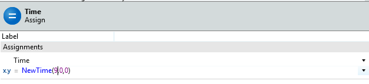

1. Set the OnSelect Event to TimePatternOnSelect.

    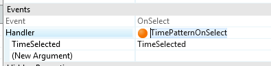

1. In the TimePatternOnSelect action, assign  TimeSelected to the Time variable. 

    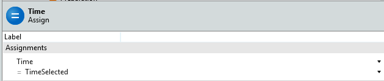

1. Set a Feedback_Message action and show the Timein the message.

1. Create a container Timepicker_Container around the TimePicker. 

    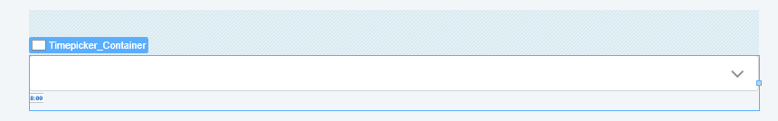

1. In the action TimePatternOnSelect, add an Ajax refresh for the Timepicker_Container.

    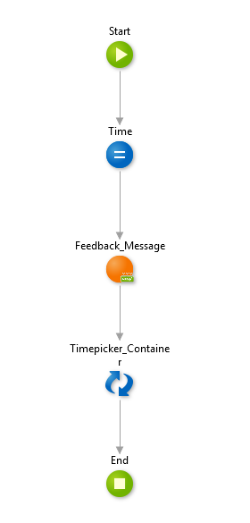

<iframe src="https://player.vimeo.com/video/998212683" width="750" height="388" frameborder="0" allow="autoplay; fullscreen" allowfullscreen="">Video demonstrating interaction with the Time Picker UI component.</iframe>

### Disable specific times

1. Drag the TimePicker pattern into the preview.

    

1. Set a variable of type Time to the input.

1. Click the plus before the AdvancedFormat parameter.

    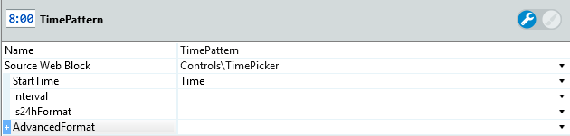

1. Click the plus before the DisabledTimes parameter.

    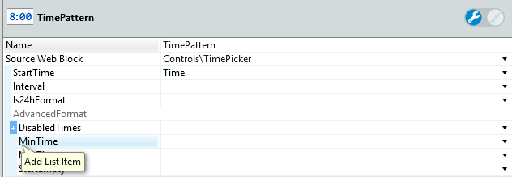

1. Add the times NewTime(4,0,0) and NewTime(7,0,0).

    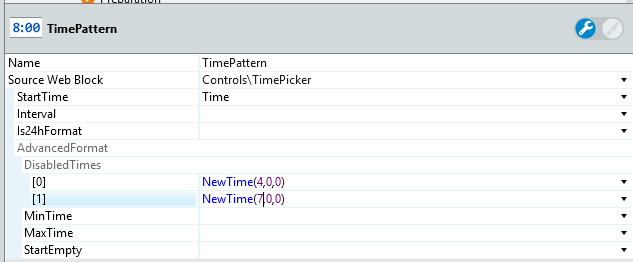

1. Publish and test.

    <iframe src="https://player.vimeo.com/video/998212655" width="750" height="388" frameborder="0" allow="autoplay; fullscreen" allowfullscreen="">Video showing the Time Picker with specific times disabled.</iframe>

### Start Input as Empty

1. Drag the TimePicker pattern into the preview.

    

1. Set a variable of type time to the input.

1. Click the plus before the AdvancedFormat parameter.

    

1. Set the StartEmpty parameter to True.

    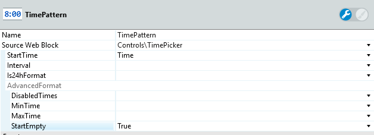

1. Publish and test.

    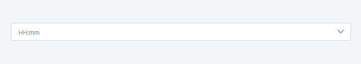
