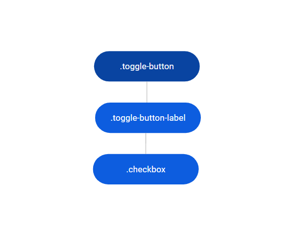
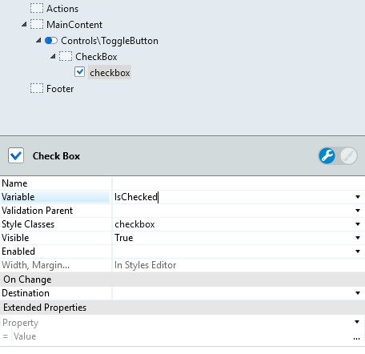
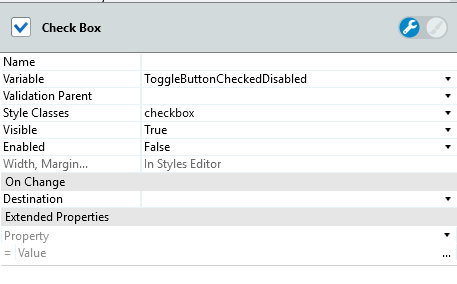
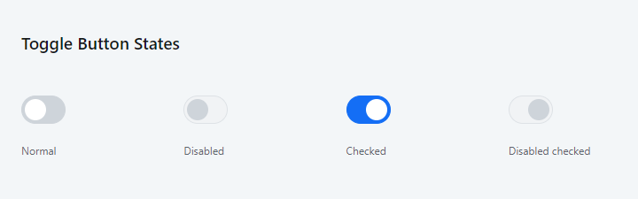

# Toggle Button Reference

Applies only to Traditional Web Apps.

## Layout and classes

## CSS selectors

| **Element** |  **CSS Class** |  **Description**  |
| ---|---|--- |
| .toggle-button | .toggle-button-checked | Is the Class Selector to style the Toggle Button when the Boolean Variable is true |
| .toggle-button | .toggle-button-disabled | Is the Class Selector to style the Toggle Button when is disabled |
| .toggle-button | .toggle-button:after | Is the Pseudo Element Selector to style the circle of Toggle Button |

## Advanced use case

### Disable the Toggle Button pattern

1. Drag the Toggle Button pattern into the preview.

1. Set a variable of type boolean to the checkbox.

    

1. In the Checkbox, set the parameter Enabled to False.

    

1. Publish and test.

    
