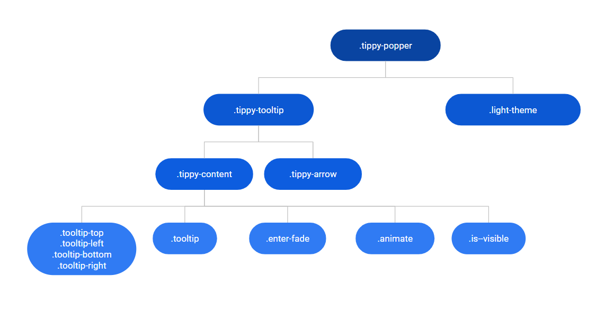

# Tooltip Reference

Applies only to Traditional Web Apps.

## Layout and classes

## Events

| **Event Name** |  **Description** |  **Mandatory**  |
| ---|---|--- |  
| OnHide | Event triggered once the tooltip is hidden.  |  False  |
| OnShow | Event triggered once the tooltip is shown.  |  False  |

## Advanced use case

### Change animation of tooltip

1. Drag a Tooltip to the preview.
1. Set the AdvancedFormat parameter to `{ animation: 'perspective' }`.

    <iframe src="https://player.vimeo.com/video/998227283" width="638" height="118" frameborder="0" allow="autoplay; fullscreen" allowfullscreen="">Video showing the change of animation in a Tooltip component within a traditional web app.</iframe>
