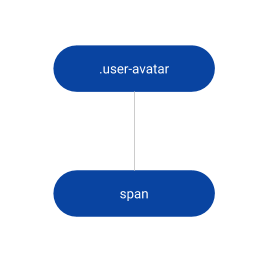
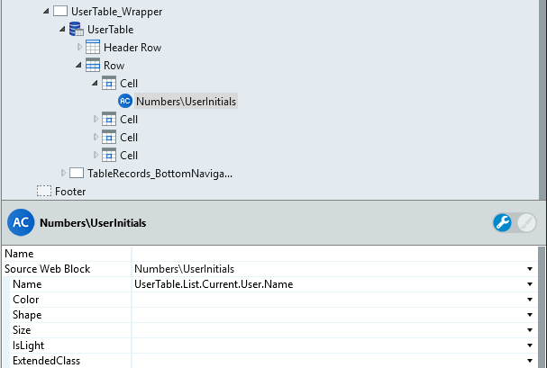
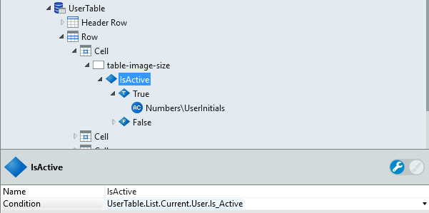
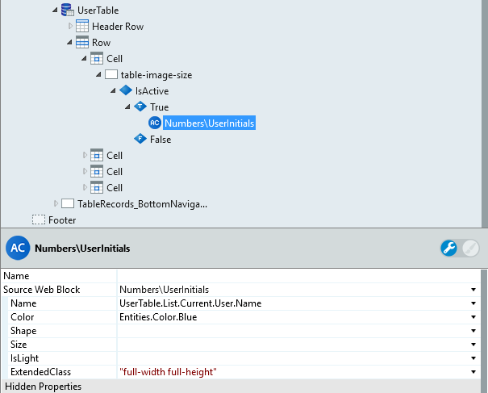
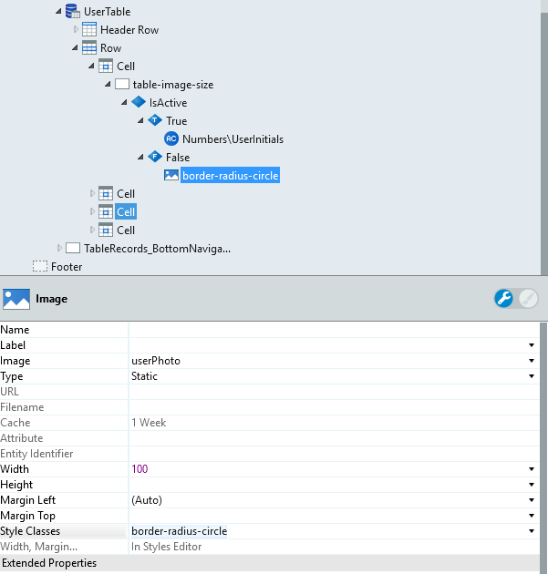
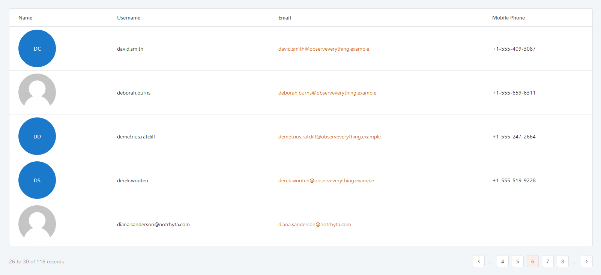

# User Initials Reference

Applies only to Traditional Web Apps.

## Layout and classes

## Advanced use case

### Use the User Initials Pattern with tables

1. Drag the Users table into preview.

1. Remove the expression from the Name and drag the UserInitials pattern to it.

1. In the UserInititals, set the name parameter to the value of the name field from the database.

    

1. Change the pattern values.

1. Publish and test.

### Use the User Initials Pattern with IF conditions

1. Create a custom class called "table-image-size".

        .table-image-size {
            height: 100px;
            width: 100px;
        }

1. Drag the Users Entity into the preview.

1. Remove the expression from the Name and drag a container into the cell.

1. Drag an IF condition tool into the container and set the condition to `UserTable.List.Current.User.Is_Active`.

    

1. In the True branch, drag the UserInitials pattern and set the name parameter to the value of the name field from the database.

1. To adapt the UserInitials to the size of container, set the ExtendedClass parameter to `full-width full-height`.

    

1. In the False branch, drag an image and set the Style Classes to  `border-radius-circle`.

    

1. Publish and test.

    
