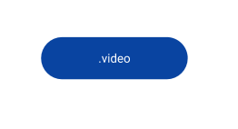
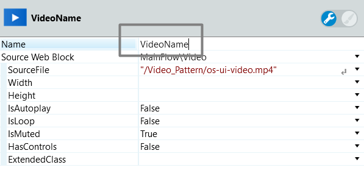
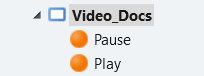
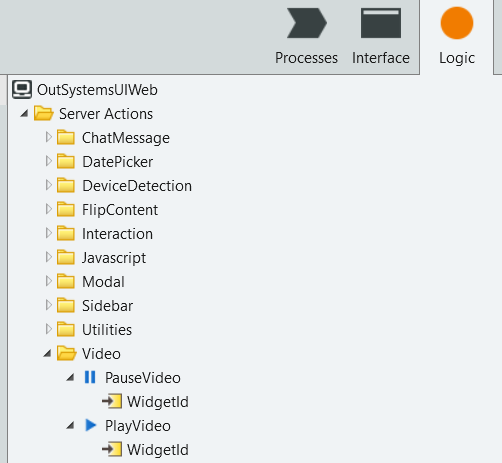
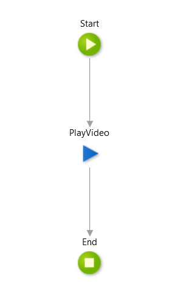
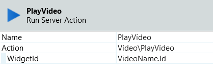
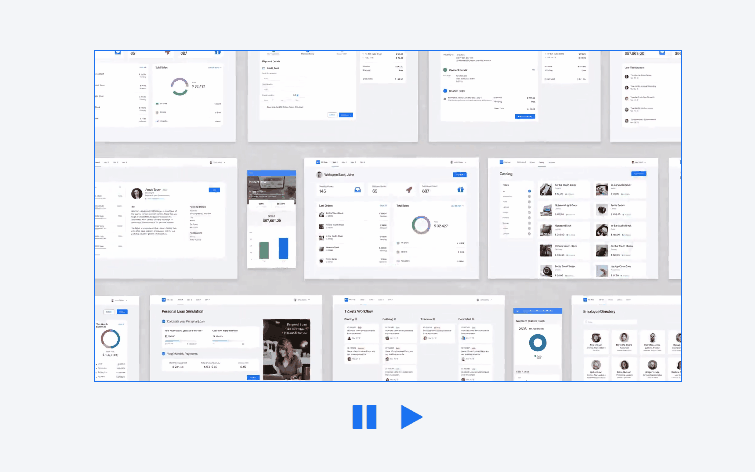

# Video Reference

Applies only to Traditional Web Apps.

## Layout and Classes

## Advanced Use Case

### Use custom Play and Pause buttons

1. Set a name to the Video pattern.

    

1. Create Play and Pause actions on the screen.

    

1. In the Logic tab, click on the OutSystems UI Web to go to the Video Folder.

    

1. Drag the PlayVideo and PauseVideo actions inside the Play and Pause actions you created.

    

1. For each server action, set the WidgetId parameter to the name of the Video pattern.

    

1. Create the elements you want to act as buttons. You can also wrap icons around containers and set the OnClick to the Play and Pause actions.

1. Publish and test.

    
