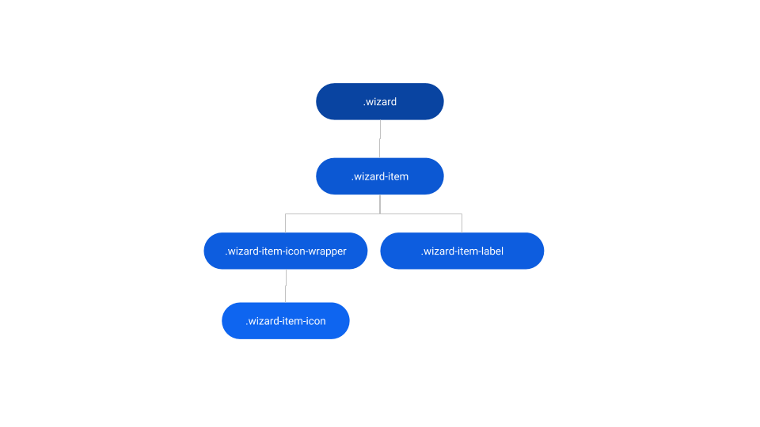
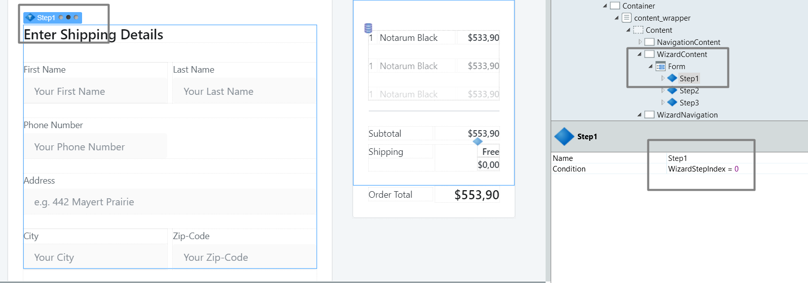
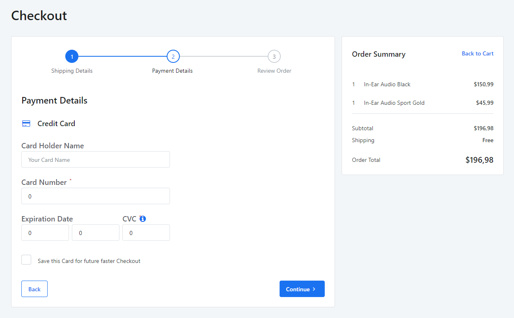
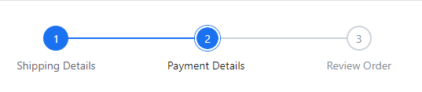

# Wizard Reference

Applies only to Traditional Web Apps.

## Layout and classes

## CSS selectors

| **Element** |  **CSS Class** |  **Description**  |
| ---|---|--- |
| .wizard |  .wizard.wizard-vertical|  When the wizard orientation is vertical  |
| .wizard-item |  .wizard-item.active|  Defines the current active step  |
| .wizard-item |  .wizard-item.past|  Defines the previous step  |
| .wizard-item |  .wizard-item.next|  Defines the next step  |

## Advanced use case

### Use the Wizard Pattern with ListRecords

1. Drag the Wizard Pattern into the screen.

1. In the Content placeholder, drag a ListRecords widget.

1. Set the Line Separator parameter of the ListRecords to None.

1. In the ListRecords widget, drag a WizardItem Pattern.

1. In the WizardItem Pattern, use expressions to display the database content you need.

1. Publish and test.

### Create a wizard navigation

Use this example to create a three steps Wizard with continue and back buttons.

1. Drag the Wizard Pattern into the page. By default, it comes with three WizardItems.

1. Create a Local Integer Variable, named WizardStepIndex, to hold the current Wizard step.

1. Drag two Button widgets and set their names to Continue and Back.

1. Create a new Screen Action named WizardNavigation.

    

1. Create a mandatory boolean Input Parameter on this action named IsNext.

1. Drag an Assign and set WizardStepIndex, to `If(IsNext, WizardStepIndex + 1, WizardStepIndex - 1)`.

    

1. Drag an AjaxRefresh to refresh your content container on the screen.

1. Set the OnClick of the Continue Button to the action WizardNavigation with Ajax Submit as the Method. Set the IsNext parameter to True.

1. Do the same for the Back button, but set the parameter to False.

    

1. In each WizardItem, add this If condition: `If(WizardStepIndex = 1, Entities.Step.Active, If(WizardStepIndex = 0, Entities.Step.Next, Entities.Step.Past))` to the Step parameter.

1. Wrap the content containers in Ifs and set the condition to the respective step.

      
    

### Custom style for active step

To implement this, you can use either method described below.

* Write the following CSS in the CSS editor and change the `yourcolor`.

        .wizard-item.active .wizard-item-icon {
            border: 2px solid #fff;
            background-color: yourcolor;
            color: #fff;
        }

        .wizard-item.active .wizard-item-icon::after {
            background-color: transparent;
            border-radius: 50%;
            border: 2px solid #fff;
            box-shadow: 0 0 0 1px yourcolor;
            content: '';
            height: 100%;
            position: absolute;
            width: 100%;
        }

* Use CSS variables like `var(--color-yourcolor)`.

        .wizard-item.active .wizard-item-icon {
            border: 2px solid var(--color-neutral-0);
            background-color: var(--color-yourcolor);
            color: var(--color-neutral-0);
        }

        .wizard-item.active .wizard-item-icon::after {
            background-color: transparent;
            border-radius: 50%;
            border: 2px solid var(--color-neutral-0);
            box-shadow: 0 0 0 1px var(--color-yourcolor);
            content: '';
            height: 100%;
            position: absolute;
            width: 100%;
        }

    
