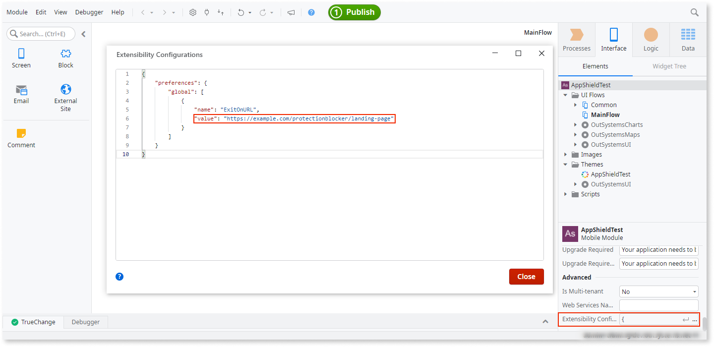

# Configuring an exit URL for a blocked app

<div class="info" markdown="1">

Applies only to Mobile Apps.

</div>

If an app with the AppShield security plugin detects modification or tempering, the app shuts down. You can use the AppShield **ExitOnURL** configuration to inform the user of the reason. The **ExitOnURL** lets you define an **Exit URL** that the app opens in the default browser. It also lets you explain the issue to the app users.

## Prerequisites

Before beginning, make sure that:

* You're working with mobile apps
* You have a licensed copy of AppShield
* You are working with an AppShield version 1.4.0 or above
* You prepared a landing page to which you redirect the user if AppShield blocks the app

<div class="info" markdown="1">

If the app shuts down due to security concerns, it loads the URL only if you configure the `ExitOnURL` value.

</div>

## Define and enable your exit URL

To enable the `ExitOnURL` feature, first copy the JSON code snippet below and continue with the following steps:

```javascript
{
    "preferences": {
        "global": [
            {
                "name": "ExitOnURL",
                "value": "https://example.com/protectionblocker/landing-page"
            }
        ]
    }
}
```

1. From **Service Studio** go to the **Interface** tab, select the app name, and click **…** on the right side of the **Extensibility Configuration** field.

   This opens the **Extensibility Configuration** window.

1. To define the `ExitOnURL` property as a new global preference, paste the JSON code snippet into the window.

    

1. In the `ExitOnURL` value string replace `example.com` with the correct domain name and `landing-page` with the path and name that suits your needs. A typical **Exit URL** may be `https://example.com/errors/protectionblocker/why-cant-i-use-my-app`. Then click **Close**.

    <div class="info" markdown="1">

    The **Exit URL** value must not contain any URL parameters. For example, appending `&param=1` to the **Exit URL** value prevents the app from loading the page.

    </div>

1. Design your landing page to display an informative message, such as the following example for a bank app:

    _Your app shut down. It's a security feature designed to protect your data and money. We suggest scanning your phone, and, in the meantime, please use our web portal._

## Enhance the Exit URL experience for your users

When AppShield blocks an app it generates query parameters that you may use to present the user with a comprehensive explanation as to why the app closed.

For example, a landing page for a blocked Android device might be something like the following:

`https://example.com/errors/protectionblocker/why-cant-i-use-my-app?reason=6&manufacturer=Google&model=Pixel4a&ANDROID=31`

You may incorporate these generated query parameters into your informative message.

_We're sorry! We had to shut your app down because we detected native code hooks, possibly inserted by a malicious app, on your Android Pixel device. This is a security feature designed to protect your data and money. We suggest scanning your phone, and, in the meantime, please use our web portal._


## Considerations

AppShield can't guarantee that the **Exit URL** page loads in all instances if an attacker is probing the app's defenses.
For example, attempting to attach a debugger to the application causes AppShield to shut the application down and open the configured **Exit URL**.
There are, however, several ways that the attacker can prevent this page from opening in the main browser, such as putting the device in flight mode. If this happens, the users may not be aware of what's happening.
So you can't assume that such hacking attempts are reported and seen on the server.

The **Exit URL** event doesn't provide precise metrics of security issue events since a single user can trigger multiple **Exit URL** events.
This feature is primarily designed to provide useful feedback to the end user about why the application stopped working rather than a reliable reporting mechanism for the app owner.

The app loads **Exit URL** in the default browser and may remain in an open tab or window until the user closes it. This may cause a number of effects, including the following:

* The **Exit URL** page may cause the browser to trigger additional page loads of the configured URL when the user launches the browser later.
* The **Exit URL** page, when it appears as the user clicks the back button or flips through the various browser tabs or windows, may lead to misleading statistics if you are tracking page views on your server.

## Reference

More information about the AppShield and the Exit URL configuration.

### AppShield query parameters

The app includes the following parameter information in the generated **Exit URL**.

| Query Parameter | Description                                                                                 |
| --------------- | ------------------------------------------------------------------------------------------- |
| %reason%        | The reason for the shutdown, in decimal. Refer to [Troubleshooting AppShield Crashes](troubleshooting.md#shutdown-reasons) for explanations of these values. |
| %manufacturer%  | The manufacturer of the device                                                              |
| %model%         | The model name of the device                                                                |
| %android%       | The Android API level of the device                                                         |
| %ios%           | The iOS API level of the device                                                             |
