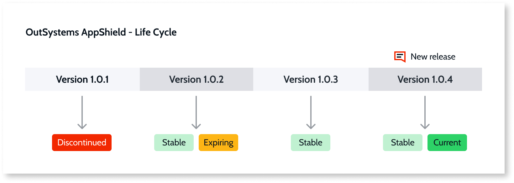
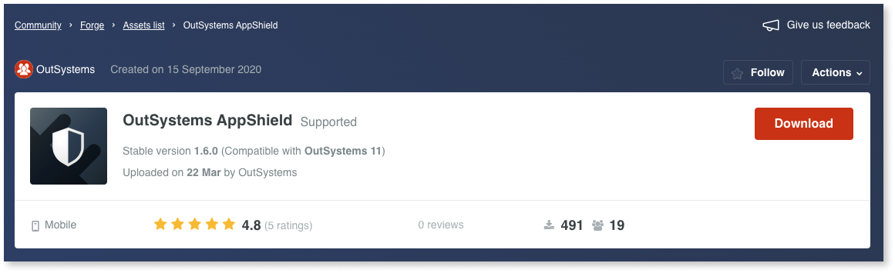
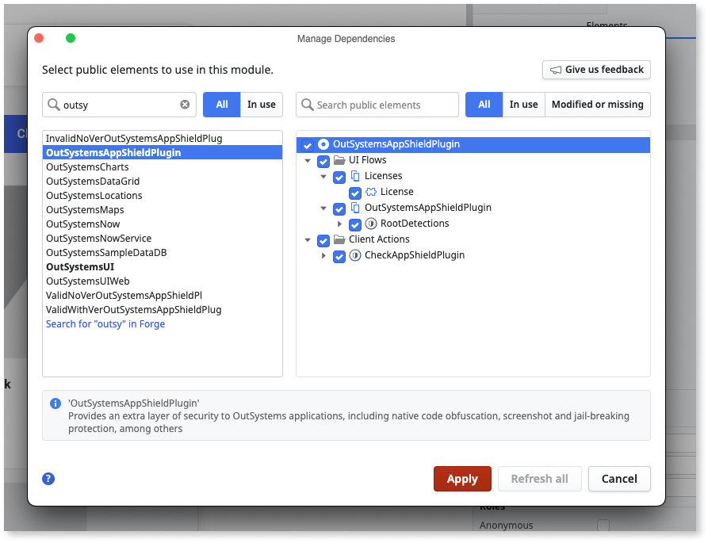
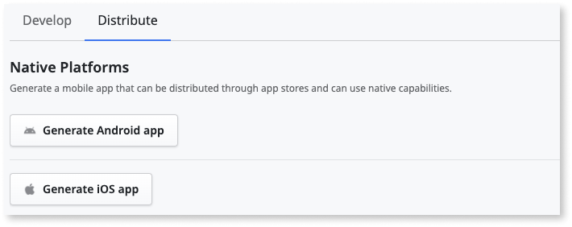
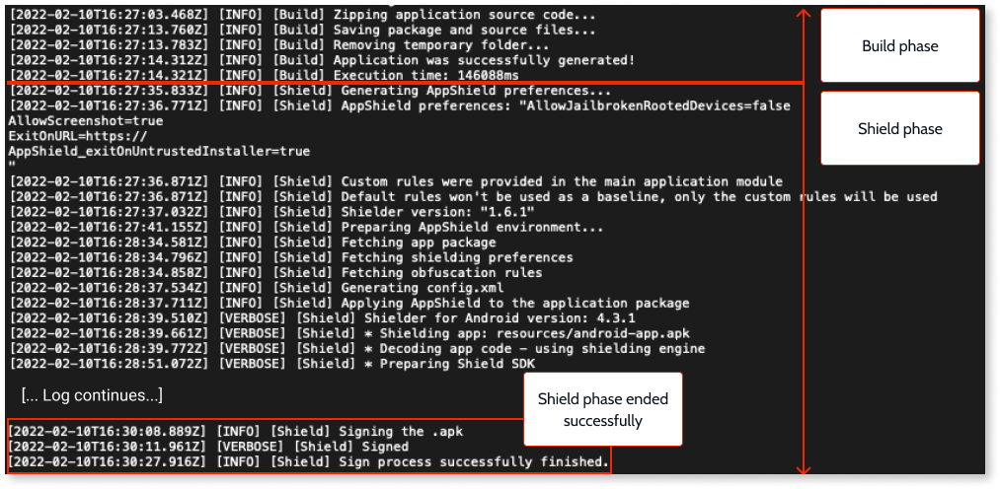

# Harden the protection of mobile apps with AppShield

<div class="info" markdown="1">

Applies only to Mobile Apps.

</div>

**OutSystems AppShield** is a licensed plugin available from the **Forge**. **AppShield** lets you harden the protection of your native Android and iOS apps. **AppShield** integrates with the Mobile Apps Build Service (MABS version 6.3 or later) and adds app protection at runtime and rest.

<div class="info" markdown="1">

To use **OutSystems AppShield**, you must have a license. If you don't already have a license, contact the sales team.

</div>

By using **AppShield**, you can prevent:

* Code from being injected into your app.
* Users from taking screenshots of the data.
* Data from being hijacked.

When the user launches a hardened app, the app performs multiple checks. Some examples of these checks are root and repackaging detection. This makes the app take slightly more time to launch, especially when starting for the first time. The start time varies depending on multiple factors, such as device hardware and app complexity.

To ensure your app users have protection against the latest security vulnerabilities, **OutSystems** provides continuous updates to **AppShield**.

## Understanding the AppShield life cycle

Before you install and use **AppShield**, it's important to understand the release cycle and how it improves security. For example, suppose you have a mobile banking application and your app data must always be secure, but your version of **AppShield** isn't current. OutSystems regularly updates **AppShield** and strongly recommends that you always install the latest version of **AppShield** in your environment. Then release a new build of your app to your users.

To identify the **AppShield** plugin releases, OutSystems uses the following tags:

* Stable
* Current
* Expiring
* Discontinued

The following list describes the tags:

* **Stable and Current** - This is the active version and has up-to-date protection. OutSystems **supports** this version and highly recommends that you install and use this version.
* **Stable** - You can use this version, but the protection isn't current. OutSystems **doesn't support** this version. You can build an app, but you get a warning message when you try to build the app.
* **Stable and Expiring** - This version becomes discontinued in three months. OutSystems **doesn't support** this version, but you can build an app with it. If you use this version, a warning message displays advising you to update to the most current version before the expiration date. Once this version is **discontinued**, you won't be able to build your app with it.
* **Discontinued** - This plugin version is out of date. OutSystems security mechanisms prevent you from creating a new build for your users. OutSystems **doesn't support** this version.

The following diagram shows how release versions work in **AppShield**.



<div class="warning" markdown="1">

To keep your apps and data secure, OutSystems recommends that you always use the current version of the **AppShield** plugin. Go to the [Versions tab of the plugin Forge page](https://www.outsystems.com/forge/component-versions/9379) to get the current version.

</div>

## Prerequisites

To ensure the integrity and protection of your apps with **AppShield**, you must meet the following requirements.

* You have a license for **AppShield**.

* You're using MABS 6.3 or later. 

    For more information about the supported operating systems, see [MABS and mobile operating systems life cycles](https://success.outsystems.com/Support/Release_Notes/Mobile_Apps_Build_Service_Versions).

* The OutSystems Platform Server is running on version 11.

## How to enable AppShield on your mobile apps

To protect your mobile app using the AppShield plugin, follow these steps:

1. **Install the AppShield** plugin in your environment.
    
    To download the plugin, go to [OutSystems AppShield](https://www.outsystems.com/forge/component-overview/9379/) in Forge.

    

1. **Add the dependencies for AppShield** plugin on each mobile app you want to protect.

    

1. **Generate and distribute a new mobile package** protected with AppShield.

    

Note the following:

* All AppShield capabilities, except [Screen reader](protection-features-description.md#android-screen-reader), [Keylogger](protection-features-description.md#keylogger-protection), [Tapjacking](protection-features-description.md#tapjacking-protection), and [Private space](protection-features-description.md#private-space-detection) detection are enabled by default.
* If any additional configuration is needed, go to the [Configuration](#configuration) section.
* The app file size increases after hardening the security.
* MABS takes more time to create a hardened build.

<div class="info" markdown="1">

To learn more about adding mobile plugins to your app, see [Adding plugins](../../integration-with-systems/mobile-plugins/intro.md#adding_plugins).

</div>

## Supported features

These are the features you can use with the current release of the **AppShield** plugin.

### Android

Protections that are available for Android builds.

* Root detection
* Repackaging detection
* Code obfuscation
* Code injection protection
* Debugger protection
* Emulator detection
* Key logger protection
* Screen reader detection
* Untrusted keyboard detection
* Screenshot protection
* Task hijacking protection
* Tapjacking protection
* Private space and work profile security enforcement

### iOS

Protections that are available for iOS builds.

* Jailbreak detection
* Repackaging detection
* Code injection protection
* Debugger protection
* Screen mirroring detection
* Screenshot protection

## Configuration

**AppShield** is on by default when you install the plugin. You can turn it off in one or more environments for testing purposes.

* To turn off **AppShield** in one or more environments, edit the **Extensibility Configuration** settings in **LifeTime** for the environment. Disabling the plugin in the development environment, for example, lets you run the app in emulators or debug the app.

* To turn off **AppShield** globally, edit the **Extensibility Configuration** settings **in Service Studio**. **LifeTime** copies configuration from **Service Studio** to other environments during deployment.

<div class="info" markdown="1">

When working with **AppShield** JSON for extensibility configuration, keep in mind:

* Specific settings in **Extensibility Configuration** override global extensibility configuration settings.
* **Extensibility Configuration** settings in LifeTime override the extensibility configuration in **Service Studio**.

</div>

Here is an example of the JSON for **Extensibility Configurations**. You can use different sections for iOS and Android.

```
{
    "preferences": {
        "global": [
            {
                "name": "DisableAppShielding",
                "value": "false"
            },
            {
                "name": "AllowJailbrokenRootedDevices",
                "value": "false"
            },
            {
                "name": "ExitOnURL",
                "value": "https://example.com/protectionblocker/landing-page"
            }
        ],
        "android": [
            {
                "name": "AllowJailbrokenRootedDevices",
                "value": "true"
            },
            {
                "name": "AllowPrivateSpace",
                "value": "false"
            },
            {
                "name": "AllowTapjacking",
                "value": "false"
            },
            {
                "name": "AllowScreenshot",
                "value": "false"
            },
            {
                "name": "BlockUntrustedKeyboards",
                "value": "true"
            },
            {
                "name": "BlockUntrustedScreenreaders",
                "value": "true"
            }
        ],
        "ios": [
            {
                "name": "AllowJailbrokenRootedDevices",
                "value": "true"
            },
            {
                "name": "AllowScreenshot",
                "value": "false"
            }
        ]
    }
}
```

### Configuration reference

These are the values available in the **AppShield** configuration JSON.

| Configuration                   | Type         | Default Value | OS           | Description                                                                                       | 
| ------------------------------- | ------------ | ------------- | ------------ | ------------------------------------------------------------------------------------------------- |
| AddTrustedKeyboardSigner        | Text         |               | Android      | If BlockUntrustedKeyboards is set to True, this option can whitelist a third-party keyboard. This option must be added for each keyboard software that you want to add to the whitelist. |
| AddTrustedScreenReaderSigner    | Text         |               | Android      | If BlockUntrustedScreenreaders is set to True, this option can whitelist a third-party screen reader. This option must be added for each screen reader software that you want to add to the whitelist. |
| AllowJailbrokenRootedDevices    | Boolean      | false         | iOS, Android | If set to True, users can run the app on the jailbroken devices.                            |
| AllowPrivateSpace               | Boolean      | true          | Android      | If set to false, the application is blocked from running if the application was started from a private space or a work profile.                                      |
| AllowScreenshot                 | Boolean      | false         | iOS, Android | If set to True, users can take screenshots of the app.                                      |
| AllowTapjacking                 | Boolean      | true          | Android | If set to false, the application will detect tapjacking attempts and remove the malicious overlay entirely for apps running on Android 12 and above or block inputs to the overlay for versions below Android 12.                                       |
| ApplicationSignerCertificate    | Text(Base64) |               | iOS, Android | Adds the given certificate to the accepted signers whitelist of the final package. This option must be added for each certificate that you want to add to the whitelist.|
| AppShieldObfuscationRules       | Text(base64) |               | iOS, Android | Custom rules for obfuscation. See [Creating custom obfuscation rules](obfuscate-custom-rules.md). |
| BlockDeveloperMode              | Boolean      | false         | iOS, Android | If set to True, the application is blocked from running on iOS devices that have Developer Mode enabled and Android devices with Developer Options unlocked.                                           |
| BlockUntrustedKeyboards         | Boolean      | false         | Android      | If set to True, untrusted keyboards are detected and blocked.                                           |
| BlockUntrustedScreenreaders     | Boolean      | false         | Android      | If set to True, untrusted screen readers are detected and blocked.                                      |
| DisableAppShielding             | Boolean      | false         | iOS, Android | Activates or deactivates App Shield.
| ExitOnURL                       | URL value    |               | iOS, Android| If an app feature is blocked due to a configured policy of the **AppShield** plugin, the default browser opens the URL where the problem may be explained. For more information, refer to ExitOnURL. |
| RemoveQueryAllPackagesPermission | Boolean | true (false for versions below 1.5.1) | Android | If set to True, it removes the app's ability to check other installed applications. For more information, see [here](query-all-packages.md). |
| android                         | JSON value   |               | Android      | The key denoting values that apply to Android devices. |
| global                          | JSON value   |               | iOS, Android | Settings in this section apply to both Android and iOS builds.|
| ios                             | JSON value   |               | iOS          | The key denoting values that apply to iOS devices.|

## Check if app with AppShield builds successfully

To ensure that your build passed the shield phase, check your [app’s build logs](../../deploying-apps/mobile-app-packaging-delivery/generate-distribute-mobile-app/intro.md#download-mobile-app-build-logs).

When you trigger a build with AppShield enabled and correctly configured, MABS includes a **shield phase** while generating the app's mobile package.

The shield phase occurs after the build phase, and a message at the end of the log file lets you know if the shield phase is successful.



## Obfuscation

The limitations that are specific to the obfuscation.

* The plugin obfuscates only the supported **OutSystems** mobile plugins.
* The plugin obfuscates native Android logs in Service Center. You need to use an external tool to deobfuscate the logs.
* JavaScript files obfuscation isn't supported.
* Native iOS bitcode obfuscation isn't supported.
* You need to contact Support to get the mapping files.

## Whitelist signing certificates

One of the security features of **AppShield** is repackaging detection, which prevents the re-signing of the app package.
However, there are some situations where a re-signing of the application is desired and/or required (for example, the Google Play App Signing is required when uploading .aab to the Google Play Store).
For those reasons, **AppShield** allows to whitelist certificates, so that a given signature is considered safe within the repackaging security analysis.

### How to obtain the signing certificate { #obtain-the-signing-certificate }

#### For iOS

If you have the **PKCS12 file**, do the following:

1. Run the command `keytool -storetype PKCS12 -keystore <pkcs12-file> -storepass <store-pass> -alias <alias> -exportcert -rfc > certificate.pem`. You should now have a **certificate.pem** file. An alternative is to run the command `openssl pkcs12 -in <pcks12-file> -nokeys -password pass:<password> -out certificate.pem`. Depending on the certificate and the openssl version, the `-legacy` option might be required.

1. Open the **certificate.pem** file in a text editor and copy the content between **-BEGIN CERTIFICATE-** and **-END CERTIFICATE-**.

#### For Android

If you have the **Keystore file**, do the following:

1. Run the command `keytool -keystore <keystore-file> -storepass <store-pass> -alias <alias> -exportcert -rfc > certificate.pem`. You should now have a **certificate.pem** file.

1. Open the **certificate.pem** file in a text editor and copy the content between **-BEGIN CERTIFICATE-** and **-END CERTIFICATE-**.


If the signing certificate is the **App Signing Certificate** from the Google Play App Signing feature, do the following:

1. From Google Play Console download the **App Signing Certificate** available in the **App Signing** fragment.

1. Convert the **.der** file to **.pem** by running the command `openssl x509 -inform der -in deployment_cert.der -out certificate.pem`. You should now have a **certificate.pem** file.

1. Open the **certificate.pem** file in a text editor and copy the content between **-BEGIN CERTIFICATE-** and **-END CERTIFICATE-**.

### How to whitelist the signing certificate

You can whitelist signing certificates using the `ApplicationSignerCertificate` preference. The value of the preference must be the signing certificate obtained by following the steps in the [How to obtain the signing certificate](#obtain-the-signing-certificate) section.

The `ApplicationSignerCertificate` preference can be specified multiple times. Each certificates provided in the value of that preference will be whitelisted by AppShield. This means that AppShield will detect applications signed with any of those certificates as secure.

With the `ApplicationSignerCertificate` feature, the certificate of the keystore provided to MABS is also whitelisted. This means that the app retrieved from MABS can be directly installed on any device (because the application will be signed with a trusted certificate).

In the **Android and/or iOS section** of the [Extensibility Configurations JSON](../../deploying-apps/mobile-app-packaging-delivery/customize-mobile-app/extensibility-configurations-json-schema.md), add the **name** with `ApplicationSignerCertificate` and the **value** with the public key. Here is an example:
```json
{
    "preferences": {
        "android": [
            {
                "name": "ApplicationSignerCertificate",
                "value": "[public-key-certificate]"
            }
        ],
        "ios": [
            {
                "name": "ApplicationSignerCertificate",
                "value": "[public-key-certificate]"
            }
        ]
    }
}
```

After these changes steps, generate a new build of your mobile app.

## Limitations { #limitations }

**AppShield** has the following limitations:

* After MABS creates a build with the **AppShield** plugin active and signs the build, you can't sign that build again manually because the app would recognize that as a sign of tampering.
