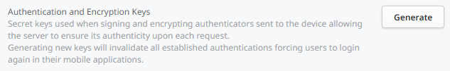

# Configure app authentication

Applies to Mobile Apps and Reactive Web Apps only

The document is about configuring app authentication in the environment. There's also information about the authentication mechanism, including the explanation about cookies.

## Configure app authentication Settings

The setting **Single sign-on between app types** (SSO) is available in Platform Server 11.8 and later.

OutSystems authentication mechanism is configurable per environment to meet different security requirements.

You can configure general authentication settings and also specific settings for persistent and session authentication.

The following setting applies to both persistent and session authentication:

* **Cache Time In Minutes** – Number of minutes the authentication information sent by the device is considered valid by the server without the need to fetch it from the database. After this time, the server validates the authentication tokens against the information stored in the database and supplies new authentication tokens. Setting it to 0 disables the authentication cache mechanism.

* **Single Sign-On Between App Types** – When activated, this option lets users navigate between Traditional, Reactive Web apps, and Mobile Apps distributed as Progressive Web apps without having to sign in again. For example, if users sign in into a Traditional Web App, and then navigate to a Reactive Web App, they’re signed in automatically in the Reactive Web App. To activate the **Single Sign-On Between App Types** setting, you must enable HTTPS in the environment.

**Note**: For Traditional Web Apps, you must log in again once the session times out. For more information, see [Troubleshoot SSO sessions for Traditional Web Apps](https://success.outsystems.com/support/troubleshooting/application_development/troubleshoot_sso_sessions_for_traditional_web_apps/). 

The **Single Sign-On Between App Types** is not turned on by default. See below the instructions for turning it on.

The following settings are used for persistent authentication: 

* **Max Idle Time** – The maximum number of days a user stays logged in (in the server) without communicating with the server. After this time passes, the user needs to log in again if the application goes online (connects to the server).

* **Cookie Expiration** – The maximum number of days a user stays logged in (in the application) without communicating with the server. After this time the cookie expires and the application needs to go online (connect to the server) and the user needs to log in again.

The following setting is used for session authentication:

* **Max Idle Time** – Number of minutes between server calls that a user authentication is recognized by the server as being valid.

To configure the authentication settings for apps in your OutSystems environment, do the following:

1. Go to the Service Center management console of your OutSystems environment.

2. Go to the **Administration** section and select the **Security** tab.

3. Select the **Applications Authentication** area:

     

In this page you can also generate new keys for authenticating and encrypting cookie values. This will force all the users of your apps to login again in the next server request. To generate new keys, press the Generate button in Authentication and Encryption Keys area:

## Authentication Types

The server handles the authentication cookies according to the type of authentication. There are two types of authentication:

* **Session authentication** – The authentication cookies are destroyed when the end user closes the app.
* **Persistent authentication** – The authentication cookies persist across multiple application starts.

The developer specifies the authentication type in the `RememberLogin` parameter when calling the action `User_Login` to login the users.

## Authentication Cookies

When the end user logs in, the server sends two authentication cookies to the app. These cookies let the end user to be authenticated in the subsequent server requests. This section describes the two cookies used in the authentication mechanism of an OutSystems app.

Cookie `nr1<User Provider Name>`:

* The server uses the cookie to enforce session expiration as needed.
* Contains information needed to ensure session authenticity.
* Its **HttpOnly** flag is set to **true** and the cookie can't be accessed through JavaScript.

Cookie `nr2<User Provider Name>`:

* Provides information to the application code about the user identifier via the built-in function **GetUserId**.
* Contains information needed to avoid CSRF attacks.
* Its **HttpOnly** flag is set to **false** and the cookie can be accessed through JavaScript. **Don't change the HttpOnly flag of the nr2 cookie to true, as that can cause unexpected behavior of the apps**. 

### Verifying Authentication Cookies

When executing a server call, the app sends the authentication cookies to the server, with a CSRF token in the X-CSRF-Token request header.

The server validates the request by checking the following conditions:

1. The request includes the X-CSRF-Token header.
2. The request contains the two authentication cookies.
3. Cookies information is authentic and was not forged.
4. Login expiration period has not been reached.

If all conditions apply, the server authenticates the request as coming from the user identified in the cookies, otherwise the server processes the request as if it was coming from an anonymous user or fails in case of tampering.

### Authentication Cache

The authentication mechanism for apps includes caching capabilities to avoid the overhead of validating and updating authentication information in the database upon each request. Within a defined period of time the server uses the information stored in the cookies to authenticate the requests of an authenticated session, instead of retrieving the authentication information from the database. 

Requests reaching the server within the Cache Time period don't extend the login expiration, as shown in the previous diagram. For example, with a session Max Idle Time of 10 minutes and a Cache Time of 5 minutes, any request reaching the server less than 5 minutes after the login doesn't extend the session expiration. If the user doesn't interact with the application after minute 5, the session expires at minute 10. Only the first request after the 5-minute period will extend the session expiration by another 10 minutes.

Keep this behavior in mind when the session Max Idle Time is low or when Max Idle Time and Cache Time values are very close. We recommend keeping the Cache Time value as a low fraction of Max Idle Time (for example, 20 %) to minimize the perception of this behavior.

### Logging out of the application

When an end user logs out of an app, all sessions are terminated. This prevents any invalid persistent authenticated session from staying alive.

When the single sign-on between app types (SSO) is configured, if the end user logs out of a Reactive or Mobile app, all Traditional web apps in the same browser scope, regardless of the user provider, are also be logged out.

The following are some example scenarios that have the same browser scope:

* Reactive, Mobile, and Traditional apps using the same user provider.
    
    * A logout in one of the apps will log out all of the apps

* Reactive or Mobile apps using the same user provider (for example, Users), and Traditional apps using a different user provider (for example, ServiceCenter).
    
    * A logout in an app with the user provider Users will cause the session in apps with the user provider ServiceCenter to become invalid.

    * A logout in an app with the user provider ServiceCenter will not cause the session in apps with the user provider Users to become invalid.

To avoid these scenarios, you can use the following different browser scopes:
    
* Use a different browser.
* Use a new instance of the same browser in incognito mode.
* Use multiple profiles in the same browser (if your browser supports it).

If the Cache Time In Minutes is not set to 0 and if the user logs out from the application, other sessions associated with the same user will be valid until that period of time has passed. After that period, the authentication information must be fetched again from the database and, as it is no longer valid, the remaining sessions will be invalidated as well.

