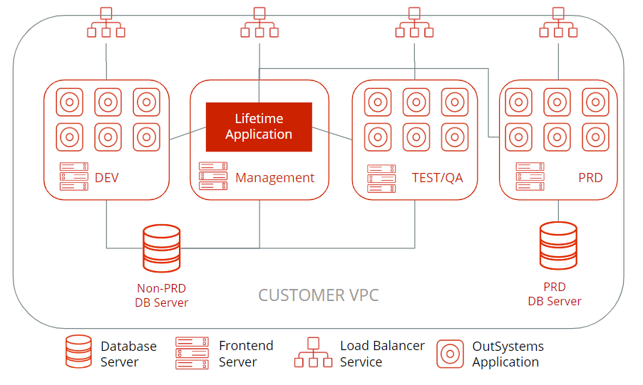
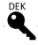
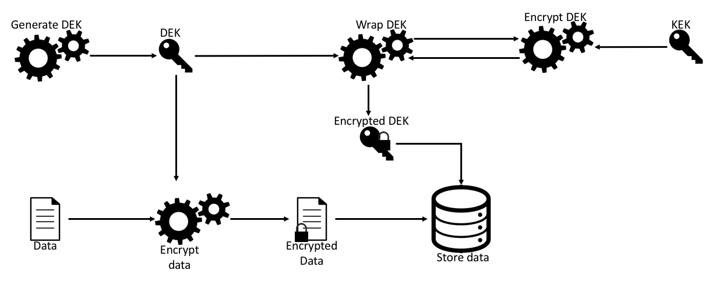
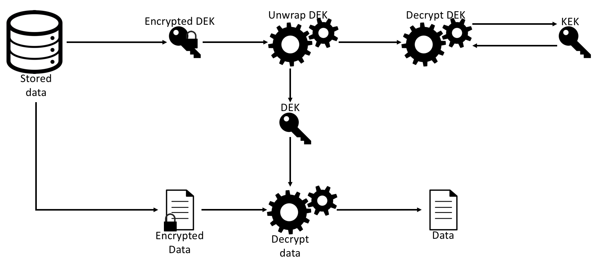
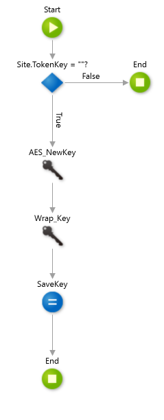
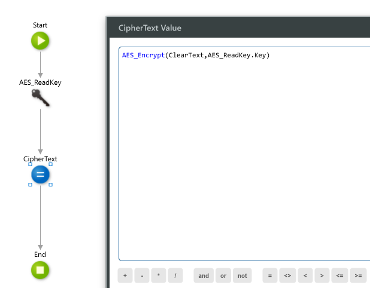
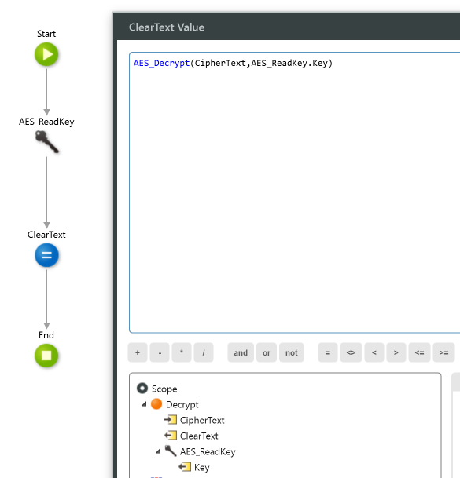

# Securing data at rest with encryption

OutSystems is responsible for the secure management of all the stack components, including database servers, front-end servers, load balancers, and all the related logs produced by the infrastructure assets. For all of these, OutSystems manages the keys to encrypt the assets for you seamlessly and is therefore responsible for the security of data stored. OutSystems acts as a data processor in the OutSystems Cloud environments.

[See our Data Processing Agreement](https://www.outsystems.com/legal/master-subscription-agreement/data-processing-addendum/)

For an OutSystems Cloud deployment, make sure you read the shared responsibility model before continuing.

## Overview of OutSystems Cloud environments

OutSystems deploys all environments and network assets under a single and unique AWS account managed by OutSystems Support. In this account, a new customer Virtual Private Cloud (VPC), with **dedicated network and resources**, is provisioned with the required number of cloud environments using automated orchestration processes.

Your workloads will be running using a dedicated set of virtual servers, load balancers, and dedicated database server instances.

The network isolation between your dedicated assets is ensured by AWS. Customer environments are completely isolated from other customers via the configuration of their dedicated infrastructure.

Additionally, a dedicated management environment is provisioned by OutSystems containing an infrastructure management application (Lifetime) where environment security features  can be configured, including:

* [Managing the Application Lifecycle](https://success.outsystems.com/Documentation/11/Setting_Up_OutSystems/Configure_the_infrastructure_management_console)

* [Managing access for developers and factory admins](https://success.outsystems.com/Documentation/11/Managing_the_Applications_Lifecycle/Manage_IT_Users)

* [Managing SSL\TLS certificates in OutSystems Cloud environments](https://success.outsystems.com/Support/Enterprise_Customers/Installation/Use_your_SSL_domain_in_OutSystems_Cloud)

* [Deploying new environments in the OutSystems cloud](https://success.outsystems.com/Documentation/11/Setting_Up_OutSystems/Configure_the_infrastructure_management_console)

* [Adding new front-end servers to an environment](https://success.outsystems.com/Support/Enterprise_Customers/Installation/Add_a_new_front-end_server_to_your_environment)

The following diagram illustrates the concepts described above: 

### Data location and sovereignty
OutSystems keeps cloud environment data in the AWS Region you select, which enables you to maintain compliance with data residency regulations.

Learn more in [Choosing the AWS Regions for an OutSystems Cloud deployment](https://www.outsystems.com/evaluation-guide/choosing-the-region-for-an-outsystems-cloud-deployment/).

## Data storage stack responsibilities
In the OutSystems cloud environments provisioned in your infrastructure, data will be stored and managed in the assets as follows:

* By default, application data produced in the application flows created by your development teams will be stored in the database of that environment.

* Application data cannot be stored in the front-end servers, apart from a specific directory (D:\User) that can be used to store temporary files. Sentry offer contains security controls that apply countermeasures when uploading malware. Malicious files are removed after upload but note that no notification is shown at runtime.

In the following table, you can find the retention period and responsibilities for the cloud environment assets. 

**Note**: The retention periods listed assume an active, paid-up subscription to the applicable OutSystems products. If your subscription has terminated, the retention periods no longer apply. In this case, the terms of the Master Subscription Agreement with OutSystems apply.

<table markdown="1">
<tbody>
<tr>
<td>

<strong>Stack</strong>

</td>
<td>

<strong>Type of Data vs Storage Asset Type</strong>

</td>
<td>

<strong>Database Servers</strong>

</td>
<td>

<strong>Front End Servers</strong>

</td>
<td>

<strong>Retention Period</strong>

</td>
</tr>
<tr>
<td rowspan="3">

 

<strong>Apps</strong>

</td>
<td>

<strong>Application data</strong>

</td>
<td rowspan="3">

Customer responsibility

Data available near real-time to the customer via apps and APIs

</td>
<td>

Not present

</td>
<td>

Defined by you in the application logic.
 1

</td>
</tr>
<tr>
<td>

<strong>Application temp files</strong> 
<strong>(d:/user/ folder)</strong>

</td>
<td>

Present

</td>
<td>

30 days

</td>
</tr>
<tr>
<td>

<strong>Application logs</strong>

</td>
<td>

Not present

</td>
<td>

9 weeks

</td>
</tr>
<tr>
<td>

 

<strong>Front-ends</strong>

</td>
<td>

<strong>Application server audit logs</strong> 
<strong>(IIS Logs )</strong>

</td>
<td colspan="2" rowspan="3">

OutSystems responsibility

Data available upon request to OutSystems Support for Customer Security Incident investigations

</td>
<td>

1 year (Sentry Offer)

1 month (Enterprise/ Universal)

</td>
</tr>
<tr>
<td>

 

<strong>Load Balancers</strong>

</td>
<td>

<strong>Load-balancer service </strong>

<strong>logs</strong>

</td>
<td>

1 year

</td>
</tr>
<tr>
<td>

 

<strong>DB Servers</strong>

</td>
<td>

<strong>Database server</strong>

<strong>audit logs</strong>

</td>
<td>

1 year (Sentry Offer)

N/A (Enterprise/ Universal)

</td>
</tr>
</tbody>
</table>

1 OutSystems allows you to delete application data. You have ownership and control over your application's data and are free to manage it according to your requirements for data retention. You can also export your data to another storage facility that you own in order to implement specific retention requirements.

## Securing data at rest on Cloud front-end servers

Where OutSystems manages keys, they are managed by key custodians following IAM Policies.

### Front-end storage usage by your applications

OutSystems restricts the use of data storage in your cloud environment’s front-end servers. However, in some cases, applications designed to run in OutSystems might need to manipulate large binary files. Examples include applications that allow documents to be stored or business processes with a step for uploading attachments.

One of the possible strategies is to temporarily store the document in the available folder - D:\user - on the OutSystems cloud front-end servers. You can use up to 2 GB of storage. If not previously removed by the applications, the files will be automatically deleted after 30 days.

### Front-end server volumes encryption at rest

OutSystems uses AWS provided disk volume encryption and key management:

Your applications run on cloud-based virtualized servers that are provisioned with storage volumes that can be encrypted, AWS EBS volumes - [Elastic Block Storage](https://aws.amazon.com/ebs/).

The industry-standard AES-256 encryption algorithm is used to encrypt the data on the volumes that host the virtualized frontend servers.

The encryption process uses envelope encryption techniques, where the master key is stored in the AWS Key Management Service (KMS) and is managed by OutSystems

The server encryption occurs on the server that hosts each of your virtualized servers upon asset creation.

Encryption is also provided when data moves between the instances and the storage volumes.

Dedicated encryption keys are used to encrypt each asset delivered to customers.

This is available by default on all Sentry offer Front-end servers. It's not available in any other editions.

## Securing data at rest on OutSystems Cloud databases 

### Database encryption at rest

In your OutSystems Cloud environments, each database server can be encrypted at rest using the features provided by AWS.

When the database server is encrypted at rest, this includes the underlying storage for database server instances, its automated backups, and snapshots.

The encryption of database server at rest:

* Uses the industry-standard AES-256 encryption algorithm to encrypt the data on the server that hosts the virtualized database server used in the environment.

* Encrypts the database servers' volumes by default upon asset creation.
 
OutSystems manages the database server encryption keys with the following policies:

* Dedicated encryption keys are used to encrypt each database server delivered to the cloud environments provisioned for your usage.

* Database server encryption keys are not shared between customer assets.

* Database server volumes are encrypted using an encryption key stored in AWS Key Management Service (KMS) and managed by OutSystems.

#### Availability of database encryption on your subscription

* Check the [cloud services catalog](https://success.outsystems.com/Support/Enterprise_Customers/OutSystems_Support/Service_changes_available_upon_request) to confirm if database encryption is available for your subscription.

* Database encryption is available by default in all Sentry database servers so you won't need to explicitly request if you have a Sentry edition.

* Note that this capability is supported for class 2 and higher of the OutSystems Cloud database servers so that the overhead on performance doesn't compromise systems availability.

* Transparent data encryption features are available for self-managed environments. This feature is not available for OutSystems Cloud environments.

* Using a purchase order or by contacting OutSystems Support, you can request the encryption at rest of your database servers. Make sure to provide the following information:

    * **What** are the environments that should have the database encrypted.
    * **When** you wish to schedule the operation (date, time, and time zone). This is important because encrypting the database will imply downtime. We want to make sure it has minimal impact on your development and apps. By default, we will schedule for your defined [maintenance window](https://success.outsystems.com/Support/Enterprise_Customers/Maintenance_and_Operations/Define_a_maintenance_window_for_OutSystems_Cloud_environments) unless you tell us otherwise.

### Data privacy using Cloud database server encryption at rest

Database encryption at rest means that no one will be able to read or modify any of your data present in the OutSystems Cloud database server volumes and storage.

Only OutSystems support teams will be able to access your business data, and it requires a support ticket troubleshooting process. It’s therefore advisable for you to protect sensitive business information with a risk-based approach that uses encryption at the application level.

Refer to our [Data Processing Agreement](https://www.outsystems.com/legal/master-subscription-agreement/data-processing-addendum/)

## Securing application data

OutSystems protects your data with several security controls. However, you are still responsible for developing applications that follow best practices for data security. This section details how to encrypt sensitive data at the application level and how you take responsibility for the key management storage and key encryption method used.

### Encrypt all sensitive data processed based on a risk approach

Encryption of sensitive data is a good security practice. However, some other risk factors emerge when you try to encrypt everything in your datasets.

Regarding data at rest, OutSystems recommends that you:

* Define your policies and controls to govern the storage of data.

* Execute [Threat Model Analysis](https://www.owasp.org/index.php/Application_Threat_Modeling) on systems and business data.

* Build encryption capabilities based on sound and robust encryption algorithms to encrypt sensitive data, typically leveraging Forge components such as the Crypto API.

* Use a Key Management System.

* Use OutSystems built-in SHA512 algorithms for hashing.

### How to fully encrypt your sensitive data

We have already detailed how data is encrypted at rest at the storage level. Since your sensitive data should also be encrypted at the application layer, this section explains how you can encrypt sensitive data, e.g. Personal Identifiable Information (PII), with illustrative examples.

#### Use envelope encryption techniques
One of the best approaches for encrypting data at the application level is to apply envelope encryption. Envelope encryption can be better defined as a way to secure the data and the keys that protect that data, and it is agnostic to the encryption algorithm used. When using envelope encryption at least two distinct keys need to be used:

**Data encryption key** 

The Data Encryption Key (DEK) is the key used to encrypt the data itself. This key should be:

1. Generated locally

1. Stored near the data it protects

1. Stored in an encrypted format

**Key encryption key** 

The Key Encryption Key (KEK) is the key used to encrypt (or wrap) the DEK. This key should be:

1. Stored in a separate place from the DEK

1. Rotated regularly

1. Accessed only by authorized external entities

Although envelope encryption is agnostic to the encryption algorithm, OutSystems recommends that you use the Advanced Encryption Standard in Galois Counter Mode with 256-bit strength.

#### How to use envelope encryption to encrypt data
The following picture shows how to encrypt data using envelope encryption and a DEK.

If you haven’t done it already, start by generating a DEK, then feed the clear text data and the DEK to the encryption algorithm that is obtaining the encrypted data that can be stored. The DEK should then be fed to a function that is responsible for wrapping (encrypting) the DEK and then stores it in the database alongside the encrypted data.

The encryption of the DEK can be done in two ways:

* Fetch the KEK from an external system (for example, AWS KMS) and encrypt the DEK.

* Send the DEK to an external system (for example, an HSM) invoking the encryption operation and receive the encrypted DEK.

In the case of the illustration, the DEK is sent to an external system that returns the wrapped DEK.

#### How to use envelope encryption to decrypt data
The following picture describes how to decrypt data using envelope encryption.

Retrieve both the encrypted data and the wrapped DEK from storage. Start by unwrapping (decrypting) the DEK. Feed both the DEK and the encrypted data to the decryption function and obtain clear text data.

The unwrapping of the DEK can be done in two ways, depending on how it was wrapped:

* Fetch the KEK from an external system (for example, AWS KMS) and feed it to the decryption DEK function alongside the wrapped DEK.

* Send the wrapped DEK to an external system (for example, an HSM) that is invoking the decrypt operation and receive the unwrapped DEK.

In the case of illustration, the wrapped DEK is sent to an external system that returns the unwrapped DEK.

By using enveloped encryption as described here, it is possible to protect data at the application layer and ensure that only authorized users, processes, or both are allowed to access the sensitive data.

#### How to apply envelope encryption
For the following examples, we used the CryptoAPI Forge component. The CryptoAPI is a community-driven component that provides strong encryption functions as well as the generation of encryption keys. 

Here are the ways you can use the platform's unique secret key as KEK and store the wrapped DEK in the database.

##### Encrypting data
Generate a DEK
Since we are going to use the Advanced Encryption Standard (AES), we start by creating an action that generates an AES key. We generate an AES key, then the key is wrapped using the platform app unique secret key, and finally, it is saved as a site property.

##### Encrypt data
Next, we use a function that receives the clear text data, reads the DEK, encrypts the data using the DEK, and returns the encrypted data to be stored.

The data is now ready to be stored in an encrypted format.

#### Decrypting data
Decrypting the data is as simple as retrieving the DEK, feeding it alongside the encrypted data to the decryption function, and obtaining the clear text data.

  

The function AES_ReadKey retrieves the wrapped DEK, performs the unwrap operation, and returns the DEK. Both the DEK and the encrypted data are then fed to the decryption algorithm that returns the clear text data.

## Conclusion
By combining infrastructure-level encryption with application-level encryption, it is possible to protect any data at rest from unauthorized access.

## References and further reading

[OutSystems Trust Page](https://www.outsystems.com/trust)

[OutSystems Data Processing Addendum](https://www.outsystems.com/legal/master-subscription-agreement/data-processing-addendum/)

[OutSystems Cloud Security Alliance Registry](https://cloudsecurityalliance.org/star/registry/outsystems/)

[CSA Security Guidance for Critical Areas of Focus in Cloud Computing](https://cloudsecurityalliance.org/artifacts/security-guidance-v4/)

[AWS EBS volumes - Elastic Block Storage](https://aws.amazon.com/ebs/)

[Encrypting Data at Rest in AWS](https://d1.awsstatic.com/whitepapers/AWS_Securing_Data_at_Rest_with_Encryption.pdf)

[AWS Key Management Best Practices](https://d0.awsstatic.com/whitepapers/aws-kms-best-practices.pdf)

[AWS Networking Security](https://d1.awsstatic.com/whitepapers/Security/Networking_Security_Whitepaper.pdf)

[OWASP Application Threat Modeling](https://www.owasp.org/index.php/Application_Threat_Modeling)
