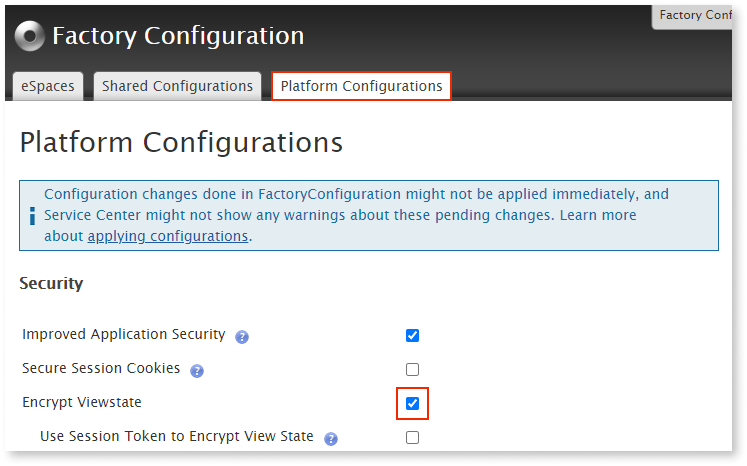

# Encrypt web apps view state

Applies only to Traditional Web Apps.

The view state is used by the OutSystems underlying technology for traditional web applications (ASP.NET). This mechanism is used to preserve the client-side state of a web page when a postback occurs. The view state stores the values and controls of the page between requests.
 
The view state is a hidden field in the HTML of the web page. Its value property stores the view state encoded information. Because a page's view state can contain sensitive information (such as a users inputs in a form) **the view state is encrypted by default**.

Check the [Microsoft documentation](https://docs.microsoft.com/en-us/dotnet/api/system.web.ui.control.viewstate?view=netframework-4.8) for more information about the view state.

## Toggling view state encryption using Factory Configuration

You can confirm or toggle the view state encryption using the supported Forge component [Factory Configuration](https://www.outsystems.com/forge/component-overview/25/factory-configuration). 

1. Open Factory Configuration in the browser and login using your LifeTime/Service Center credentials.

1. Navigate to the **Platform Configurations** tab and toggle **Encrypt Viewstate**. 
    
    

    For an extra level of protection, it's also possible to enable the **Use Session Token to Encrypt View State** option. This will include an extra session generated token in the encrypted view state. This token changes after a login to a different user, and ensures every requested page is only valid in the context of that same user session. 

    

    There are multiple use cases that are broken by this extra protection. Make sure to read the consequences [Use Session Token to Encrypt View State](#use-session-token-to-encrypt-view-state) section.

    

1. [Apply the settings](../deploying-apps/apply-configurations.md#apply-pending-settings-to-a-set-of-modules) to all modules.

## Use session token to encrypt view state

When active, use the session token to encrypt the view state. This ensures that every requested page in one user session is only valid in the context of that user session.

**Enabling this feature has an impact on the end-user experience**. The following scenarios will no longer work after you enable the feature:

* Performing a login operation in two different applications opened in different browser tabs. Once you log in to the first application, performing a login in the second application will fail. Reason: the first login sets a session token that is not present in the first load of the page. Therefore, the second POST operation of the login form (performed when logging in to the second application in the second tab) fails because it doesn't have this session token.

* Accessing an application with auto-login enabled. If you let the session expire while filling in a form, you will not be able to perform a POST operation on that specific form anymore.

* The same is also applicable if you log out and try to perform a POST operation on the form of another application in the meantime.
