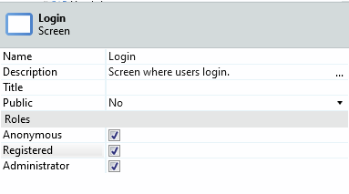
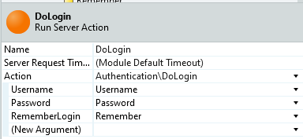
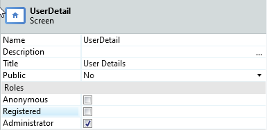
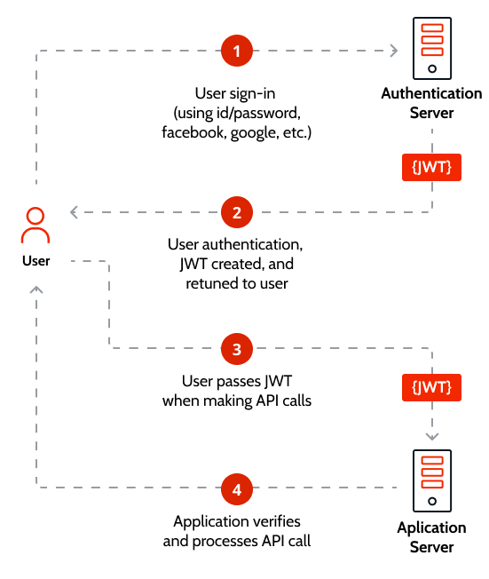
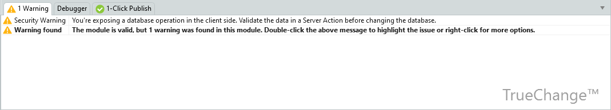

# Best practices for reactive web security

This article was written by [Remco Dekkinga](https://www.outsystems.com/profile/jppqqjaygb/), OutSystems MVP

There are several aspects to securing your Reactive Web Apps before launching them. This article covers them, and provides recommendations on securing your application.

Specifically, a Reactive Web App consists of two parts, **client-side** and **server-side**. For both sides you need to think about different security measures.

## Client-side security

A rule of thumb for client-side security is that the code that is on the client-side can be abused by the end-user via its unauthorized modification which can result in changes in content or behavior of your application.

### Don’t expose sensitive data on the client-side

**Client-side code** (UI, client actions, screen and block variables, and input parameters) converts into web resources (HTML, JavaScript and CSS). This means that it can be manipulated. That's why we need to make sure that all security sensitive code and data is on the server side.

When using [**Client Variables**](https://success.outsystems.com/documentation/11/reference/outsystems_language/data/handling_data/client_variable/), remember that they are stored in the browser’s local storage ([HTML Web Storage](https://www.w3schools.com/html/html5_webstorage.asp)) and they are [shareable between applications](https://success.outsystems.com/documentation/11/developing_an_application/use_data/share_a_client_variable_between_apps/). Make sure that you never store sensitive data in client variables and don’t use them to control the flows of your application, because they can be manipulated using tools that alter client-side code in the user’s browser.

### Retrieve only the necessary data for the screen

When you need data, don’t fetch all fields. Only fetch the data that is needed for the screen. Since the latest versions of the OutSystems Platform, the [**aggregates**](https://success.outsystems.com/documentation/11/reference/outsystems_language/data/handling_data/queries/aggregate/) **are optimized** and handle this security risk for you. When you work with an older version, update your platform or minimize this risk by limiting the data that comes back from the aggregates.

### Securing server calls

When you **fetch data from the server** (queries or API calls), don’t use input parameters that have impact on the data that is returned. An attacker can change these values and fetch some other data.

For instance, if retrieving data about the current logged-in user, instead of using client-specific details consider using server-side logic to get that same information.

A common good practice is to place the GetUserId() inside the aggregate. The aggregate is running on the server, which is secured and the attacker can’t alter this query anymore to access data from other users.

This same best practice works for [fetching data based on user roles](https://success.outsystems.com/documentation/11/reference/outsystems_language/logic/built_in_functions/roles/) or when you fetch data from the server and you send an identifier or another element that uniquely identifies an element as input parameter to the server.

### Protect screens and aggregates with roles

For each and **every aggregate and server action** used at the client-side, a **REST API method** is created to handle its specific request.

When the screen where the aggregate or server action belongs to is made available to the public (the Anonymous role is selected), that REST API is also made available to the public.

Make sure that when you fetch data from the server in a screen with the anonymous role active, the input parameters can’t be manipulated in any way to get different records.

Take for instance the DoLogin(). This one is available to the public (the Login screen has the Anonymous role is selected), but you can’t use it when you don’t have a working Username and Password combination.

When the screen is not available to the public (assigned to one or more roles except the Anonymous role), the **system implements an authentication mechanism** based on the logged-in user.

Only the logged-in user can use this REST API.

When you have one screen with different functionality based on different roles, the easiest way to secure them is to make a separate screen for each role with its own functionality. Mixing roles on a single screen impacts the security of the application as even if you hide specific functionality on the client-side, an attacker can still tamper with the content and may be able to access them.

### Securing user accounts on Public screens interactions

You may need to create Public screens for flows that still need to be secure and  verify an user’s identity - for instance, when creating an account or resetting a forgotten password.

In these cases a secure approach is to request a [One-Time Authorization Code](https://en.wikipedia.org/wiki/One-time_authorization_code) (OTAC). In order to do so, the user needs to identify himself.

How do you do this when you forgot your password? One option is to implement a flow with a second device where the user can receive the OTC. Think about an SMS flow where you receive a unique token generated on the server, an email with a time-based special URL or an Authenticator app that gives back a token. Use the result from any of these flows to uniquely identify you on the server side and log you in. At this point you are logged in and you can use the Server action normally, because it’s secured. Right after the login you can show the reset password screen as a mandatory option.

As a second option you can do both the identity validation and the reset password in the same request. You request a token, the token is then used to identify you in the password reset flow. When the token is not correct, your password won’t be updated.

A third option is to consider using [JSON Web Token](https://jwt.io/introduction/) (JWT) to encrypt the session and to send only encrypted data. There are different ways to do it, which are beyond the scope of this article, but one way to implement it can be with the [JWT Forge component](https://www.outsystems.com/forge/component-overview/1853/jwt).

## Server-side security

### Validate security in core modules

When you have server actions that you expose to Reactive applications, you should always think about the possibility that the user is not correctly identified. Start an action with [User and Roles validations](https://success.outsystems.com/documentation/11/reference/outsystems_language/logic/built_in_functions/roles/) on by using GetUserId() and `Check<RoleName>Role()`, to see if this user is allowed to execute this action.

## Tips

When you compare Traditional Web with Reactive Web there are more security angles that you need to be aware of

1. Take the warnings in [TrueChange](http://gemoc.org/pub/20190625-MLE19/paper9.pdf)™ at heart. They will guide you through the biggest mistakes and help you improve the Client Code Quality.

1. As an extra option, you can also look into the [AI Mentor Studio](https://success.outsystems.com/documentation/11/managing_the_applications_lifecycle/manage_technical_debt/), because this tool also has several [code analysis patterns](https://success.outsystems.com/documentation/11/managing_the_applications_lifecycle/manage_technical_debt/code_analysis_patterns/).

1. Don’t deploy test screens to other environments than the development environment. They are normally Public screens with quite some functionality which you can use to tamper with the database.

1. Keep track of the 3rd party plugins you are using. They can also contain vulnerabilities. When you don’t check regularly or update the components on a regular basis, you have the chance to get attacked via known vulnerabilities.
