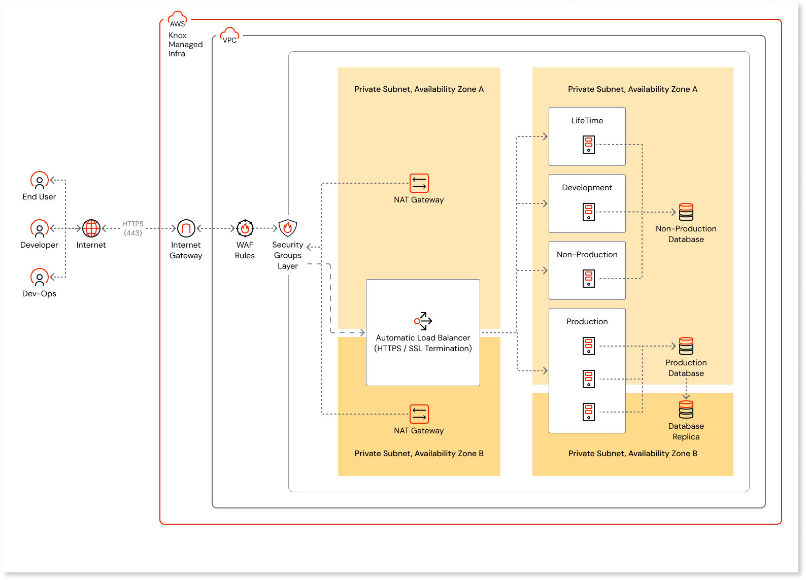

# OutSystems FedRAMP overview

OutSystems FedRAMP is a FedRAMP certified version of OutSystems 11 designed for US federal agencies, state and local governments, and commercial organizations that provide services to the US government.

## Hosting and authorization

OutSystems FedRAMP is hosted and operated by [Knox Systems](https://knoxsystems.com/platform) on Amazon Web Services (AWS) US East (North Virginia). It's an OutSystems-managed cloud offering. Customers don't have direct access to the underlying infrastructure or the ability to configure it themselves.

Knox Systems is FedRAMP certified at Certification Class C, which aligns with the [**Moderate**](https://csrc.nist.gov/pubs/fips/199/final) impact level. OutSystems 11 operates under Knox’s [Authority to Operate (ATO)](https://cic.gsa.gov/basics/cloud-security). Verify the certification on the [FedRAMP Marketplace](https://www.fedramp.gov/marketplace/products/F1206111371/), where OutSystems 11 is listed under Knox Systems.

## Platform details

The following details apply to OutSystems FedRAMP:

* **Region**: AWS US East (North Virginia)
* **Domain**: `osgov-cloud.com` by default. Custom domains are available on request via a support case.
* **Database**: SQL Server. Oracle isn't available.
* **High availability**: Your environment runs across multiple [AWS Availability Zones](https://aws.amazon.com/about-aws/global-infrastructure/regions_az/) within US East, so a single data-center failure doesn't cause downtime.
* **Support**: 24x7 support is included.

## Architecture

OutSystems FedRAMP runs inside a Virtual Private Cloud (VPC) on Knox Systems-managed AWS infrastructure. Knox Systems generates and manages all AWS accounts, VPCs, and subnets, and all traffic enters this Knox-administered environment.

End users, developers, and DevOps users access the platform over the internet using HTTPS on port 443. Each request passes through the following layers before reaching an OutSystems environment:

1. **Internet Gateway**: the entry point into the VPC.
1. **WAF Rules**: a web application firewall that filters incoming requests.
1. **Security Groups Layer**: network rules that control which traffic reaches each resource.
1. **Automatic Load Balancer**: performs HTTPS and SSL termination and distributes requests across the environment servers.

The VPC spans two Availability Zones for high availability. Each Availability Zone contains a public subnet and a private subnet:

* **Public subnets** hold the **Automatic Load Balancer**, which spans both Availability Zones, and a **NAT Gateway** in each Availability Zone that provides outbound internet access for resources in the private subnets.
* **Private subnets** hold the OutSystems environment servers and databases, which aren't directly reachable from the internet.

The private subnets contain the following OutSystems environments and databases:

* The **LifeTime**, **Development**, and **Non-Production** environments connect to the **Non-Production Database**.
* The **Production** environment, which spans both Availability Zones, connects to the **Production Database** in the first Availability Zone (Zone A), which then replicates to a **Database Replica** in the second Availability Zone (Zone B).

## Shared responsibility model

The [OutSystems Cloud shared responsibility model](https://www.outsystems.com/tk/redirect?g=b04339ce-7b9f-4c93-94b7-e4cf397eab47) applies to OutSystems FedRAMP. You're responsible for architecting secure applications and validating the security of the components you use. OutSystems and Knox Systems are responsible for the platform infrastructure and operations.

## FedRAMP certification and Agency ATOs

The following types of Authority to Operate (ATO) apply to OutSystems FedRAMP:

* **FedRAMP certification**: Awarded by the FedRAMP Program Management Office (PMO) after a third-party audit. Knox Systems holds this Certification through an agency ATO, which covers OutSystems 11.

* **Agency-level ATO**: Allows an agency to use an application, service or platform. Issued by the federal agency after reviewing compliance documentation. Each agency that uses OutSystems FedRAMP must issue its own ATO.  This ATO applies to an agency’s use of OutSystems FedRAMP itself, and not to the applications you build. Those applications will be subject to agency review and issuance of ATO separate from OutSystems.

Refer to [How OutSystems enables FedRAMP controls](controls.md) for a high-level description of how the platform and Knox Systems hosting support FedRAMP Certification Class C (Moderate) controls.

## Limitations

OutSystems FedRAMP doesn't support all features available in the standard OutSystems 11 Cloud offering. Refer to [Unavailable features in OutSystems FedRAMP](unavailable-features.md) for the complete list.
