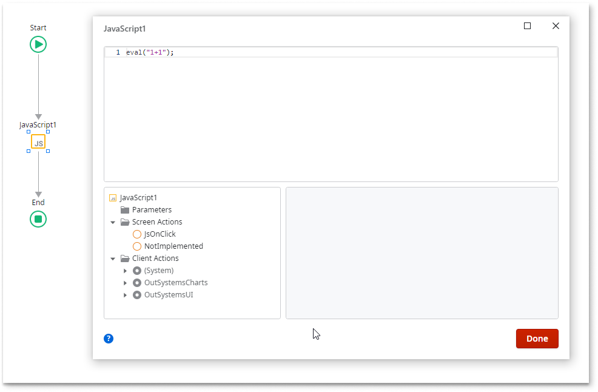
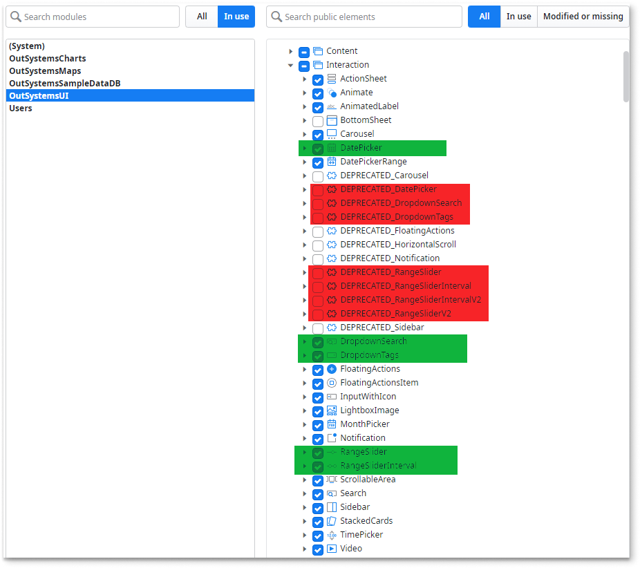
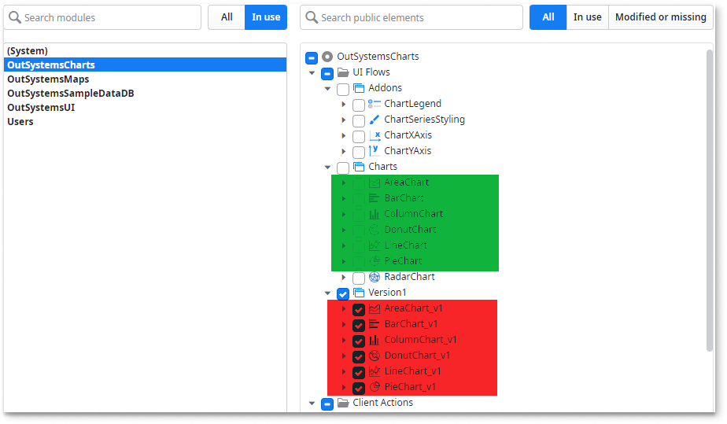
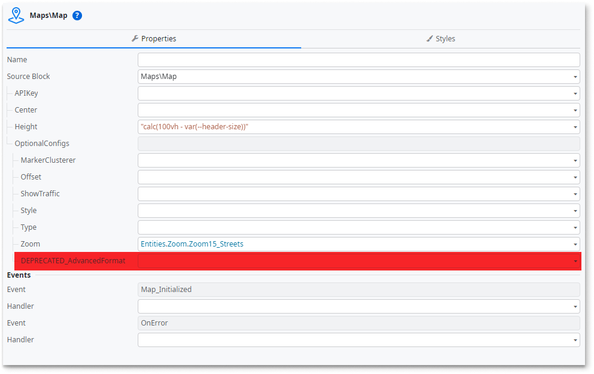

# Impacts of removing unsafe directives (Reactive Web Apps Only)

A Content Security Policy (CSP) helps to prevent attacks from untrusted sources. Your policy should detect and mitigate these attacks.

For OutSystems to adhere to security guidelines, the use of unsafe-inline and unsafe-eval directives is now optional. This change applies to OutSystems Platform version 11.28.0 and higher and Factory Configuration version 11.2.1 and higher. The change in behavior of the directives are controlled by Factory Configuration settings. By default the settings are enabled and set to True, meaning the platform adds these directives.

Disabling the use of these directives is done through configuration settings. The impacts identified in this document only occur if you change the factory configuration settings from True to False.

This change impacts:

* [Javascript widgets](#impact-to-javascript-widgets)
* [UI components](#impact-to-ui-components)
* [OutSystems Charts](#impact-to-charts)
* [OutSystems Maps](#impact-to-maps)

## Impact to Javascript widgets

* **Issue**:  The Javascript widgets that use the eval() function don’t execute as expected, and throw an exception.
* **Runtime**:  Reactive
* **Rationale**: When you set Compiler.EnforceEvalReactive to false, the unsafe-eval directive isn't allowed in the app. Therefore, any use of the eval() function in the Javascript widgets results in an exception.
* **Fix**:  Modify the logic using the eval() function.

    

## Impact to UI components

* **Issue**:  Components using the eval() function were deprecated and are no longer reviewed. Following is a list of the deprecated components:

    * DEPRECATED_DatePicker (Init)
    * DEPRECATED_DropdownSearch (Init)
    * DEPRECATED_DropdownTags (Init)
    * DEPRECATED_RangeSlider (OnReady)
    * DEPRECATED_RangeSliderInterval (OnReady)
    * DEPRECATED_RangeSliderV2 (OnReady)
    * DEPRECATED_RangeSliderIntervalV2 (OnReady)

* **Runtime**: Reactive
* **Rationale**: To eliminate the use of the eval() function, new components were created.
* **Action**:  Replace the deprecated components with new components highlighted in green.

    

## Impact to Charts

* **Issue**: The script OutSystemsChart.js used for AdvancedFormat on all Chart types from Version 1 is no longer supported.
* **Runtime**: Reactive
* **Rationale**: To eliminate the use of the eval() function in the script OutSystemsChart.js , a newer version is recommended.
* **Fix**:  Replace version 1 with the newer equivalent components. The components from version 1 and the new available version aren't exactly equivalent in functionality.Replace the deprecated components with new components highlighted in green.

    

## Impact to Maps

* **Issue**:  The configuration used for DEPRECATED_AdvancedFormat is not compatible with with the removal of the unsafe-eval / unsafe-inline directives. The script OutsystemsMaps.js  used for_AdvancedFormat is deprecated and isn't reviewed.  
* **Runtime**: Reactive
* **Rationale**:  This specific component is deprecated.
* **Fix**:  Don't use this sub-configuration inside the optional configurations.

    
