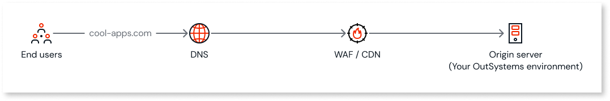
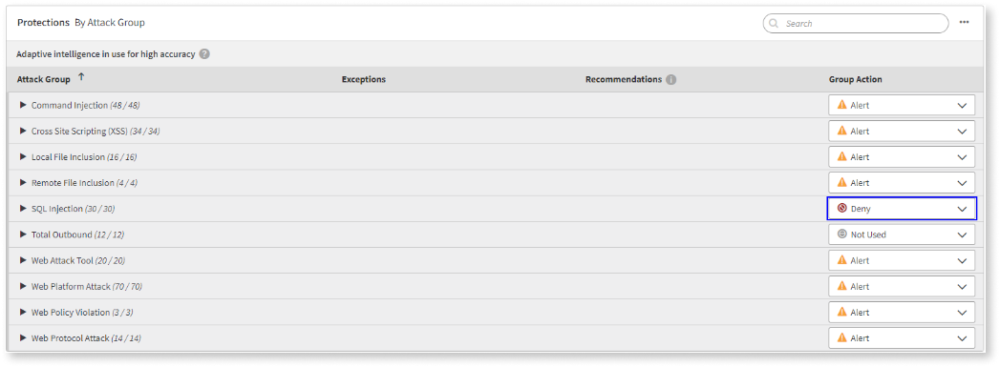
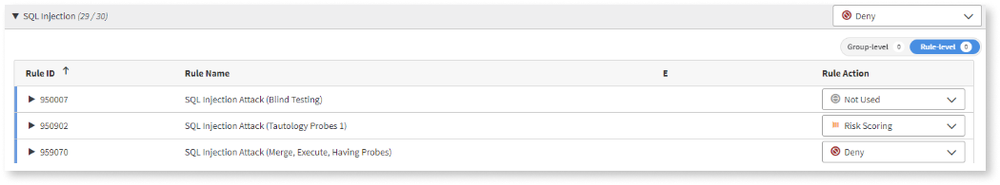
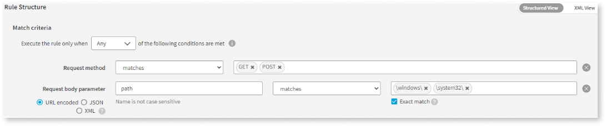

# Implementing a Akamai WAF for an OutSystems web app

This article provides you with a step-by-step guide to implement a WAF in Akamai. Akamai's product for WAF deployment is the [App & API Protector](https://www.akamai.com/products/app-and-api-protector/).
Implementing Akamai's Web Application Firewall (WAF) involves several steps. Follow the following steps to integrate Akamai WAF with your web applications.

## Create an Akamai Account for App & API Protector Product

1. Visit the Akamai website.
1. Click on **Start Free Trial** and follow the instructions to create an account and subscribe to this product.
1. You’ll be sent the credentials to access the Akamai Control Center.
1. Log in to the Akamai Control Center with your credentials.
1. Update your default credentials and define whether you want to setup MFA.

## Configure the CDN / WAF

To configure Akamai CDN/WAF:

1. On the left pane from Akamai Control Center expand **Security Configurations** under Web & Data Security and click on **Web Security**
1. Click on **Create new Property**
1. Under Properties click **+New Property** and choose **App & API Protector**
1. Choose your:

    * Hostname
    * Contract
    * Group.

    The Hostname should point to your OutSystems environment hostname custom DNS. The next page sends you to configuring your hostname:

    1. Core CDN settings:
        1. Origin Type - Web server
        1. Origin hostname - Akamai uses this address to fetch content from your OutSystems environment when needed.
        1. You may have to add a DNS record for your new origin hostname to your DNS provider:
            
            The way it works is that your environment DNS (cool-apps.com in example) will start pointing to Akamai Edge endpoint using a CNAME record.
            Then Akamai Edge endpoint uses the created origin hostname DNS record to reach out to your Origin server (Your OutSystems environment)

        1. In the end press **Validate**
        1. Click **Continue** to move on to Edge Certificate and choose one of the secure options with HTTPS traffic by applying your certificate for your OutSystems environment applications.
        1. For Cache File extensions OutSystems recommends this list:
        css, js, gif, woff, woff2, svg, jpeg, jpg, png, otf, ttf, ico, zip, eot, txt
        If you prefer to add more static files to the list, please do at this moment
        1. Choose **Cache for 1 days**
        1. Press **next**

           

            To avoid stale cache issues, make sure you adopt the platform setup recommendations documented [here](https://success.outsystems.com/documentation/11/setup_outsystems_infrastructure_and_platform/setting_up_outsystems/using_a_cdn_with_outsystems/#cache-timeout).

           

    1. On the **Security Settings** tab, give a name for this configuration and click **Next**.
    1. On the **Review and activate** tab, you can review the applied settings in the previous steps. If you’re happy with the settings click **Activate**.
    1. On the **Verify** step, perform the host file changes and test that your settings work. Click **Next**.
    1. Change your DNS settings to point your OutSystems environment hostname to Akamai Edge endpoint using a CNAME record. Click **Check Name** and verify that the DNS change got propagated. Click **Exit**.
1. Test connecting to your OutSystems environment and applications. If you enable your browser Developer Tools and inspect the traffic you’ll notice the traffic going to Akamai endpoints.

At this stage, Akamai will automatically enable some out-of-the-box features for your OutSystems environment, namely:

* IP/Geo Firewall
* DoS Protection
* Web Application Firewall

## Customize Akamai WAF

To customize the rules on your Akamai WAF, do the following:

1. On the left pane expand **Security Configurations** and click on **Web Security**.
1. Click **Version History** > Click on the **…** button next to the v1 rule and choose **Create new version from v1**.

    This will allow you to edit your security settings without impacting your existing configuration.
1. Click on the **…** button next to the First Security Policy and click **View Security Policy**.
1. On the left pane, click on **Web Application Firewall**. Here you will see your protections by the attack group. You can also view this list by rule ID.
1. Here you will be able to decide what action you want to take place for each attack group type. As an example If I wanted to deny all SQL Injection attack type, I could select Deny in the dropdown:
    
    This option would serve a default 403 response to the client attempting this kind of attack.

1. If you wanted to only deny some of the attacks part of the SQL injection attack type, click on the dropdown for **SQL Injection** and click on the **Rule-level** option on the far-right. This would give you the option to tailor my actions for specific attacks:
    
1. If you want to create a custom WAF rule, as an example, for [Rule ID 930120](waf-outsystems.md#recommended-waf-rules), follow the steps:
    1. Navigate to **Custom Rules** under OVERVIEW AND PROTECTIONS, and click on … > Manage Custom Rules
    1. Click **Add a custom rule**
    1. Enter the Rule Name
    1. Under Rule Criteria select the Custom Sample Rate to **Yes** and 100%
    1. Select a time period to apply this rule
    1. Under Match Criteria select **Any** and configure the rule such as in the image below:
        
    This rule will attempt to block suspicious patterns of access to your filesystem:
    1. In the end insert a tag for this rule and click **Save**
    1. Apply the rule and select the action you want to occur when it triggers following this [Akamai documentation](https://techdocs.akamai.com/app-api-protector/docs/apply-custom-rule).
1. Remember, there should be a balance between the rules you implement and the impact it may bring to your applications security. Implementing too many rules without value may compromise the performance of your applications.
1. When you’re happy with the WAF security changes, you can click on **Activate** > Select the Network and insert Activation Notes. In the end click **Activate**.

Although this guide focus on WAFs, you can leverage other components of Akamai App & API Protector to personalize your security configuration, such as applying a geo protection to your OutSystems infrastructure. That, for example, would allow you to block traffic from certain countries.

## Test, Monitor, Fine-tune

After you have set up the Akamai WAF remind to:

* **Test**. After applying new policy changes to your WAF, thorough testing should be made to ensure there was no negative impact to your applications.
* **Monitor**. [Web Security Analytics](https://techdocs.akamai.com/security-ctr/docs/web-security-analytics-ov-new) provides a unified and efficient platform to assess security events across products and capabilities, so that you can take informed actions.
* **Fine-Tune**. Fine-tune the WAF rules based on the insights from the analytics features of Akamai App & API Protector.
