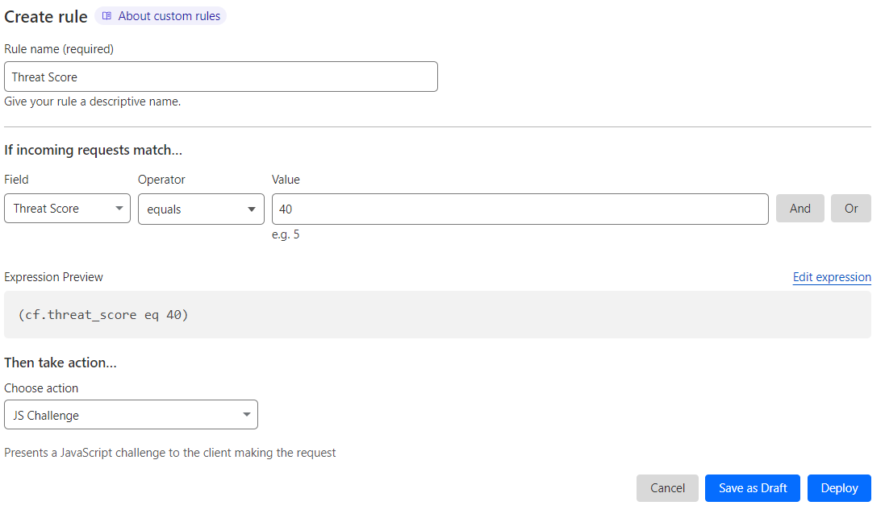

# Implementing a Cloudflare WAF in an OutSystems web app

Implementing Cloudflare's Web Application Firewall (WAF) involves several steps. Follow this guide to integrate Cloudflare WAF with your web application:

## Create a Cloudflare Account

To start using Cloudfare WAF you need to sign up. To do it:

1. Visit the Cloudflare website.
1. Click on "Sign Up"
1. Select the desired Service Tier
1. Create an account by providing the required information.

## Add Your Domain to Cloudflare

To add your domain to Cloudflare:

1. Log in to your Cloudflare account.
1. Add a Site:
    1. Click on the **Add a Site** button on the dashboard.
    1. Enter your domain name and click **Continue**.
    1. Select a Plan that suits your needs (Free, Pro, Business, or Enterprise).
    1. Click **Continue**.

## Update Your DNS Settings

1. Scan DNS Records.
    1. Cloudflare will automatically scan and import your DNS records.
    1. Review and verify the records.

1. Change Nameservers Full Setup (optional):
    1. Cloudflare will provide new nameservers.
    1. Log in to your domain registrar's website and replace the existing nameservers with the Cloudflare-provided nameservers.
    1. Save the changes.

This means that you’ll be using Cloudflare for your authoritative DNS nameservers.

As an alternative you can follow the [Partial (CNAME) setup Guide](https://developers.cloudflare.com/dns/zone-setups/partial-setup/)

## Configure Basic Cloudflare Settings

1. DNS Settings.Ensure all your DNS records are correctly configured in Cloudflare.
1. SSL/TLS Settings:
    1. Navigate to the **SSL/TLS** app in Cloudflare dashboard.
    1. Choose the appropriate SSL/TLS encryption mode (Off, Flexible, Full, Full (strict)).

1. Verify Site Functionality. Ensure your site is functioning correctly after the nameserver changes.

## Enable and Configure Cloudflare WAF

1. Access the WAF:
    1. Go to the Cloudflare dashboard.
    1. Select your domain.
    1. Navigate to the **Security** tab.
    1. Click on **WAF**.

1. Ensure the WAF is turned on (it should be enabled by default). If, not enable the WAF.

1. Set up the WAF Rules.

    

    Note that [managed rules](https://developers.cloudflare.com/waf/managed-rules/) are predefined and automatically updated by Cloudflare to address common threats. [Custom rules](https://developers.cloudflare.com/waf/custom-rules/) are user-defined, allowing precise control and tailored responses to specific security needs, but require manual maintenance.
    

    1. Set up the Managed Rules by clicking in **Managed Rules**
    1. Enable the relevant rule sets provided by Cloudflare (e.g., OWASP, Cloudflare Specials). **Note:** This is only available on paid plans

    Check [Recommended WAF Rules](waf-outsystems.md#recommended-waf-rules) for more knowledge in this common set of rules.

    1. Set up your custom Rules:
        1. Click on **Custom Rules**

        1. Click the **Create Rule** button

        1. Provide the Rule Name and the matching criteria for what you’re trying to achieve. For example:

            

            In this example we’re creating a rule that enables a js Challenge if the Threat Score is above 40.

            Check [Security Level](https://developers.cloudflare.com/waf/tools/security-level/) to better understand the Threat Score.

        1. Click Deploy.

Know more about [WAF managed rules](https://developers.cloudflare.com/waf/managed-rules/), which pre-configured managed rule-sets exist, when and how they are upgraded, and how you [can customize those rule-sets](https://developers.cloudflare.com/waf/managed-rules/#customize-the-behavior-of-managed-rulesets).

## Monitor and adjust WAF settings

* **Monitor traffic**. Regularly check the **Security** and **Firewall** analytics, available on the **Analytics and Logs** on your Cloudflare dashboard, to monitor blocked threats and traffic patterns.
* **Fine-Tune rules**. Adjust the WAF rules based on the analytics data to ensure optimal protection without affecting legitimate traffic.

## Test your application

To test your application ensure that you do:

* **Functionality Testing**. Verify that your web application functions correctly with the WAF enabled.
* **Security Testing**. Conduct penetration testing to ensure the WAF is effectively blocking attacks.

## Ongoing Management and Maintenance

After you implemented the WAF in your application make sure that you:

* **Do regular reviews**. Periodically review and update the WAF settings as your application evolves.
* **Stay updated**. Keep abreast of the latest security threats and adjust the WAF rules accordingly.

By following these steps, you can effectively implement Cloudflare WAF to protect your OutSystems web applications from various security threats.
