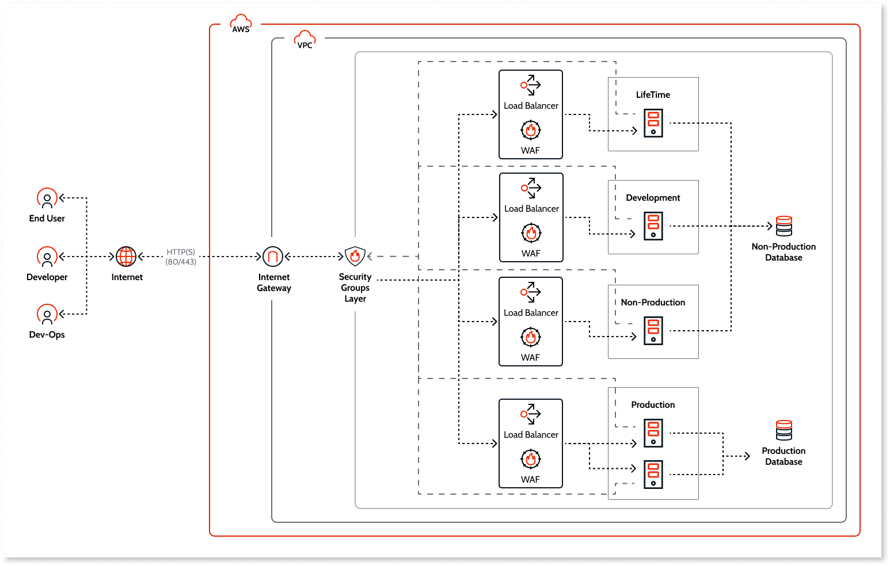
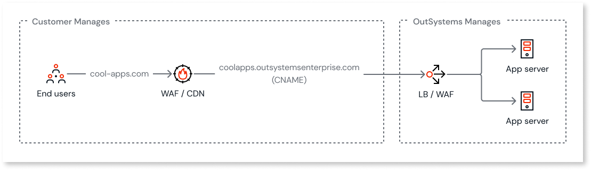

# Implementing a WAF for your applications on OutSystems Cloud

Following the initial deployment of your cloud infrastructure and the development of your first application, the next critical step should be to enhance the security of your apps. 
For each OutSystems Cloud environment, an Application Load Balancer with WAF capabilities exists to protect your applications from a wide range of attack types. Our OutSystems Cloud team is committed to reviewing and managing some of these protections and thrive to keep them updated to the latest security threats.

 

On top of this out of the box protection, you can have your own WAF to enhance the security of your applications with tailored WAF rules for your applications needs.

The WAF that you implement on your side will grant you extra security, such as the ability to disallow certain geo locations to access your applications, implementing additional custom WAF rules to protect from certain attacks more common to your applications' use case, and additional security monitoring and alerting.
In addition, some WAF providers, such as Cloudflare and Akamai, also come with a CDN feature that will bring a significant impact on the performance of your appls and offload some requests from coming to your OutSystems Cloud Application Servers.
There are no special requirements from OutSystems side to run a WAF in your OutSystems Cloud.

## Recommended WAF rules

Web Application Firewalls (WAF) have a set of rules that you can configure. In the following table, you can see the recommended WAF rules that you should always apply to your WAF when using it on your OutSystems applications

|Rule Name/Type|ID|Description|
|--|--|--|
|REQUEST-913-SCANNER-DETECTION|913100|Found User-Agent associated with security scanner|
|REQUEST-913-SCANNER-DETECTION|913101|Found User-Agent associated with scripting/generic HTTP client|
|REQUEST-913-SCANNER-DETECTION|913102|Found User-Agent associated with web crawler/bot|
|REQUEST-913-SCANNER-DETECTION|913110|Found request header associated with security scanner|
|REQUEST-913-SCANNER-DETECTION|913120|Found request filename/argument associated with security scanner|
|REQUEST-920-PROTOCOL-ENFORCEMENT|920220|URL Encoding Abuse Attack Attempt|
|REQUEST-920-PROTOCOL-ENFORCEMENT|920230|Multiple URL Encoding Detected|
|REQUEST-920-PROTOCOL-ENFORCEMENT|920240|URL Encoding Abuse Attack Attempt|
|REQUEST-920-PROTOCOL-ENFORCEMENT|920250|UTF8 Encoding Abuse Attack Attempt|
|REQUEST-920-PROTOCOL-ENFORCEMENT|920260|Unicode Full/Half-Width Abuse Attack Attempt|
|REQUEST-920-PROTOCOL-ENFORCEMENT|920460|Abnormal Escape Characters|
|REQUEST-921-PROTOCOL-ATTACK|921110|HTTP Request Smuggling Attack|
|REQUEST-921-PROTOCOL-ATTACK|921120|HTTP Response Splitting Attack|
|REQUEST-921-PROTOCOL-ATTACK|921130|HTTP Response Splitting Attack|
|REQUEST-921-PROTOCOL-ATTACK|921140|HTTP Header Injection Attack via headers|
|REQUEST-921-PROTOCOL-ATTACK|921150|HTTP Header Injection Attack via payload (CR/LF detected)|
|REQUEST-921-PROTOCOL-ATTACK|921151|HTTP Header Injection Attack via payload (CR/LF detected)|
|REQUEST-921-PROTOCOL-ATTACK|921160|HTTP Header Injection Attack via payload (CR/LF and header-name detected)|
|REQUEST-930-APPLICATION-ATTACK-LFI|930100|Path Traversal Attack (/../)|
|REQUEST-930-APPLICATION-ATTACK-LFI|930110|Path Traversal Attack (/../)|
|REQUEST-930-APPLICATION-ATTACK-LFI|930120|OS File Access Attempt|
|REQUEST-930-APPLICATION-ATTACK-LFI|930130|Restricted File Access Attempt|
|REQUEST-931-APPLICATION-ATTACK-RFI|931100|Possible Remote File Inclusion (RFI) Attack: URL Parameter using IP Address|
|REQUEST-931-APPLICATION-ATTACK-RFI|931110|Possible Remote File Inclusion (RFI) Attack: Common RFI Vulnerable Parameter Name used w/URL Payload|
|REQUEST-931-APPLICATION-ATTACK-RFI|931120|Possible Remote File Inclusion (RFI) Attack: URL Payload Used w/Trailing Question Mark Character (?)|
|REQUEST-931-APPLICATION-ATTACK-RFI|931130|Possible Remote File Inclusion (RFI) Attack: Off-Domain Reference/Link|

## Mobile apps integrity protection

If your WAF service is protecting or serving mobile apps built with MABS, using features that modify mobile app files (such as bot protection, file compression, or code injection) will cause errors with the MABS Over-the-Air update capability. This is because the update feature relies on file integrity validation through checksums to determine if the client app is eligible for an update. To avoid this issue, configure your WAF to prevent changes to specific artifacts for all mobile apps. For each mobile app OS, you can access a document listing the resources and paths to exclude via the URL ``<environment_url>/<app>/moduleservices/moduleinfo``. Typically, you should exclude the following paths:
* ``/<app path>/css/``
* ``/<app path>/img/``
* ``/<app path>/scripts/``
* ``/<app path>/fonts/``
* ``/<app path>/assets/``
* Any other paths containing app static files

## Post WAF configuration activities

After installing your WAF and configuring it to point to the OutSystems Cloud Servers, there are a few measures you can take to further enhance your security configuration. Here are a few key recommendations:

* **Explore and Experiment.** Fully use the capabilities of your WAF by exploring and experimenting with different rules and settings. This helps to strengthen the security of your applications and safeguard your users.
* **Rule Customization.** Customize the security rules to address specific threats relevant to your applications. Regularly update and refine these rules based on evolving security needs and emerging threats.
* **Monitor Security Analytics.** Both Cloudflare and Akamai and likely other WAF providers, offer a Security Analytics feature that allows you to keep monitoring incoming traffic and if they deem it malicious. With that information, you can create additional rules to keep your applications more protected
* **Involve an expert.** Many WAF providers have security experts that your team can rely to help you tailor your security configurations better to your applications' use cases.
