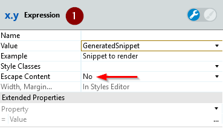

# Injection and Cross Site Script - XSS

Injection flaws and Cross Site Script are still the most common application vulnerabilities. You can find here a set of best practices for development and OutSystems platform configurations to protect your application from these kinds of vulnerabilities.

XSS enables attackers to inject HTML to display or execute client-side scripts into web pages viewed by other users. OutSystems provides warnings through the IDE and some functions that you can use to avoid this.

## Injection Flaws

Usually, the injection flaws occur when an interpreter executes an untrusted command (SQL, HTML, JavaScript) coming from a UI input or an external source.

Generally, the OutSystems platform escapes content, namely in Expressions and Aggregates, but if developers need to use custom JavaScript, HTML, and SQL Object with inline parameters, OutSystems provides built-in functions and actions to encode/sanitize to escape and delete malicious content.

Beyond that, the OutSystems IDE presents design-time warnings to developers when they construct patterns that expose their applications to injection threats.

### SQL Injection

On the OutSystems platform, SQL injections can occur on advanced queries using SQL Object with inline parameters and String Literals.

In such cases the typical strategy is to escape the inline parameter String Literals content by wrapping the distrusted Variables in the [EncodeSql()](https://success.outsystems.com/Documentation/11/Reference/OutSystems_Language/Logic/Built-in_Functions/Text#EncodeSql) built-in function to avoid certain characters (like single quotes, ') and always surrounding each [EncodeSql()](https://success.outsystems.com/Documentation/11/Reference/OutSystems_Language/Logic/Built-in_Functions/Text#EncodeSql) with single quotes (e.g. " ‘ “ + EncodeSql(Variable) + “ ‘ ").

**See the example code below:**

**Figure 1** shows that the code assumes the request arrives with a valid client id, like OU12345. If this happens we have the SQL in **Figure 2**, and everything occurs rightly:

However, an attacker may exploit this assumption by modifying the URL parameter passing the string  **DUMMYSTR OR 1 = 1**. If this happens, we have the code below, and the attacker has access to all the client database, as shown in **Figure 3**:

By passing this query parameter directly into the SQL statement, the code returns every user in the database and exposes their personal information. This is a bad idea. [OWASP](https://www.owasp.org/) suggests that developers sanitize all inputs before a statement execution or avoid interpretation entirely by using safe APIs.

How does this work in OutSystems? When you set the **Expand Inline** property to **Yes** you deactivate the default escape content from the platform, and you need to take care.

For a SQL clause with non-string literals, or if additional security is required, the VerifySqlLiteral() or the  [EncodeSql()](https://success.outsystems.com/Documentation/11/Reference/OutSystems_Language/Logic/Built-in_Functions/Text#EncodeSql) functions can be used, from the Sanitization Extension, to ensure it only contains valid SQL literals. With the tradeoff that Variables with SQL reserved characters are rejected, of course. See below the wrong way (Figure 1) and correct wat (Figure 2) way:

  

### JavaScript and HTML injection

Javascript is one of the most popular and widely used technologies for web pages and web applications. However, this technology can bring some security issues, which the developer and tester should be conscious of. Javascript can be used not only for good purposes but for some malicious attacks too. One among them is Javascript Injection.

OutSystems escapes all content before showing it to the user, by default. However, the developer can explicitly disable this mechanism if there is the need to inject custom HTML or Javascript, likely to prevent SQL injection. You need to take care when you do this. OutSystems provides [EncodeJavascript()](https://success.outsystems.com/Documentation/11/Reference/OutSystems_Language/Logic/Built-in_Functions/Text#EncodeJavaScript) for this purpose to guarantee that all Javascript reserved words are replaced by their escaped counterpart. OutSystems IDE takes special care of this and shows the developers alerts in case their application is exposed to injection threats.

In Figure 1 below, the developer deactivates the default escape protection and in Figure 2 the developer disregards the guaranty of the variable content safety by not using the [EncodeHtml()](https://success.outsystems.com/Documentation/11/Reference/OutSystems_Language/Logic/Built-in_Functions/Text#EncodeHtml) function.

     

### Dynamic URLs

If your application executes dynamic redirects, by chance, and gets data from form-data or URL parameters, you must be aware that data can be potentially tempered. Whenever your application logic redirects to a specified URL, you must guarantee that the URL remains unchanged. Fortunately, OutSystems users have the [EncodeUrl()](https://success.outsystems.com/Documentation/11/Reference/OutSystems_Language/Logic/Built-in_Functions/Text#EncodeUrl) built-in function.

#### Content Security Policy (CSP)

CSP essentially provides a standard way of declaring approved origins of content that browsers are allowed to load, and provide an additional layer of security against Cross Site Scripting (XSS) attacks.

XSS attacks typically happen when malicious user-generated content bypasses websites' security mechanisms, causing it to deliver executable code to a user. This code then runs in the user's browser to perform malicious activity.

To reduce the likelihood of a successful XSS event on OutSystems, you can enable the CSP protection on the Service Center / Security and specify more than a dozen configurations to increase your security.

One disadvantage is maintaining an allowlist of permitted resources. This typically involves communicating with third party sites to determine their inclusion’s authenticity.

In OutSystems, you enable CSP in LifeTime. See [Apply Content Security Policy](https://www.outsystems.com/tk/redirect?g=e59d9233-7c2d-43ae-b8a2-f55d75263c68) for further instructions.

#### Enforce HTTPS Security

OutSystems provides developers with the ability to decide the HTTP security used in applications at the designing phase. They can do it by defining which pages and integrations are available over HTTP and HTTPS.

IT Managers or Administrators can override and enforce the HTTPS security of installed and running applications. They can do it for a whole environment, affecting all applications running there, or application by application.

#### Broken Access Control

Depending on the sensitivity of the data your application handles, the repercussions of broken access control can be very severe or even fatal to the company. Data leaks can cause reputational damage, cost your business financial penalties, make your customers vulnerable to fraud, and lose their trust in you.

There’s no magic solution to prevent broken access control, generally speaking. You need to build a strategy to cover at least the following two aspects:

* Authentication: Correctly identify the user when someone tries to access the application.

* Authorization: Determine what actions or resources a user is able or not to perform.

Applications built with OutSystems have low risk to suffer a broken access control if developers decide to use the default protocols the platform offers. OutSystems doesn’t keep personal information, and the passwords are strongly encrypted. To enforce the security mechanism, OutSystems implements a User Roles concept to restrict or deny end users access to specific screens or operations of your application. Learn more about [Secure the Application](https://success.outsystems.com/Documentation/11/Developing_an_Application/Secure_the_Application) with OutSystems.

## Benefit

Injection and XSS attacks can result in data loss, corruption, or disclosure to unauthorized parties, loss of accountability, or access denial.

The main benefit of this article is to protect applications’ sensitive data and consequently, gain the user's trust.

## Know more about Injection and Cross Site Script (XSS)

[SQL Injection Warning](https://success.outsystems.com/documentation/11/reference/errors_and_warnings/warnings/sql_injection_warning/)

[HTML Injection Warning](https://success.outsystems.com/Documentation/11/Reference/Errors_and_Warnings/Warnings/HTML_Injection_Warning)

[Javascript Injection Warning](https://success.outsystems.com/Documentation/11/Reference/Errors_and_Warnings/Warnings/JavaScript_Injection_Warning)

[OWASP Top 10-2017 A1-Injection](https://www.owasp.org/index.php/Top_10-2017_A1-Injection)

[OWASP Top 10-2017 A7-Cross-Site Scripting (XSS)](https://www.owasp.org/index.php/Top_10-2017_A7-Cross-Site_Scripting_(XSS))

## Samples and Examples

[Security Best Practices](https://www.outsystems.com/forge/component/4719/security-sample/)

## See Also

[Content Security Policy (CSP)](https://success.outsystems.com/Documentation/11/Managing_the_Applications_Lifecycle/Secure_the_Applications/Apply_Content_Security_Policy)

[Enforce HTTPS Security](https://success.outsystems.com/Documentation/11/Managing_the_Applications_Lifecycle/Secure_the_Applications/Enforce_HTTPS_Security)

[String Literal](https://en.wikipedia.org/wiki/String_literal)
