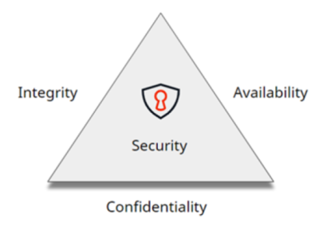
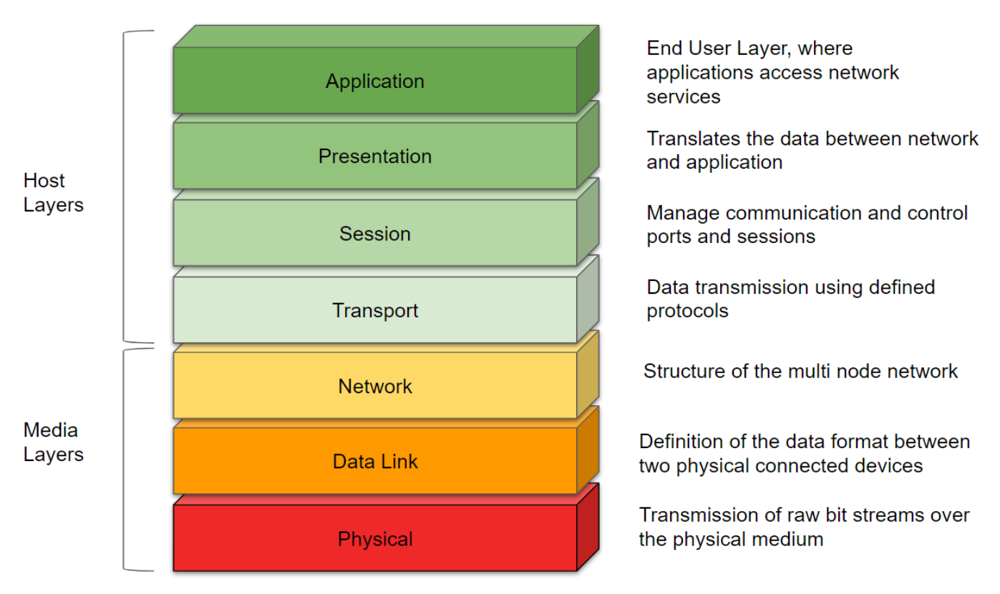

# Security

## A brief introduction to software security

Demand for some level of software security, even for small applications, is growing. That's why, before diving deep into software security vulnerabilities and mitigation techniques, it’s important to understand the most common software security questions, such as:

* What does software security aim to protect? And what are the commonly used security models?
* What's the OSI model?
* How can an organization assure customers/users that its applications are trustworthy?
* Where can you find or how can you know what the major software vulnerabilities are?
* From a developer perspective, what's the scope regarding security?

### Software security and the CIA model

The CIA Security Triangle is a model that represents the three base pillars of information security within an organization, confidentiality, integrity, and availability. This triad is considered the most crucial components of security, and they’re used to guide the policies that protect an organization’s information.

Checking them in detail:

* **Confidentiality** – Confidentiality is the assurance that the information is accessible only to those authorized to have access.
You can guarantee confidentiality by controlling access to information, making sure that only those who are authorized can access the required information.

    You can attain this by following good authentication practices, like strong passwords, multi-factor authentications, security tokens, and digital certificates. You should limit the access to sensitive information and only appear when it's necessary. It must also be subject to Role validation. Common means used to manage confidentiality include access control lists, volume, file encryption, and data permissions.

* **Integrity** – Integrity means the trustworthiness of data or resources in terms of preventing improper and unauthorized changes.
Data and resources must not be compromised or tampered with, and it must be reliable. You can verify data integrating by using checksums as a practice.

    If the data had modifications, backup or redundancy should exist to guarantee data recovery, which also ensures that  when an authorized person makes a foul change in the data, you can reverse the damage.

* **Availability** – Availability assures that the systems responsible for delivering, storing, and processing information are accessible every time authorized users require them.
High availability (HA) systems are the computing resources that have architectures specifically designed to improve availability, with hardware and software ready to ensure that sensitive data is always available.

    Deploying specific HA system architectures can prevent target hardware failures, upgrades, or power outages to support availability, or it may manage several network connections to route around various network outages.

More recently, complementary concepts to the CIA model were added, such as:

* Authenticity – Refers to the characteristic of communication, documentation, or any data that ensures genuine quality.

* Non-Repudiation – Guarantees that the sender of a message can't later deny having sent the message and that the recipient can't deny having received the message.

### Shared responsibility model

The OSI Model is a shared responsibility model that serves as a standard for defining the way computers communicate with each other. It's divided into seven layers; each layer serves the layer above it and is served by the layer below it:

The security of the applications developed in OutSystems is of utmost importance. OutSystems continuously works to provide and improve the built-in security protection in the host layers, by applying the latest security features in the platform.

This is one of the main reasons why you should keep your OutSystems platform updated to the latest version (Platform Server, LifeTime, Service Studio, and Integration Studio).

### Finding major vulnerabilities

Major security vulnerabilities are compiled by [OWASP - Open Source Foundation for Application Security](https://owasp.org/). OWASP an open community of volunteers that works to improve the security of software, providing several articles, tools, and documents that set the baseline of best practices to overcome known software vulnerabilities.

Also, periodically OWASP publishes the top software vulnerabilities for Web and Mobile Applications:

* [Top 10 Web Application Security Risks](https://owasp.org/www-project-top-ten/)

* [Top 10 Mobile Risks - Final List 2016](https://owasp.org/www-project-mobile-top-10/)

### Security certifications - business overview

Security certifications have gained high relevance because earning these certifications demonstrates the organization’s capabilities, accuracy, and compliance with the certification specific scope.

Compliance is the set of practices, processes, and tools that a company uses to guarantee that personnel and the company as a whole abide by internal rules of conduct and external rules and regulations. This compliance is attained with through a specific approach, being an iterative and continuous process, where you need to prove the compliance to have those certifications renewed.

Check the other articles in this section for best practices related to security.
