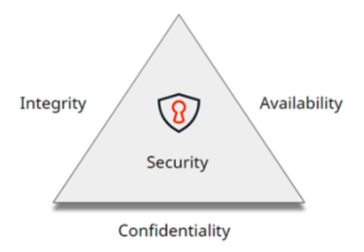
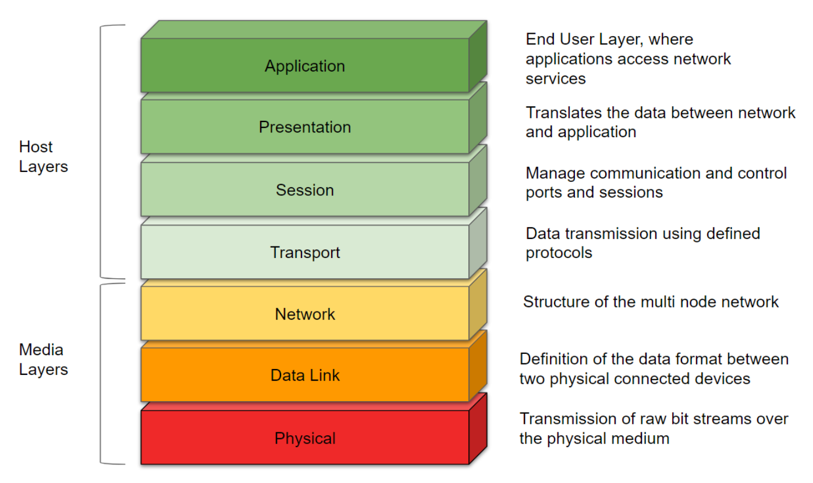

# Security and compliance

## A brief introduction to software security

Demand for some level of software security, even for small applications, is growing. That's why, before diving deep into software security vulnerabilities and mitigation techniques, it’s important to understand the most common software security questions, such as:

* What does software security aim to protect, and what are the commonly used security models?
* What's the OSI model?
* How can an organization assure customers and users that its applications are trustworthy?
* Where can you find the major software vulnerabilities?
* From a developer's perspective, what's the scope of security?

### Software security and the CIA model

The Confidentiality, Integrity, and Availability (CIA) Security Triangle is a model that represents the three base pillars of information security within an organization. These three pillars are the most crucial components of security, and they guide the policies that protect an organization's information.

Checking them in detail:

* **Confidentiality**: The assurance that information is accessible only to those authorized to access it. You guarantee confidentiality by controlling access, so only authorized people reach the information they need.

    Attain this by following good authentication practices, like strong passwords, multi-factor authentication, security tokens, and digital certificates. Limit access to sensitive information, grant it only when necessary, and apply role validation. Common means to manage confidentiality include access control lists, volume and file encryption, and data permissions.

* **Integrity**: The trustworthiness of data or resources, preventing improper and unauthorized changes. Data and resources must remain intact, free from tampering, and reliable. You verify data integrity by using checksums.

    If data changes unexpectedly, backups or redundancy guarantee recovery, so you can reverse an incorrect change made by an authorized person.

* **Availability**: The assurance that the systems responsible for delivering, storing, and processing information are accessible whenever authorized users require them. High availability (HA) systems use architectures specifically designed to improve availability, with hardware and software that keep sensitive data available.

    HA architectures help keep applications available through hardware failures, upgrades, or power outages, and route around network outages by using several network connections.

More recently, the CIA model gained complementary concepts, such as:

* **Authenticity**: The characteristic of communication, documentation, or any data that ensures genuine quality.

* **Non-repudiation**: Guarantees that the sender of a message can't later deny having sent it, and the recipient can't deny having received it.

### Shared responsibility model

Securing an application is a shared responsibility across the layers it runs on. The Open Systems Interconnection (OSI) model is a standard that defines how computers communicate across seven layers, where each layer serves the layer above it and relies on the layer below it:

The security of the applications developed in OutSystems is of utmost importance. OutSystems continuously works to provide and improve the built-in security protection in the host layers, by applying the latest security features in the platform.

To benefit from the latest platform security features, keep your OutSystems platform updated to the latest version (Platform Server, LifeTime, Service Studio, and Integration Studio).

### Finding major vulnerabilities

The [Open Worldwide Application Security Project (OWASP)](https://owasp.org/) compiles major security vulnerabilities. OWASP is an open community of volunteers that works to improve software security. It provides articles, tools, and documents that set the baseline of best practices to overcome known vulnerabilities.

OWASP periodically publishes the top software vulnerabilities for web and mobile applications:

* [Top 10 Web Application Security Risks](https://owasp.org/www-project-top-ten/)
* [Top 10 Mobile Risks](https://owasp.org/www-project-mobile-top-10/)

### Security certifications

Security certifications have gained high relevance because earning these certifications demonstrates the organization's capabilities, accuracy, and compliance with the certification's specific scope.

Compliance is the set of practices, processes, and tools a company uses to ensure its personnel and the organization follow internal rules of conduct and external regulations. Compliance follows an iterative, continuous approach, where you keep proving it to renew your certifications.

## Compliance offerings

OutSystems 11 provides the following compliance offerings:

* **[OutSystems 11 Sentry](https://security.outsystems.com/?product=o11sentry)**: An edition of OutSystems 11 Cloud with additional layers of compliance, including PCI DSS, HIPAA, and other certifications.
    * **[HIPAA compliance](hipaa/intro.md)**: How OutSystems helps you develop and secure healthcare applications that comply with HIPAA security and privacy requirements.
    * **[PCI compliance](pci-compliance.md)**: How to build applications that handle payment card data in compliance with PCI DSS service provider standards.
* **[OutSystems FedRAMP](fedramp/fedramp-overview.md)**: A FedRAMP Moderate-authorized version of OutSystems 11 for US federal agencies and regulated customers, hosted by Knox Systems.
