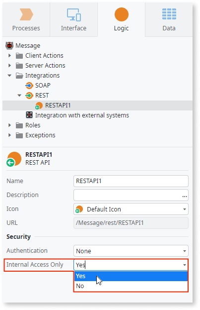

# Restrict access to an internal network

To effectively use this feature, you need to [configure your environment Internal Network](https://success.outsystems.com/Documentation/11/Managing_the_Applications_Lifecycle/Secure_the_Applications/Configure_an_Internal_Network) in Service Center.

You can tighten the security of your applications by restricting access to authenticated users on an internal network IP address.

Before using this feature, define the IP range of your internal network. See [Configure an internal network](configure-internal-network.md).

You can restrict internal network access to the following elements:

* UI Flows of a Web application (restricts the access of the Web Screens within the Flow). This is only available for Traditional Web apps.
* Exposed SOAP Web Services
* Exposed REST APIs

To restrict these elements to internal network access, set its **Internal Access Only** property to `Yes`.

