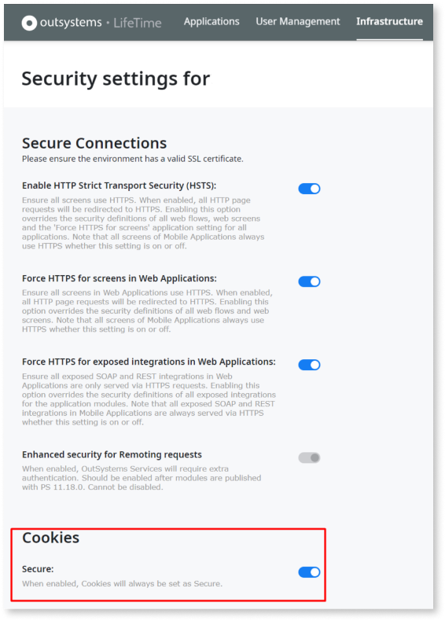
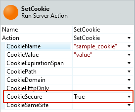
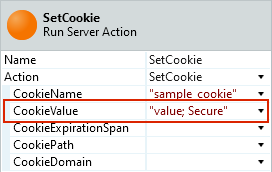

# Enable secure session cookies and set application cookies as secure

## Overview

Cookies may contain sensitive information that attackers can intercept if transmitted over unencrypted connections. You can add the `Secure` flag to cookies to ensure browsers only send them over HTTPS.

Web browsers supporting the `Secure` flag only send cookies with this flag when the request uses HTTPS. Setting the `Secure` flag on a cookie prevents browsers from sending it over an unencrypted channel.

Penetration test reports commonly flag unsecure cookies in OutSystems applications when environments are missing certain configurations. See the following sections for instructions on securing both session and application cookies.

## Secure session cookies

Session cookies store information about a user session after login. This information is sensitive because an attacker can use a session cookie to impersonate the user. Learn more about [session hijacking](https://en.wikipedia.org/wiki/Session_hijacking).

You can configure an OutSystems environment to have secure session cookies. Service Center and LifeTime provide options to configure security settings. These include [cookie handling options for SameSite and Secure attributes](https://success.outsystems.com/Support/Enterprise_Customers/Maintenance_and_Operations/Upcoming_changes_in_cookie_handling_in_Google_Chrome#patch). Enabling the **Secure Cookies** option adds the `Secure` attribute to all platform-generated cookies, including session cookies. In LifeTime, enable this setting in the Environment Security section of each environment:



<div class="warning" markdown="1">

When you enable secure cookies, browsers only send session cookies over HTTPS connections. To prevent session issues, you must also [enforce HTTPS for all screens](https://success.outsystems.com/documentation/11/managing_the_applications_lifecycle/secure_the_applications/enforce_https_security/) in your environment. You can do this in the same configuration screen by enabling either **HTTP Strict Transport Security (HSTS)** or **Force HTTPS for Screens in Web Applications**.

</div>

<div class="info" markdown="1">

For Platform Server versions earlier than 11.0.614, you can configure **Secure Session Cookies** using [Factory Configuration](https://www.outsystems.com/forge/component/25/factory-configuration/) from the OutSystems Forge. Use this method only for environments without access to the built-in settings in Service Center or LifeTime.

</div>

## Secure application cookies

To set the `Secure` flag on a custom cookie in a **server-side context**, such as within a Server Action, set **CookieSecure** to `True` when calling the [SetCookie](https://success.outsystems.com/Documentation/11/Reference/OutSystems_APIs/HTTPRequestHandler_API#SetCookie) Server Action:



<div class="info" markdown="1">

The `CookieSecure` parameter is available in Platform Server 11.7.0 and later. For earlier versions, append `; Secure` to the cookie value as a workaround, as shown in the following example.

</div>



To set the `Secure` flag in a **client-side context**, such as in JavaScript code, append `; Secure` to the cookie string:

```javascript
document.cookie = 'sample_cookie=value; Secure';
```
