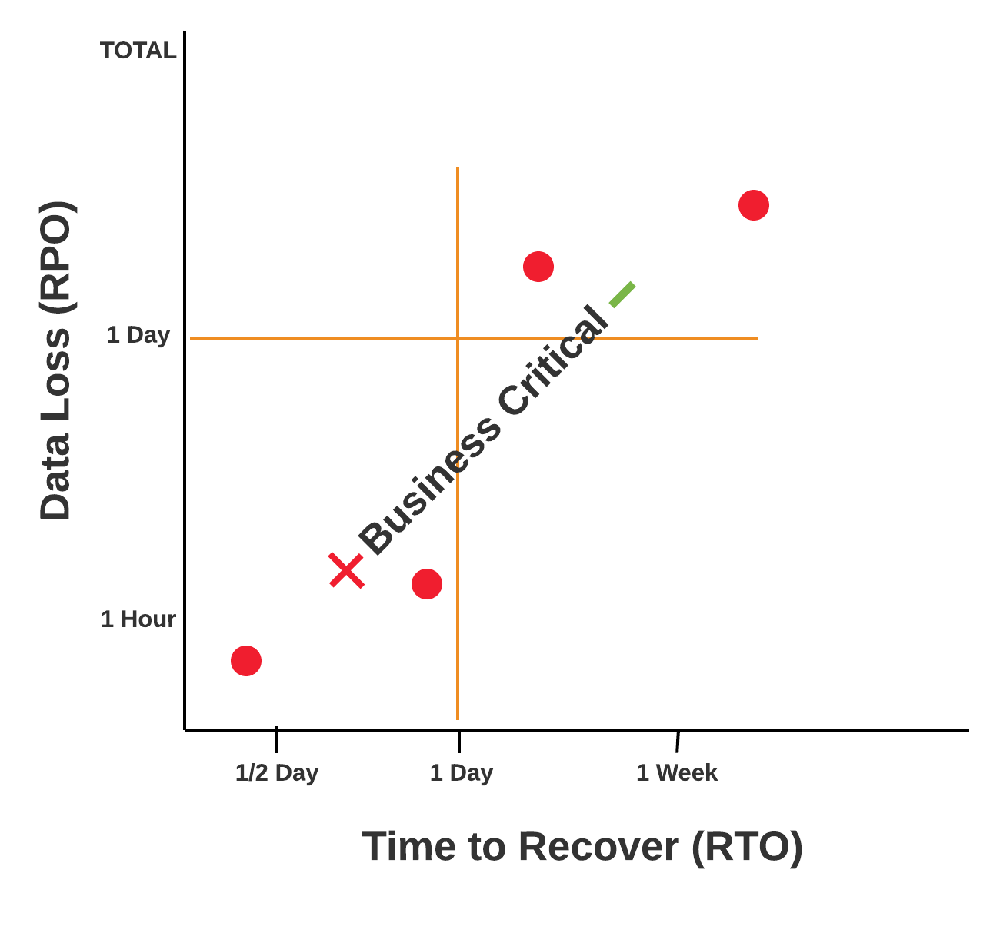

# Disaster Recovery and High Availability for OutSystems Platform servers

**Important:** The information in this guide applies only to OutSystems Platform on-premises or private cloud deployments.

Once you design your infrastructure to support OutSystems, you need to understand if you are going to have an High Availability setup and Disaster Recovery plan or not.

## High Availability vs Disaster Recovery

To understand the difference in each approach, mind the following:

* **High Availability** - is a system that is expected to be continuously delivering for a long time. Availability can be measured relative to "100% operational" or "never failing". A widely-held but difficult-to-achieve standard of availability for a system or product is known as "five 9s" (99.999 percent) availability.

* **Disaster Recovery** - defines a set of policies and procedures to assure the recovery or continuation of vital technology infrastructure and systems, following a natural or human-induced disaster.

These setups can live together but they require different planning and different implementations.

## High Availability

High Availability is all about uptime when facing hazardous events. The goal is to create a redundancy in your infrastructure that can respond to events, through horizontal scalability, preventing them from impacting your business. Depending on your configuration, it can respond to events at a server level, an entire datacenter or even in geographical areas. Is your business risk level and customer landscape that will determine to what point OutSystems has to scale, but we present the following examples to show typical scenarios that can be put in place.

Keep in mind that this examples are technology agnostic. They just show a simple layout on how to achieve High Availability.

**Example 1 - Localized High Availability Design**

This design example prevents localized system events. By having redundancy you are able to balance your load to respond to any existing events.

 

**Example 2 - Geographic High Availability Design**

This design example prevents geographic system events. By having redundancy both at the datacenter level and within the datacenter you can cope with geographical system events:

## Disaster Recovery

A disaster recovery happens after you had any kind of disaster. Here you are defining how fast can you recover from that disaster and what is the amount of information you are willing to lose in it. To help you creating the right decision there are two important concepts to keep in mind:

* **Recovery point objective (RPO)** - is defined by business continuity planning. It is the maximum targeted period in which data might be lost from an IT service due to a major incident.

* **Recovery time objective (RTO)** - is the targeted time frame and service level within a business process that it must be restored after a disaster (or disruption) in order to avoid unacceptable consequences associated with a break in business continuity.

 

Optimally, the more critical is your business process the less **RPO** vs **RTO** is to be aimed. This is achieved through a conjunction of an High Availability design and a set of policies and procedures contained in a Disaster Recovery Plan.

To help you achieving success, whether there’s an existing business continuity plan or a new one is to be aligned, we share a very simple disaster recovery plan for an OutSystems Infrastructure.

### Building a Disaster Recovery Plan

The following plan is a baseline that helps you to define your own plan. Keep in mind that this is the minimum acceptable plan for a disaster recovery situation and you should invest in creating a plan tailored to your specific needs.

#### Communication Plan

All communications before and after each work item are to be done by e-mail. The handover from a action item to the next action item should be done by phone to the next action item responsible contact or by the department 24/7 contact.

#### Personnel

List of people/departments that take part in the plan.

| Responsibility        | Name          | E-mail                  | Contact      | Department 24/7 contact |
|-----------------------|---------------|-------------------------|--------------|-------------------------|
| Network               | Diane Man     | <diane.man@acme.corp>     | +1 432 7434  | +1 432 7434             |
| Database              | Jack Lang     | <jack.lang@ext.acme.corp> | +1 378 4320  | +1 479 4321             |
| Server Operations     | Lee Connan    | <lee.conan@ext.acme.corp> | +62 444 9254 | +62 229 5478            |
| Global Infrastructure | Rob Roy       | <rob.roy@acme.corp>       | +1 334 7845  | +1 334 3402             |
| Applications          | Audrey Branch | <audrey.branch@acme.corp> | +1 434 1121  | +1 432 001              |
| Backups               | Cindy Krall   | <cindy.krall@acme.corp>   | +1 432 5009  | +1 332 887              |

#### Systems

List of devices that directly take part of the OutSystems Factory

| System                | Hostname      | IP Address              | Responsibility|
|-----------------------|---------------|-------------------------|--------------      |
| Load Balancer 1       | syslb1        | 81.253.167.3            | Network            |
| Frontend 1            | srvappout1    | 10.56.1.11              | Server Operations  |
| Frontend 2            | srvappout2    | 10.56.1.12              | Server Operations  |
| Frontend 3            | srvappout3    | 10.56.1.13              | Server Operations  |
| Frontend 4            | srvappout4    | 10.56.1.14              | Server Operations  |
| Database1             | oradbout1     | 10.80.1.33              | Database           |

##### Support Contracts

Information regarding supplier’s support and SLA over the systems.

| System           | Quantity | Brand      | Support Type | Support Contact |
|------------------|----------|------------|--------------|-----------------|
| OutSystems       |     -    | OutSystems |     24/7     | +1 888 707 2957 |
| Storage          |     1    | Eximax     |     24*7     | 0800 569 112    |
| Virtual Machines |     6    | Microsoul  |     24*7     | +1 378 4320     |
| Database         |     3    | Oracle     |     24*7     | +62 444 9254    |
| Loadbalancer     |     2    | RapidFire  |      8*5     | +1 434 1121     |

#### Backups

You must configure the following automatic backups for both Servers and Databases.

**Servers**

* Daily virtual machine snapshot at 4am

* 5 snapshots kept (5 days)

**Database**

* Oracle Archive Logs every 2 hours starting at 0h

* Daily Differential at 1am

* Weekly Full at 1am

* Monthly Full at 1am

#### Front-End Recovery

Action items required to recover from an hazard event affecting a server or servers.

| # | Action                                                                                                 | Responsibility     | SLA |
|---|--------------------------------------------------------------------------------------------------------|--------------------|-----|
| 1 | Remove affected server from load balancer                                                              | Network Operations | 15m |
| 2 | Restore virtual machine snapshot                                                                       | Server Operations  | 2h  |
| 3 | Access the server and start all OutSystems services.                                                   | Server Operations  | 15m |
| 4 | Verify OutSystems status by accessing [http://localhost/ServiceCenter](http://localhost/ServiceCenter) | Server Operations  | 5m  |
| 5 | Confirm internal application access                                                                    | Applications       | 15m |

#### Database Restore

Action items required to recover from a database hazard event.

| # | Action                                                 | Responsibility    | SLA |
|---|--------------------------------------------------------|-------------------|-----|
| 1 | Setup maintenance web page                             | Server Operations | 15m |
| 2 | Access each frontend and stop all OutSystems services  | Server Operations | 30m |
| 3 | Database Restore                                       | Backups           | 4h  |
| 4 | Verify database                                        | Database          |     |
| 5 | Access each frontend and start all OutSystems services | Server Operations | 1h  |
| 6 | Verify runtime of applications and execute smoke tests | Applications      | 1h  |
| 7 | Unset maintenance web page and internet access test.   | Server Operations | 15m |

#### Full Recovery

Action items required to achieve full recovery.

| # | Action                                                                                                                           | Responsibility    | SLA |
|---|----------------------------------------------------------------------------------------------------------------------------------|-------------------|-----|
| 1 | Redirect Load Balancers to a web server with maintenance web page                                                                | Server Operations | 30m |
| 2 | Database Restore                                                                                                                 | Backups           | 4h  |
| 3 | Verify database                                                                                                                  | Database          | 15m |
| 4 | Restore virtual machine snapshot                                                                                                 | Server Operations | 4h  |
| 5 | Access the server and start all OutSystems services.                                                                             | Server Operations | 1h  |
| 6 | Verify OutSystems status by accessing [http://localhost/ServiceCenter](http://localhost/ServiceCenter) from each restored server | Server Operations | 30m |
| 7 | Verify runtime of applications and execute smoke tests                                                                           | Applications      | 1h  |
| 8 | Unset maintenance web page and internet access test.                                                                             | Server Operations | 15m |

## More Information

To learn more about how to set up your OutSystems Platform check the [Designing OutSystems infrastructures guide](https://success.outsystems.com/Support/Enterprise_Customers/Maintenance_and_Operations/Designing_OutSystems_Infrastructures).
