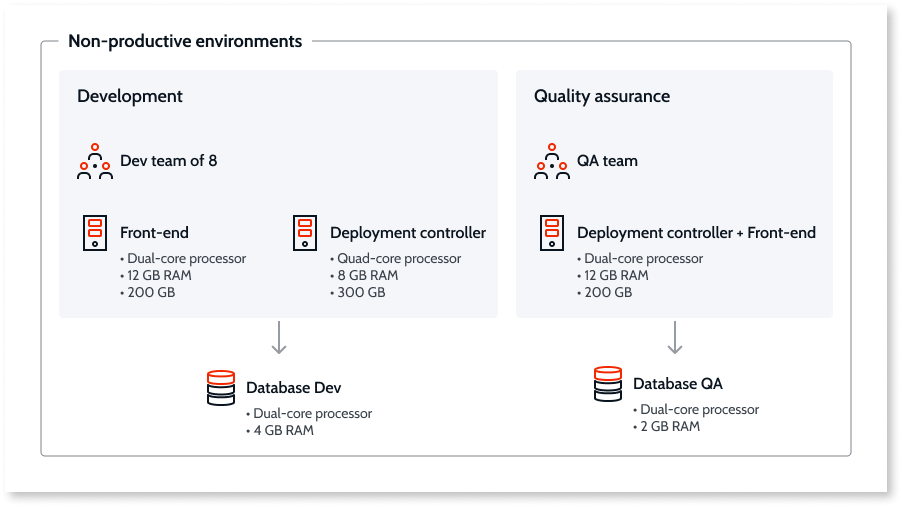

# Infrastructure design examples

**Important:** The information in this guide applies only to OutSystems Platform on-premises or private cloud deployments.

Some parts of this content may look out of context without reading the remaining content in this section. Please make sure to read the [whole section](https://success.outsystems.com/Support/Enterprise_Customers/Maintenance_and_Operations/Designing_OutSystems_Infrastructures) for complete understanding of the topics discussed here.

The following examples display typical scenarios and are applicable only to self managed infrastructures.

## Example 1: Non-productive environments

The following diagram represents a development portion of an OutSystems  factory with a team of 8 developers and a **Quality Assurance** environment.

Since predicted team growth was considered in advance, a dedicated **Deployment Controller** was set up and the development database was isolated on a dedicated SQL Server instance.

## Example 2: Production environment

The following example depicts a .NET Production environment with 3 **Front-ends**. These machines are serving requests through a load balancer and on top of a SQL Server database cluster for high availability.

## Example 3 - LifeTime environment

This example shows a standard **LifeTime** setup.

## Example 4 - Production environment with zones

An OutSystems zone is a logical separation of applications across **Front-ends** within the same infrastructure. Each zone is paired with network security segments that are isolated from the remaining network.

This example shows an environment with isolated zones for public access, for partners via a secure VPN, and for internal users.

## More information

To learn more about how to set up your OutSystems Platform check the [Designing OutSystems infrastructures guide](https://success.outsystems.com/Support/Enterprise_Customers/Maintenance_and_Operations/Designing_OutSystems_Infrastructures).

