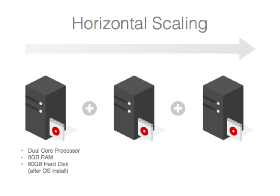
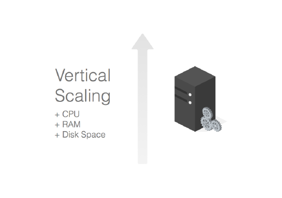
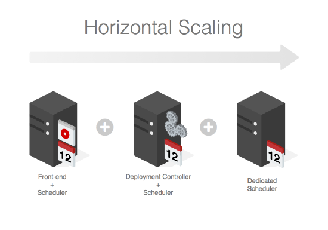
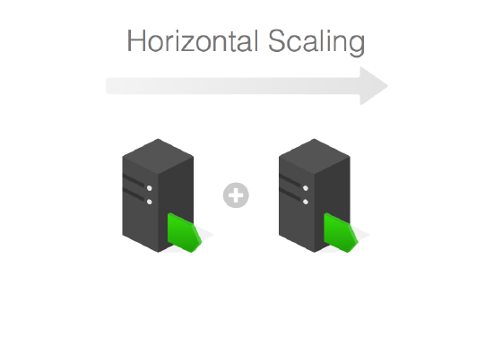

# Scaling and high availability for OutSystems Platform servers

**Important:** The information in this guide applies only to OutSystems Platform on-premises or private cloud deployments.

OutSystems is ready for you to design your infrastructure for high availability.

Servers can be scaled for clustering, failover and performance. Databases should implement the recommended vendor policies.

## Server roles

The characteristics of each [OutSystems Platform server role](server-roles.md) define how they can be clustered and how failover is implemented.

| **Role**                  | **Cluster Capable** | **Failover** |
|---------------------------|---------------------|--------------|
| **Front-end**             | Yes                 | Yes          |
| **Deployment Controller** | No                  | Yes*         |
| **Scheduler**             | Yes                 | Yes          |
| **LifeTime Front-end**    | Yes                 | Yes          |

*_Manual procedure_. Learn more about [how to execute the appropriate actions](https://success.outsystems.com/support/enterprise_customers/maintenance_and_operations/outsystems_platform_server_failover_procedures/).

### Front-end

In a cluster scenario, the **Front-end** role scales best horizontally. Balancing the load across nodes will provide failover and several levels of disaster recovery, depending on the implementation.

The design can range from a segmented distribution of **Front-ends** that contain small incidents, to a geographical distribution aimed at containing high-risk events.

To properly scale your **Front-end** horizontally, OutSystems recommends that you decide on a suitable set of hardware specs for the **Front-end** server, and replicate that configuration on subsequent **Front-end** machines.

### Deployment controller

This service can only grow vertically since it has no cluster capability. Adding CPU cores, memory and increasing disk I/O will provide faster compile times for large/very active teams.

In a Production environment, it's only in use when new application versions are published. In a Development environment, it's used every time a developer publishes an module, application, or solution.

### Scheduler

This role can be activated in any node with the **Front-end** or **Deployment Controller** roles. The OutSystems platform will distribute the load generated by [timer executions](https://success.outsystems.com/documentation/11/developing_an_application/use_timers/) across all nodes that have this role, within the same OutSystems zone.

With heavy analytics timers, the pressure on shared **Front-end** and **Deployment Controller** nodes can negatively influence their performance. In this case, a dedicated **Scheduler** node or nodes are recommended.

### LifeTime

LifeTime scales horizontally like any **Front-end,** mostly for high availability reasons, since it simply consists of a very light management console.

You should set up a dedicated node with, at least, the [recommended hardware requirements](sizing-platform.md) for a **Front-end** role.

## Database

Within the databases that the OutSystems supports, there are several high availability options. Check the following vendor documentation for specific extra details.

* [SQL Server](https://msdn.microsoft.com/en-us/ms190202.aspx)

* [Oracle](https://docs.oracle.com/en/database/oracle/oracle-database/19/high-availability.html)

Check the [Infrastructure Design Examples](infra-design-examples.md) for some simple scenarios where database high availability is represented.

## Cache invalidation with high-availability

RabbitMQ can be configured to work as a cluster, offering benefits like fault-tolerance, high availability and data replication. If your [application requires that the cache invalidation service is always available](https://success.outsystems.com/documentation/11/setup_and_maintain_your_outsystems_infrastructure/setting_up_outsystems/cache_invalidation_in_outsystems_11/#when-ha), [you should use a RabbitMQ cluster](https://success.outsystems.com/documentation/11/setup_and_maintain_your_outsystems_infrastructure/setting_up_outsystems/possible_setups_for_an_outsystems_infrastructure/high_availability_and_scalability_strategies/).

To learn more about how to set up your OutSystems platform check the [Designing OutSystems infrastructures guide](designing-infrastructures.md).
