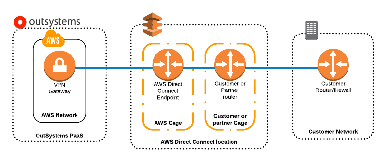

# AWS Direct Connect on OutSystems Cloud

This topic details how you can connect to your OutSystems Cloud using AWS Direct Connect.

Check in the [Cloud services catalog](https://success.outsystems.com/Support/Enterprise_Customers/OutSystems_Support/Cloud_services_catalog) if the AWS Direct Connect service is available for your OutSystems Cloud edition.

## AWS Direct Connect and your OutSystems Cloud

[AWS Direct Connect](http://docs.aws.amazon.com/directconnect/latest/UserGuide/Welcome.html) is a service that links an internal network to an AWS account over a dedicated circuit: a standard 1-gigabit or 10-Gigabit Ethernet fiber-optic cable.

For scenarios which require the use of high bandwidth and a steady connection without network congestion, you can use AWS Direct Connect to link your **private network** to your **OutSystems Cloud** over a dedicated line.

The following diagram shows how it works:

The above diagram exposes the direct connect topology:

* The Customer Network is connected to an AWS Direct Connect location via a dedicated link.

* Within the AWS Direct Connect location, the AWS Cage is cross-connected to the customer or partner cage.

* The AWS Direct Connect location is part of the AWS Network.

If you use your own [AWS Transit Gateway](https://aws.amazon.com/transit-gateway/) to connect OutSystems Cloud to your corporate network, you manage all the internal traffic to your OutSystems Cloud on your side. Therefore:

* The current procedure doesn't apply to you. You must set up any needed AWS Direct Connect on your side, using your AWS Transit Gateway.

* When you [request the connection to your OutSystems Cloud using your AWS Transit Gateway](../connect-tgw/connect-tgw.md), you must reconfigure any existing AWS Direct Connect on your side. After the connection with your AWS Transit Gateway is up and running, OutSystems terminates the virtual hosted interfaces of any existing AWS Direct Connect that you previously requested.

## Configuration

The setup of the Direct Connect service is to be executed by the customers, as the owners of the dedicated link. You can find the required configuration steps detailed on [AWS Getting Started document](http://docs.aws.amazon.com/directconnect/latest/UserGuide/getting_started.html).

There are two possible topologies for such link:

* **A.** Customer has network presence in one of AWS Direct Connect datacenters, [listed in this document](https://aws.amazon.com/directconnect/details/). This way a [cross connection](http://docs.aws.amazon.com/directconnect/latest/UserGuide/Colocation.html) can be established directly in the datacenter.

* **B.** Customer works with a partner in the [AWS Partner Network (APN)](http://docs.aws.amazon.com/directconnect/latest/UserGuide/Colocation.html) to help establish network circuits between an AWS Direct Connect location and the customer's network.

In both scenarios, this connection is managed by the customer.

The following steps are required in order to conclude the Direct Connect integration with the OutSystems Cloud:

1. After establishing the link between the customer network and the AWS Direct Connect location, associate the OutSystems Cloud AWS account ID with the newly created connection. This information shall be requested [by opening a support case](https://success.outsystems.com/Support) with OutSystems.

1. Create a [hosted virtual interface](http://docs.aws.amazon.com/directconnect/latest/UserGuide/createhostedvirtualinterface.html) using the account ID provided by OutSystems. In case you are under scenario **B**, this step is performed by the AWS partner, to whom you need to provide the OutSystems Cloud AWS account ID.

1. After this, [submit a new support case](https://success.outsystems.com/Support) requesting OutSystems to accept the newly created hosted connection.

1. OutSystems accepts the newly created hosted connection. Customers can download configuration at their end and establish connectivity.

By design, all OutSystems Cloud infrastructures have an internet gateway attached to the VPC, and the route-specific for the internet gateway is 0.0.0.0/0. Hence, if another route (0.0.0.0/0) is advertised from the customer end to the direct connect's routing table, the traffic will still be routed through the internet gateway as AWS will always prefer the shorted route.

So, in this case, we recommend advertising specific subnets in the direct connection route table.

