# Additional Configurations for OutSystems on Microsoft Azure

In this article you can find the instructions for some additional configurations you might want to apply to **OutSystems on Microsoft Azure**.

Check [OutSystems Documentation](https://success.outsystems.com/Documentation) and [Support Center](https://success.outsystems.com/Support) for further information.

## Enable Remote Desktop for a Virtual Machine

To access the machines remotely through RDF, you need to create a jump server - a dedicated VM with enabled RDP to reach and manage devices inside a network.

1. Create a VM with the RDP activated and connect to the VM. This is your jump server. Check [Quickstart: Create a Windows virtual machine in the Azure portal](<https://docs.microsoft.com/en-us/azure/virtual-machines/windows/quick-create-portal>) for detailed instructions. You can also use [Azure Bastion](https://azure.microsoft.com/services/azure-bastion).

1. Discover the IP of a machine you want to connect to. Access the machine in the Azure Portal and in the left blade choose **Networking**. The IP shows next to the label **Private IP**.

    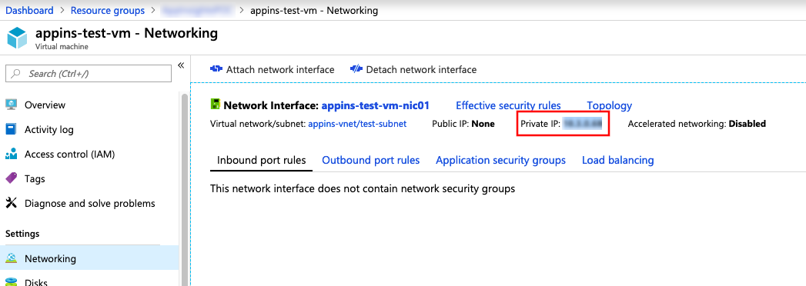  

1. After you connect remotely to the jump server, use it to connect to a machine inside the group by using the private IP of the machine.

## Add a Certificate Issued by a Certificate Authority to the Application Gateway of the Environment

SSL certificates enable secure connections between the web server and the web browser through HTTPS protocol. If you wish to build mobile applications with OutSystems, you will need a certificate from a public trusted authority to place on your application gateway.

SSL offloading is active by default on every environment. All access, both http and https, to the environments are made through the Application Gateway IP/DNS Address.

To add the trusted certificate to the application gateway of the environment, do the following:

1. Go to the details of the **application gateway** that was created for the environment and choose **Listeners** from the menu to the left.

      

1. Select the **appGatewayHttpsListener**.

    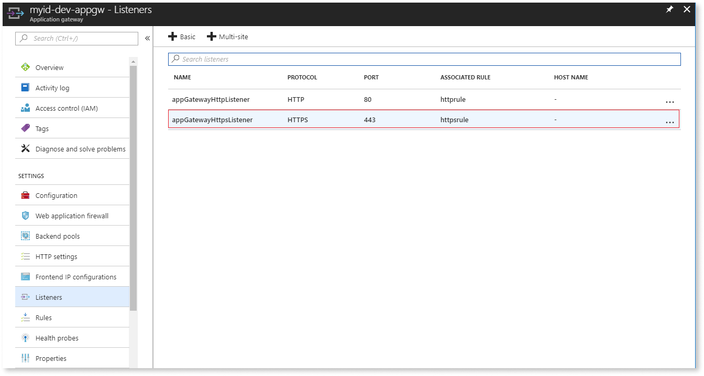  

1. Add a new certificate by uploading the .pfx file and providing its password. Name it according to your preference.

    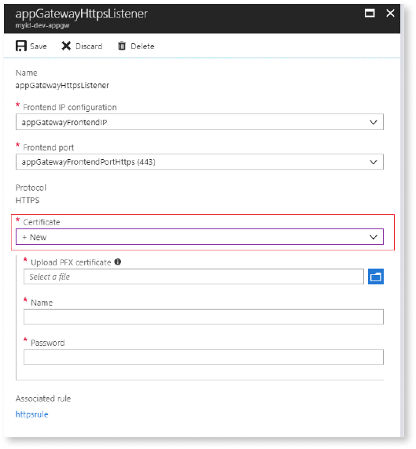

Note that you can set up the end-to-end encryption for traffic in Microsoft Azure, as described in the Microsoft document [Configure end to end SSL by using Application Gateway with PowerShell](https://docs.microsoft.com/en-us/azure/application-gateway/application-gateway-end-to-end-ssl-powershell).

## Scale Your Environments Using Azure Scale Sets

Your OutSystems environments are ready for horizontal scaling using **Azure virtual machine scale sets**. This is achieved scaling the number of front-ends of the environment with no need to manually install and register new servers into your infrastructure. To proceed with this operation, make sure your OutSystems license allows for multiple front-ends.

To scale the number of front-ends of an OutSystems environment on Microsoft Azure, do the following:

1. Go to your OutSystems resource group and list only the "Virtual machine scale sets" resources.

    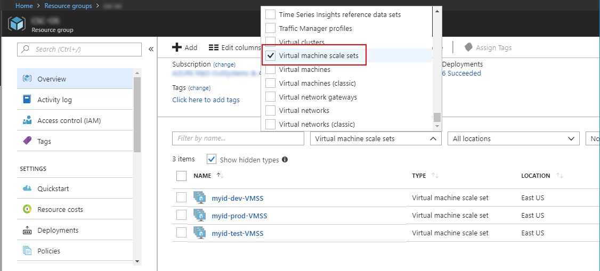  

1. Select the virtual machine scale set corresponding to your OutSystems Production environment.

    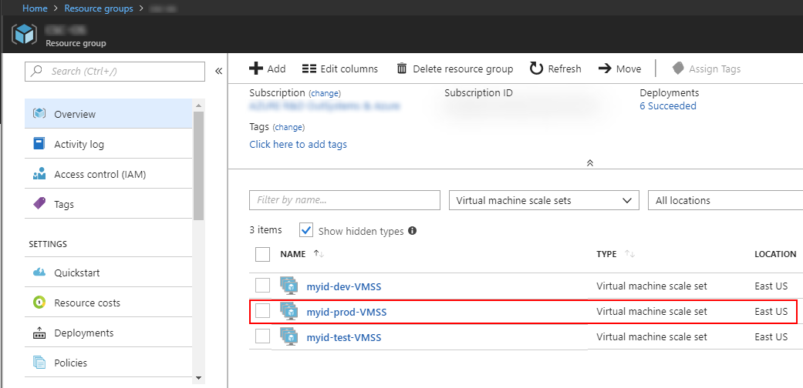

1. Choose **Scaling** from the menu to the left.

    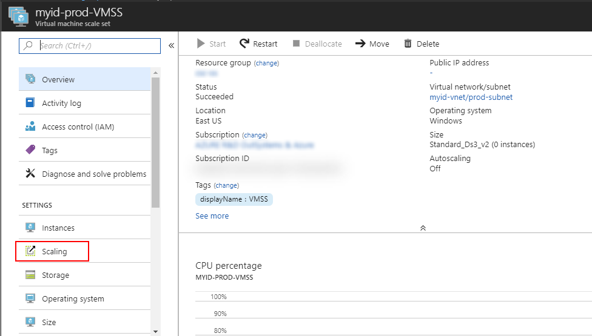  

1. Drag the slide or input the number of servers you want to add to your environment and click **Save**.

    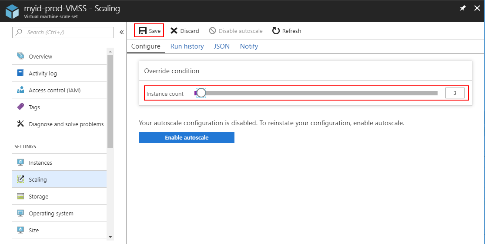

Choosing **Instances** from the menu to the left, you can see the progress of the deployment.

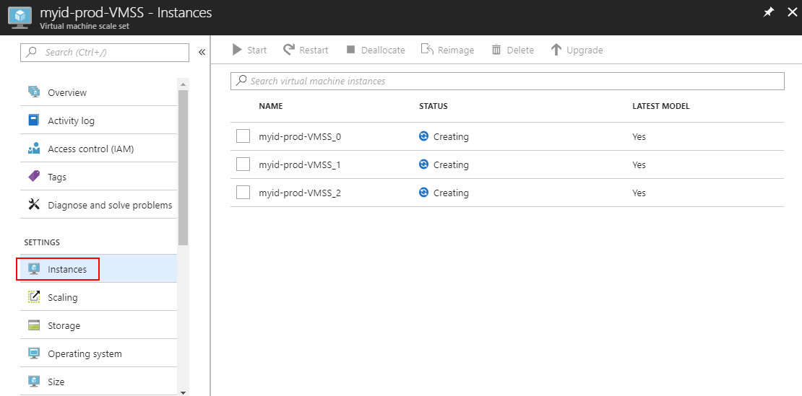

When the deployment finishes, you will see in the Service Center console for your environment that the new front-end servers are already running.

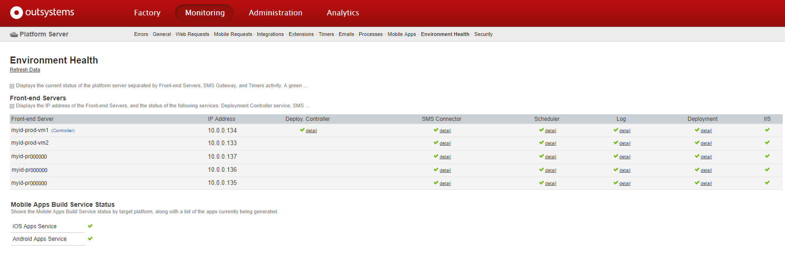

## Update Azure Scale Sets to a Newer Platform Version

Follow these steps to update a Platform Server deployed on Microsoft Azure scale sets.

1. Go to **Service Center** > **Administration** > **Servers** and disable the servers that are part of the scale set. Deleting is optional, but advised, to ensure you stay within the limit of the front-ends your license permits.

    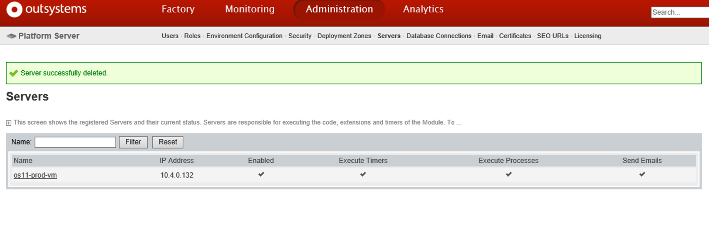

1. Go to your Azure Portal and make sure **Scaling** > **Configure** > **Instance count** is 0.

    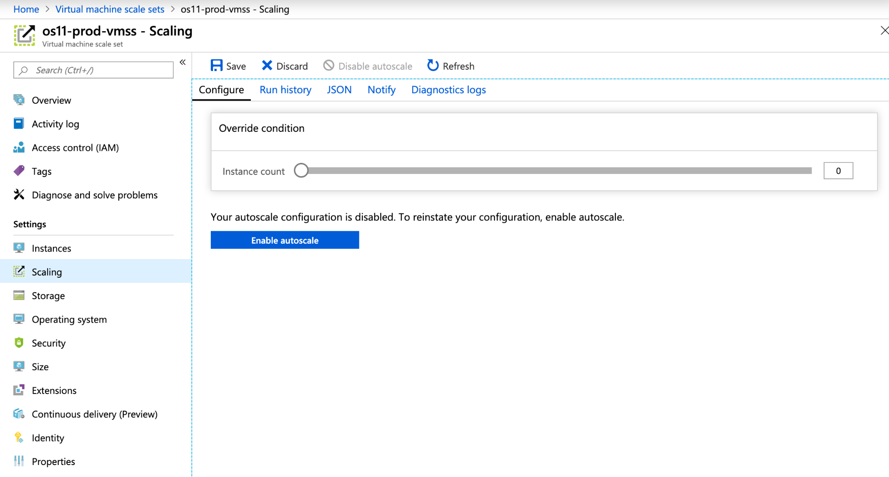

1. Update the Platform Server in your Deployment Controller, according to the checklist that opens in your browser when you run the update binary.

1. Go to the [Base Image Versioning table](<https://github.com/OutSystems/AzureARMTemplates/#base-image-versioning>) of the available image versions and note the version that matches the Platform Server you installed/updated in your Deployment Controller VM.

    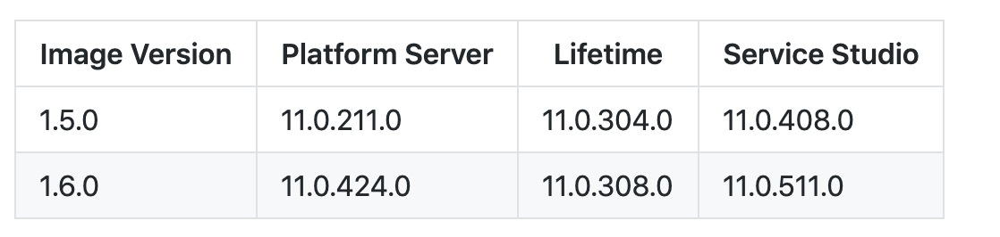

1. Update the Platform version by running the following command in your Azure Portal Powershell: `Update-AzVmss -ResourceGroupName "your_resource_group" -VMScaleSetName "your_scaleset_name" -ImageReferenceVersion your_desired_version`

    Here is an example:

    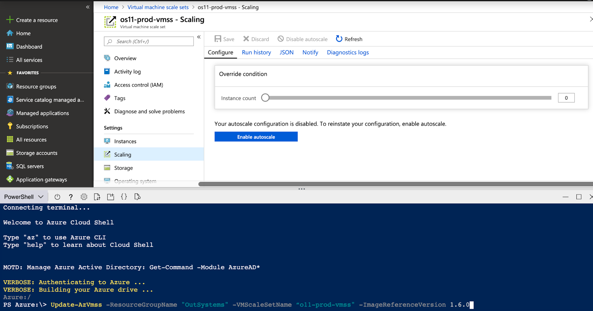

    And here is the expected result. Notice that the version is updated to 1.6.0, which corresponds to the Platform Server 11.0.424.0:

    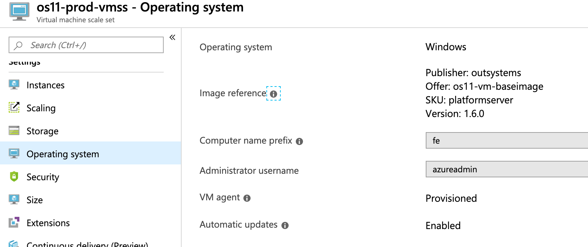

1. Set the desired **Instance count** in the Azure Portal .

1. After a few minutes confirm that Service Center is reachable through the Application Gateway URL or the Public IP.
