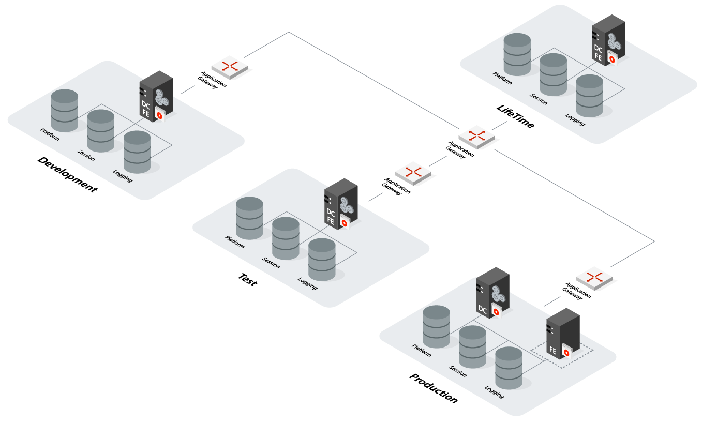

# OutSystems on Microsoft Azure

OutSystems solution template for Microsoft Azure Marketplace provides you with an OutSystems 11 infrastructure with four environments: Development, Test, Production, and [LifeTime deployment management console](../../../manage-platform-app-lifecycle/intro.md). At the end of the [setup process](set-up-platform.md "Set Up OutSystems on Microsoft Azure"), you will have an OutSystems infrastructure running on Azure configured according to OutSystems best practices.

## OutSystems Infrastructure

The deployed OutSystems infrastructure is summarized in the following diagram:

Learn [more details about the deployed infrastructure](quick-reference.md "Quick Reference for OutSystems on Microsoft Azure") in the quick reference.

## Farm Option for Production Environment

You can choose to deploy a Farm production environment with the front-end server running on a scale set. The incoming application traffic will be sent to this node while the Deployment Controller will be an independent VM outside the HTTP(S) workload.

Alternatively, you can deploy a standalone production environment with a single server playing the roles of both front-end server (FE) and OutSystems Deployment Controller service (DC).

## Horizontal Scaling

Production environments, when deployed in Farm mode, are ready for horizontal scaling with [Azure scale sets](https://docs.microsoft.com/en-us/azure/virtual-machine-scale-sets/overview "About the virtual machine scale sets"). This scaling operation is exclusively done in the Azure Portal, so you don’t have to make any changes in OutSystems to register the new front-end servers. This will allow your Farm to distribute the workload evenly across the scale set servers.
