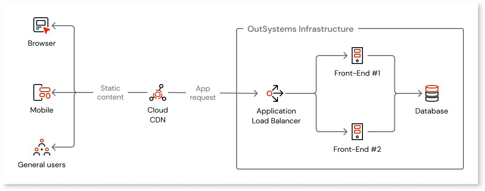
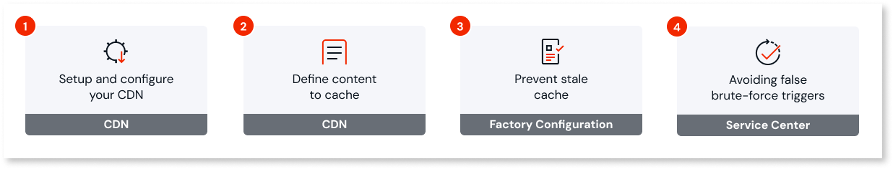
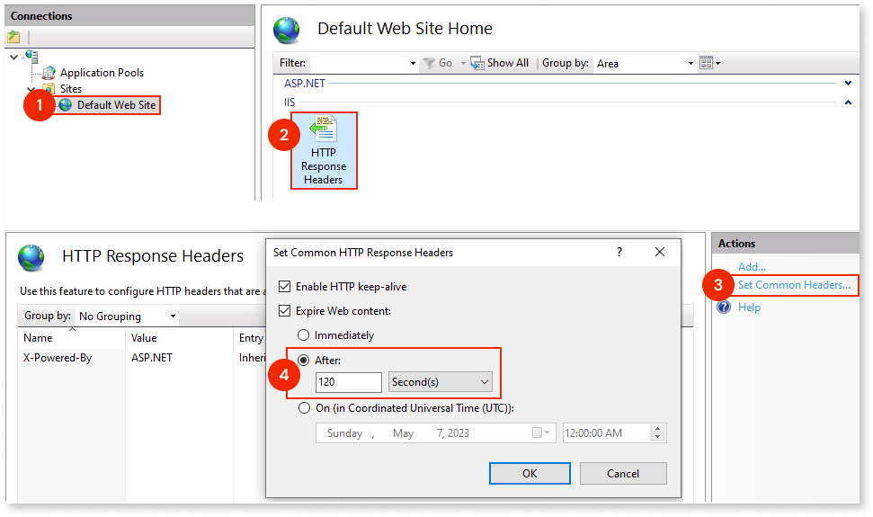

# Using a CDN with OutSystems

Content Delivery Network (CDN) is a cache mechanism that leverages a service with multiple servers spread over multiple regions around the world that work in delivering static content.

Mobile and Reactive apps can have a lot of static content, for example, CSS, js, and jpeg, which means that they only change when a new version of the app is deployed.

With a CDN on your infrastructure, static content is served to users by the CDN instead of the front-end servers. This **removes load from your servers allowing you to save hardware resources and improve performance**.

Because CDN servers can be spread around the world, the latency of the clients to the CDN is lower than to the front-end servers. **This results in an improved loading experience to end-users**.

OutSystems advises OutSystems Cloud and self-managed customers using  a CDN for:

* Mobile or reactive web apps

* B2C or B2B apps

With a CDN, the hydration process (ability to update the mobile app without downloading a new version from the app store) is served from the CDN instead of front-end servers. This reduces front-end load and helps prevent the need for hardware scale-up.

If your Platform Server version is earlier than 11.30.0, we advise upgrading to ensure an optimal experience with CDN and stale cache.

Below is an example of a typical architecture:

OutSystems lets you integrate a CDN of your choice to improve asset delivery. You'll need to set it up and configure it properly to ensure seamless performance. The following diagram breaks down the necessary steps, and this article provides detailed guidance for each.

## Setup and configure your CDN

First, setup a CDN of your choice, making sure it’s properly set up. Then, apply the following configurations to ensure everything works correctly:

* Add an alias canonical name (CNAME) resource record in DNS. Configure an additional CNAME in DNS with the same URL that is showing up on the Environment Hostname (Service Center Administration tab)
* Install the SSL certificate on the CDN. To ensure a secure connection, the certificate used by the apps that will be served by the CDN must be installed on the CDN. If more than one certificate is used (for different apps), then more than one CDN must be configured.
* Define the HTTP versions (supported by OutSystems) that the CDN will use: HTTP/1.1; HTTP/1.0  and, optionally, HTTP/2.
* The CDN must deliver the requests to the load balancer. To do this, ensure that the origin domain name and path are the load balancer address.
* ForwardCookies must match the cache policy. This means the CDN won’t cache the objects based on a cookie sent by the client.
* Always redirect to HTTPS. When accessing the URL via HTTP, the CDN redirects to HTTPS.
* Set up OriginKeepaliveTimeout to 60 seconds. This is the time that the CDN will maintain an idle connection before timing out.
* Set up OriginReadTimeout to 30 seconds. This is the amount of time that the CDN will wait for a response from the origin.
Avoid any configuration that allows code injection in the cached files. This prevents you from having problems with your mobile apps during your release cycle when you push new code to production.

## Define the content to cache

Static resources, like images and scripts, don’t change often, so caching them reduces server load and speeds up content delivery.

OutSystems apps often include the following static files. We recommend caching them, but you can choose to add others.

* *.css
* *.js
* *.gif
* *.woff
* *.woff2
* *.svg
* *.jpeg
* *.jpg
* .png
* *.otf
* *.ttf
* *.ico
* *.zip
* *.eot
* *.txt

## Prevent stale cache

Starting with Platform Server 11.30.0, a stale cache prevention mechanism ensures users always receive the latest application resources, preventing issues caused by outdated or incorrect content.

This mechanism automatically fetches new resource versions instead of waiting for caches to expire, allowing you to set long cache expiration times without risking stale content. As a result, it reduces unnecessary origin requests, improves performance, and lowers CDN costs.

You can enable stale cache prevention in the Factory Configuration. For details, see [Preventing stale cache](stale-cache.md).

### Fallback option: configure cache timeout in IIS

If upgrading to Platform Server 11.30.0 or higher isn't possible, you can use a less optimal fallback: configure the cache timeout in IIS. This option isn't available in the OutSystems Cloud.

**Using stale cache prevention is the preferred approach.**

By default, the cached timeout is set to 30 days, meaning the CDN will refresh the content only after that period.  

When deploying a new app version, you don’t want to manually purge the cache or wait 30 days for the CDN to update.  

To avoid this, reduce the static content expiration time from 30 days to a shorter interval. OutSystems recommends setting it to 2 minutes (120 seconds).

To apply this change, follow these steps:

1. Open Internet Information Services (IIS) Manager.
1. Go to **Sites**, and then **Default Web Site**.
1. Double-click **HTTP Response Headers**.
1. Under the **Actions** section, click **Set Common Headers…**
1. In the dialog box, select the **Expire Web content** checkbox and set the **After** value to **120 Second(s)**.

## Avoid false brute-force triggers

If your application uses the **Users** module as the user provider, you need to adjust its brute-force protection settings when using a CDN.

The Users module includes a brute-force protection mechanism that blocks multiple failed login attempts from a single user. However, with a CDN in place, the system can't detect the end-user's IP address, making all requests appear to come from the same source IP. This can unintentionally trigger the protection mechanism.

To prevent this, set the EnableBruteForceProtectionPerIP site property to False. Follow these steps to apply the change:

1. Open Service Center in your environment (`http://<environment>/ServiceCenter`) and log in with your credentials.
1. On the **Factory** tab, select **Modules** and filter by **Users**.
1. Select the module **Users (Users)**;
1. Inside the **Users** module detail click **Site Properties**.
1. In the list of site properties find and click  **EnableBruteForceProtectionPerIP**.
1. Change the **Effective Value** to **False**.
1. Click **Apply**.

To compensate for disabling this setting, consider implementing additional protection measures, such as a firewall.
